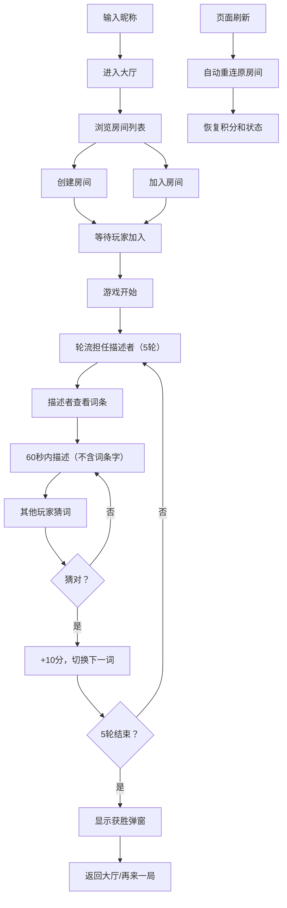

## 1. 产品概述

在线多人猜词游戏 Web 应用，为远程办公团队提供轻松的游戏化社交互动方式。玩家通过实时房间匹配、轮流描述和猜词、积分排名等功能，在游戏中增进团队凝聚力。

- **核心问题**：远程办公团队缺乏非正式社交互动，现有会议工具缺少轻松的游戏化交流方式
- **目标用户**：远程办公团队成员、朋友聚会、在线社交群体
- **产品价值**：提供低门槛、高互动性的实时猜词游戏，增强团队凝聚力和社交乐趣

## 2. 核心功能

### 2.1 用户角色
| 角色 | 参与方式 | 核心权限 |
|------|----------|----------|
| 描述者 | 游戏中随机/轮流担任 | 查看词条、进行文字描述 |
| 猜词者 | 其他所有玩家 | 输入猜测、查看描述、获得积分 |

### 2.2 功能模块
1. **房间大厅**：昵称输入、房间列表展示、创建房间、加入房间
2. **游戏房间**：词条展示（按角色区分）、倒计时、描述输入、猜词输入、猜词结果反馈
3. **积分系统**：实时积分显示、排名、回合得分、最终获胜展示
4. **实时同步**：WebSocket 房间状态同步、游戏状态同步、积分同步
5. **重连机制**：页面刷新自动重连、保留积分和游戏状态

### 2.3 页面详情
| 页面名称 | 模块名称 | 功能描述 |
|-----------|-------------|---------------------|
| 房间大厅 | 昵称输入框 | 用户输入昵称后进入大厅（最长8字符） |
| 房间大厅 | 房间列表卡片 | 显示房间名、玩家数、状态，悬停上浮动画 |
| 房间大厅 | 创建房间按钮 | 创建新房间，房间名最长8字符且不可重复 |
| 游戏房间 | 顶部积分板 | 显示所有玩家头像（首字母圆形图标）和分数，分数变化弹性动画 |
| 游戏房间 | 左侧描述区 | 深色底色，描述者可见词条（大号白色字体），猜词者显示"等待描述..." |
| 游戏房间 | 右侧猜词区 | 聊天式消息气泡，自己发送靠右橙色，别人靠左白色 |
| 游戏房间 | 倒计时组件 | 60秒倒计时，时间到自动切换 |
| 游戏房间 | 输入框 | 描述/猜词输入，提交验证 |
| 游戏房间 | 获胜弹窗 | 5轮结束后展示庆祝动画，含玩家名和总积分 |

## 3. 核心流程

用户输入昵称进入大厅，浏览或创建房间，加入房间后等待其他玩家。游戏开始后，每位玩家轮流担任描述者（共5轮），描述者看到词条后在60秒内进行文字描述（不能出现词中任何一个字），其他玩家猜词，猜对得10分并自动切换到下一个词。每轮结束后显示本回合得分和正确词，最终积分最高的玩家获胜。页面刷新时自动重连到原房间，保留积分和游戏状态。

## 4. 用户界面设计

### 4.1 设计风格
- **主色调**：深蓝渐变背景（#1a1a2e 到 #16213e）
- **强调色**：亮橙色（#ff6f61）
- **按钮风格**：圆角按钮，点击回弹效果（transform: scale(0.95) 持续0.1秒）
- **字体**：现代无衬线字体，标题粗体，正文常规
- **布局风格**：卡片式布局，游戏房间左右分栏（移动端上下排列）
- **图标风格**：首字母圆形头像图标

### 4.2 页面设计概述
| 页面名称 | 模块名称 | UI元素 |
|-----------|-------------|-------------|
| 房间大厅 | 整体布局 | 深蓝渐变背景，居中卡片网格，加载动画 |
| 房间大厅 | 房间卡片 | 悬停上浮3px + 投影加深（transition: 0.2s ease），圆角设计 |
| 游戏房间 | 顶部积分板 | 横向排列玩家头像+分数，分数变化放大回缩弹性动画（0.3s） |
| 游戏房间 | 左侧描述区 | 深色底色，大号白色字体展示词条或"等待描述..." |
| 游戏房间 | 右侧猜词区 | 聊天气泡，自己靠右橙色，别人靠左白色 |
| 游戏房间 | 输入控件 | 底部输入框+发送按钮，点击回弹效果 |
| 游戏房间 | 获胜弹窗 | 居中展示，庆祝动画，玩家名+总积分 |

### 4.3 响应式
- **桌面端（>768px）**：游戏房间左右分栏布局
- **移动端（≤768px）**：游戏房间上下排列布局，描述区在上，猜词区在下
- **触控优化**：按钮和输入框尺寸适配触摸操作，最小点击区域44px

### 4.4 动画与交互
- 房间卡片悬停：上浮3px + 投影加深（0.2s ease）
- 分数变化：先放大再回缩（0.3s 弹性动画）
- 按钮/输入框点击：transform: scale(0.95) 持续0.1秒
- 页面加载：加载动画
- 获胜弹窗：庆祝动画效果
