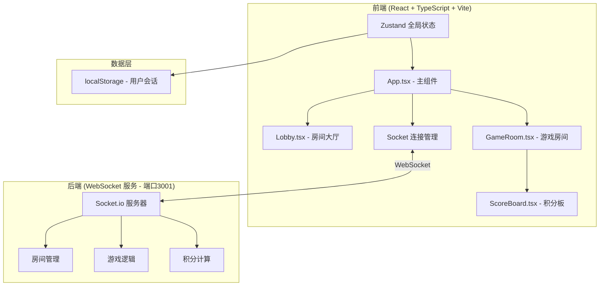

## 1. 架构设计



## 2. 技术说明

- **前端框架**：React@18 + TypeScript@5 + Vite@5
- **状态管理**：Zustand（全局游戏状态管理）
- **实时通信**：socket.io-client（连接到端口3001）
- **构建工具**：Vite，配置 React 插件和 WebSocket 代理
- **样式方案**：CSS Modules / 内联样式（遵循设计规范，深蓝渐变+橙色强调）
- **路由**：简单条件路由（App 组件内管理 Lobby/GameRoom 切换）

## 3. 路由定义
| 路由 | 用途 |
|-------|---------|
| /（无路由，状态控制） | 根据用户状态展示 Lobby 或 GameRoom |

说明：应用采用单页面+状态控制方式，不使用 react-router-dom，通过 App 组件内的全局状态判断当前展示大厅还是游戏房间。

## 4. 文件结构与调用关系

```
├── package.json              # 项目依赖配置
├── vite.config.js            # Vite配置（React插件 + WebSocket代理到3001）
├── tsconfig.json             # TypeScript配置（严格模式，ESNext模块）
├── index.html                # 入口页面（加载动画 + 根容器）
└── src/
    ├── App.tsx               # 主组件：路由/全局状态/Socket事件分发
    ├── main.tsx              # 应用入口
    ├── index.css             # 全局样式
    ├── components/
    │   ├── Lobby.tsx         # 房间大厅（socket emit → 服务器广播 → 更新列表）
    │   ├── GameRoom.tsx      # 游戏房间（socket接收 → UI渲染 → 猜词emit）
    │   └── ScoreBoard.tsx    # 积分板（socket接收积分更新 → 动画渲染）
    ├── hooks/
    │   └── useSocket.ts      # Socket连接管理Hook
    ├── store/
    │   └── useGameStore.ts   # Zustand全局状态
    └── types/
        └── index.ts          # TypeScript类型定义
```

### 数据流向说明
1. **房间大厅数据流**：用户操作（创建/加入房间）→ `Lobby.tsx` emit socket 事件 → 服务器广播房间更新 → `App.tsx` 接收 → Zustand 更新 → `Lobby.tsx` 重新渲染
2. **游戏房间数据流**：Socket 接收词条/游戏事件 → `App.tsx` 分发 → Zustand 更新 → `GameRoom.tsx` UI 渲染；猜词输入 submit → `GameRoom.tsx` emit 验证 → 服务器广播结果 → UI 更新
3. **积分板数据流**：Socket 接收积分更新 → Zustand 更新 → `ScoreBoard.tsx` 动画过渡渲染
4. **重连机制**：`useSocket.ts` 检测断线 → 从 localStorage 恢复会话 → 自动重连 → 服务器恢复状态

## 5. Socket 事件定义
| 事件名 | 方向 | 数据结构 | 说明 |
|-------|------|---------|------|
| `set-nickname` | C→S | `{ nickname: string }` | 设置用户昵称 |
| `get-rooms` | C→S | - | 请求房间列表 |
| `rooms-update` | S→C | `Room[]` | 房间列表更新广播 |
| `create-room` | C→S | `{ roomName: string }` | 创建房间 |
| `join-room` | C→S | `{ roomId: string }` | 加入房间 |
| `leave-room` | C→S | `{ roomId: string }` | 离开房间 |
| `room-state` | S→C | `RoomState` | 房间状态更新 |
| `start-game` | C→S | `{ roomId: string }` | 开始游戏 |
| `word-assign` | S→C | `{ word: string, isDescriber: boolean }` | 分配词条 |
| `submit-description` | C→S | `{ roomId: string, text: string }` | 提交描述 |
| `new-message` | S→C | `ChatMessage` | 新消息广播 |
| `submit-guess` | C→S | `{ roomId: string, guess: string }` | 提交猜词 |
| `guess-result` | S→C | `{ correct: boolean, playerId: string, points: number }` | 猜词结果 |
| `score-update` | S→C | `Player[]` | 积分更新广播 |
| `round-end` | S→C | `{ word: string, scores: Player[] }` | 回合结束 |
| `game-end` | S→C | `{ winner: Player, rankings: Player[] }` | 游戏结束 |
| `timer-tick` | S→C | `{ secondsLeft: number }` | 倒计时心跳 |
| `reconnect` | C→S | `{ sessionId: string }` | 重连请求 |

## 6. 类型定义

```typescript
// 用户/玩家
interface Player {
  id: string;
  nickname: string;
  score: number;
  isDescriber: boolean;
  isOnline: boolean;
}

// 房间信息
interface Room {
  id: string;
  name: string;
  players: Player[];
  maxPlayers: number;
  status: 'waiting' | 'playing' | 'finished';
  currentRound: number;
  totalRounds: number;
}

// 聊天消息
interface ChatMessage {
  id: string;
  playerId: string;
  playerName: string;
  text: string;
  type: 'description' | 'guess' | 'system';
  timestamp: number;
  isCorrect?: boolean;
}

// 游戏状态
type GamePhase = 'lobby' | 'waiting' | 'describing' | 'roundEnd' | 'gameEnd';

// 全局游戏状态
interface GameState {
  phase: GamePhase;
  currentPlayer: Player | null;
  currentRoom: Room | null;
  rooms: Room[];
  currentWord: string | null;
  isDescriber: boolean;
  messages: ChatMessage[];
  timeLeft: number;
}
```

## 7. 性能约束实现

- **DOM/Canvas 数量**：控制在200个以内，使用虚拟列表避免消息过多
- **WebSocket 消息频率**：节流处理，限制每秒不超过30条
- **猜词反馈**：本地即时UI反馈 + 服务器验证，确保200ms内响应
- **重连机制**：localStorage 存储 sessionId，断线自动重连
- **动画性能**：使用 CSS transform/opacity 动画，避免 layout thrashing
