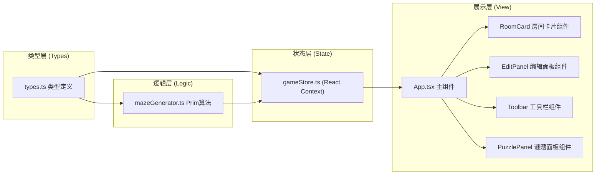
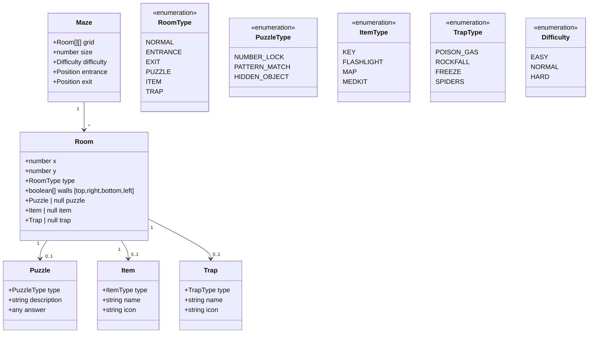

## 1. 架构设计



## 2. 技术栈说明

- **前端框架**：React 18 + TypeScript
- **构建工具**：Vite 5 + @vitejs/plugin-react
- **状态管理**：React Context + useReducer
- **样式方案**：CSS Modules / 原生CSS (无Tailwind，按用户需求使用原生CSS)
- **项目初始化**：Vite react-ts 模板

## 3. 文件结构与调用关系

```
auto70/
├── package.json                          # 依赖配置(react/react-dom/typescript/vite/@vitejs/plugin-react)
├── vite.config.js                        # Vite配置，React插件
├── tsconfig.json                         # TS配置：strict+ES2020+ESNext
├── index.html                            # 入口页面，#root容器
└── src/
    ├── types.ts                          # [基础层] 类型接口定义
    │   └── 导出：Maze/Room/Puzzle/Item/Trap/Difficulty
    ├── mazeGenerator.ts                  # [逻辑层] 迷宫生成算法
    │   ├── generateMaze()               # 接收size+difficulty → Room[][]
    │   ├── randomPrimAlgorithm()        # 随机Prim连通图生成
    │   └── assignPuzzlesItemsTraps()    # 随机分配谜题/道具/陷阱
    ├── gameStore.tsx                     # [状态层] React Context全局状态
    │   ├── GameContext Provider         # 提供迷宫数据/选中房间/修改方法
    │   ├── useGameStore() Hook          # 组件访问状态
    │   ├── actions: generate/reset/selectRoom/updateRoom
    │   └── 数据流：用户交互→dispatch→reducer→更新Context→视图重渲染
    ├── App.tsx                           # [展示层] 主组件
    │   ├── 布局：Toolbar + MazeGrid + EditPanel
    │   ├── 状态消费：useGameStore()
    │   └── 子组件：RoomCard/EditPanel/Toolbar/PuzzlePanel
    ├── components/
    │   ├── Toolbar.tsx                  # 顶部工具栏(尺寸滑块/难度/按钮)
    │   ├── MazeGrid.tsx                 # 迷宫网格容器
    │   ├── RoomCard.tsx                 # 单个房间卡片(60px，颜色/图标/连通线)
    │   ├── EditPanel.tsx                # 右侧编辑面板(房间类型/谜题/道具/陷阱)
    │   └── PuzzlePanel.tsx              # 谜题交互面板(数字锁/图案/寻物)
    └── main.tsx                          # React入口渲染
```

**数据流向**：
1. 用户操作 Toolbar → 触发 gameStore actions → mazeGenerator 生成数据 → 更新 Context → App/MazeGrid 重渲染
2. 用户点击 RoomCard → gameStore selectRoom → EditPanel 显示 → 修改房间 → updateRoom → 视图更新
3. 导出JSON：从 gameStore 获取最新状态 → 序列化为JSON → 触发下载

## 4. 数据模型



## 5. 核心算法说明

### 5.1 随机Prim迷宫生成算法

```
输入: size (迷宫尺寸)
输出: Room[][] (已连通的迷宫网格)

1. 初始化 size×size 网格，所有房间四周都有墙
2. 从左上角(0,0)开始，将其加入已访问集合
3. 将起始房间的所有邻墙加入墙列表
4. 随机从墙列表中取一面墙:
   a. 如果墙两侧只有一个房间被访问过
   b. 打通这面墙，将另一侧房间标记为已访问
   c. 将新房间的所有邻墙加入墙列表
5. 重复步骤4直到墙列表为空
6. 设置入口(左上角)和出口(右下角)
```

### 5.2 谜题/道具/陷阱分配策略

| 难度 | 谜题数量 | 道具数量 | 陷阱数量 |
|------|---------|---------|---------|
| 简单 | 3 | 3 | 1 |
| 普通 | 4 | 2 | 2 |
| 困难 | 6 | 2 | 3 |

- 从非入口/出口的房间中随机抽取
- 每个房间最多包含1个谜题和1个道具/陷阱
- 谜题类型均匀随机分配
