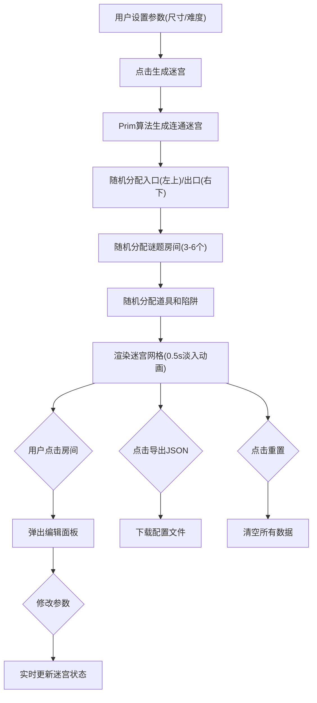

## 1. 产品概述

密室逃脱迷宫生成与谜题编辑器是一款为密室逃脱游戏设计师打造的交互式工具，帮助快速生成复杂迷宫布局并自动编排谜题、道具和陷阱，解决传统工具难以兼顾迷宫生成与谜题逻辑自动化的痛点。

- 目标用户：密室逃脱游戏设计师、游戏策划、桌游创作者
- 核心价值：一键生成连通迷宫，智能分配谜题/道具/陷阱，支持手动微调，大幅提升设计效率

## 2. 核心功能

### 2.1 功能模块

1. **主编辑器页面**：迷宫参数配置、迷宫可视化、房间编辑面板、操作工具栏

### 2.2 页面详情

| 页面名称 | 模块名称 | 功能描述 |
|-----------|-------------|---------------------|
| 主编辑器 | 顶部工具栏 | 迷宫尺寸滑块(5x5-10x10)、难度下拉菜单(简单/普通/困难)、生成迷宫按钮、重置按钮、导出JSON按钮 |
| 主编辑器 | 迷宫网格区 | CSS Grid布局的迷宫可视化，每个房间60px，按类型着色，房间间显示连通线，支持点击选中 |
| 主编辑器 | 房间编辑面板 | 右侧固定抽屉，可修改房间类型、谜题参数、道具类型、陷阱类型，实时更新视图 |
| 主编辑器 | 谜题交互面板 | 点击谜题房间时显示，包含数字密码锁、图案匹配、寻物列表三种谜题的交互界面 |

## 3. 核心流程

## 4. 用户界面设计

### 4.1 设计风格

- **主色调**：深蓝色渐变背景(#0d1b2a → #1b2838)，暗色主题
- **房间配色**：普通室#2d2d44、谜题室#4a2e5c、道具室#3a5a4c、陷阱室#5c3a3a
- **标识色**：入口金色边框、出口绿色边框、道具蓝色#3498db、陷阱红色#e74c3c
- **按钮样式**：圆角6px，0.2s背景色过渡动画
- **字体**：系统默认无衬线字体，标题24px加粗，正文14px
- **图标风格**：Emoji图标（❓🔑⚠️💊💚🗻❄🕷🔦🗺）

### 4.2 页面设计

| 模块 | UI元素 | 设计说明 |
|-----------|-------------|-------------|
| 顶部工具栏 | 标题、尺寸滑块、难度下拉、操作按钮 | 高度80px，背景#1a1a2e，标题#e0e0e0，红色重置按钮hover变#c0392b，绿色导出按钮 |
| 迷宫网格 | 房间卡片、连通线、类型图标 | 居中显示，房间圆角8px带阴影，hover放大1.05倍(0.2s)，点击亮蓝#3498db边框高亮，0.5s淡入 |
| 编辑面板 | 表单控件、下拉菜单、输入框 | 固定右侧280px宽，背景#1e1e2e，padding10px，输入框背景#2d2d44，聚焦边框#3498db |
| 谜题面板 | 数字输入、符号按钮、物品点击区 | 弹窗形式，包含谜题说明和交互控件 |

### 4.3 响应式设计

- **桌面端(≥768px)**：编辑面板固定右侧280px，迷宫居中
- **移动端(<768px)**：编辑面板变为底部抽屉(高300px)，支持拖拽手柄展开收起，迷宫网格自适应缩放

## 5. 性能要求

- 10x10迷宫生成：≤100ms
- 编辑面板弹出动画延迟：≤50ms
- 网格渲染帧率：≥60fps
