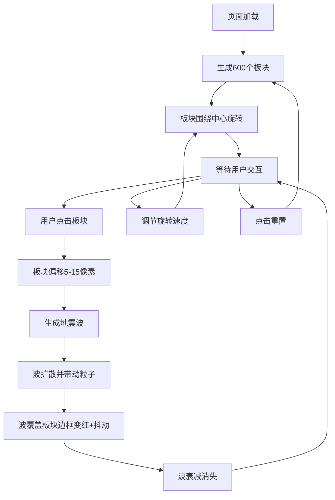

## 1. 产品概述
地壳板块运动与地震波扩散交互式可视化应用，用于地质教学和科普，直观展示板块挤压、断裂及地震波传播过程。
- 主要目的：通过交互式动态可视化，帮助学生和科普受众理解地壳板块运动和地震波传播的物理过程
- 目标用户：地质学科教师、学生、科普爱好者
- 产品价值：将抽象的地质过程转化为可交互、可观察的动态视觉体验，提升学习效率和兴趣

## 2. 核心功能

### 2.1 用户角色
| 角色 | 注册方式 | 核心权限 |
|------|----------|----------|
| 普通用户 | 无需注册 | 浏览和交互使用全部功能 |

### 2.2 功能模块
1. **主画布区域**：600个不规则多边形板块拼图、动态旋转、点击交互、地震波扩散
2. **底部控制面板**：旋转速度调节滑块、重置按钮、地震波强度计数器
3. **缩略图雷达视图**：右下角120x120像素的俯视简化视图

### 2.3 功能详情
| 功能模块 | 子功能 | 功能描述 |
|----------|--------|----------|
| 主画布 | 板块生成 | 600个不规则多边形组成直径400单元的圆形板块拼图，颜色中心黄到边缘红渐变(HSL 30到0)，1像素灰色缝隙 |
| 主画布 | 板块旋转 | 所有板块围绕中心缓慢旋转(默认每帧0.001弧度)，方向随机偏移 |
| 主画布 | 点击交互 | 点击板块时沿相邻边界随机偏移(5-15像素)，生成地震波 |
| 主画布 | 地震波扩散 | 初始半径10像素，颜色#ff4444，透明度0.8，0.6秒内正弦扩散至150像素，透明度衰减至0，边缘高亮脉冲 |
| 主画布 | 连锁反应 | 波覆盖板块边框变红(#ff0000)0.2秒后恢复，同时板块0.1秒±2像素抖动 |
| 主画布 | 粒子效果 | 15个粒子跟随波边缘，大小2-4像素，颜色#ff6b6b，透明度0.5，最多800活跃粒子 |
| 控制面板 | 速度滑块 | 调节旋转速度0.000-0.005弧度/帧 |
| 控制面板 | 重置按钮 | 恢复所有板块初始位置和颜色 |
| 控制面板 | 波计数器 | 实时显示最近5秒内的地震波数量 |
| 雷达视图 | 缩略图 | 120x120像素俯视简化显示所有板块和地震波 |

## 3. 核心流程
用户打开页面后看到动态旋转的地壳板块拼图，可点击任意板块触发地震，观察地震波扩散和连锁反应，通过底部控制栏调节参数或重置状态。

## 4. 用户界面设计

### 4.1 设计风格
- 主色调：深灰背景(#1a1a2e中心 → #0f0f23边缘径向渐变)，板块黄到红渐变(HSL 30→0)，地震波红色系(#ff4444, #ff6b6b, #ff0000)
- 板块样式：半透明渐变增加立体感，1像素灰色缝隙模拟断裂带
- 字体：简洁无衬线字体，易于阅读
- 布局：全屏Canvas占满视口，底部固定控制栏，右下角浮动雷达视图
- 动画风格：流畅自然，地震波带脉冲高亮和拖影粒子效果

### 4.2 页面设计概览
| 页面/区域 | 模块名称 | UI元素 |
|-----------|----------|--------|
| 全屏画布 | 主可视化区 | 600个旋转多边形板块、地震波扩散动画、粒子拖影 |
| 底部控制栏 | 控制面板 | 速度滑块(标签+滑块+数值)、重置按钮、波计数器 |
| 右下角 | 雷达缩略图 | 120x120像素简化视图，边框样式 |

### 4.3 响应式
- 桌面优先：全屏Canvas自适应窗口尺寸
- 控制栏始终固定在底部，雷达视图固定在右下角
- 触摸设备支持点击交互

### 4.4 性能要求
- 稳定60fps帧率
- 250次连续点击后仍保持稳定性能
- 活跃粒子数不超过800个
