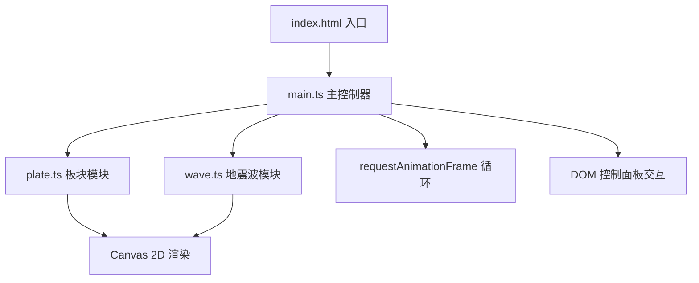

## 1. 架构设计
纯前端Canvas应用，单页面结构，无后端服务。



## 2. 技术说明
- 前端：TypeScript + Vite + 原生 Canvas 2D API（无第三方图形库）
- 构建工具：Vite
- 包管理：npm

## 3. 项目文件结构
| 文件/目录 | 用途 |
|-----------|------|
| package.json | 项目依赖和脚本配置 |
| index.html | 入口页面，全屏Canvas容器和底部控制面板 |
| tsconfig.json | TypeScript严格模式配置(目标ES2020，模块ESNext) |
| vite.config.js | Vite基础构建配置 |
| src/main.ts | 初始化Canvas、动画循环、协调板块和地震波更新、DOM交互 |
| src/plate.ts | Plate板块类：位置、颜色、旋转、碰撞检测、抖动方法 |
| src/wave.ts | Wave地震波类：扩散、透明度衰减、粒子生成 |

## 4. 核心数据模型

### 4.1 Plate 类
```typescript
interface Plate {
  id: number;
  vertices: Point[];          // 多边形顶点(相对中心)
  center: Point;              // 板块中心坐标
  baseCenter: Point;          // 初始中心位置(用于重置)
  colorHue: number;           // HSL色相值(30到0)
  rotationOffset: number;     // 旋转偏移量(随机方向)
  isShaking: boolean;         // 是否处于抖动状态
  shakeEndTime: number;       // 抖动结束时间
  shakeOffset: Point;         // 抖动偏移
  isHighlighted: boolean;     // 边框是否高亮
  highlightEndTime: number;   // 高亮结束时间
}
```

### 4.2 Wave 类
```typescript
interface Wave {
  id: number;
  center: Point;              // 波源中心
  startTime: number;          // 开始时间
  duration: number;           // 持续时间(0.6秒)
  startRadius: number;        // 初始半径(10)
  endRadius: number;          // 结束半径(150)
  affectedPlates: Set<number>; // 已触发连锁反应的板块ID
}

interface Particle {
  x: number;
  y: number;
  size: number;               // 2-4像素
  vx: number;
  vy: number;
  life: number;               // 0-1
}
```

## 5. 核心算法

### 5.1 板块生成算法
- 使用改进的Voronoi图/泊松盘采样生成600个不规则多边形中心点
- 限制在直径400的圆形区域内
- 每个多边形顶点在中心点周围随机偏移生成不规则形状
- 根据距中心距离映射HSL色相(30黄到0红)

### 5.2 旋转动画
- 每帧所有板块围绕画布中心旋转rotationSpeed + randomOffset弧度
- 使用2D旋转矩阵变换坐标

### 5.3 地震波扩散
- 使用正弦缓动函数: progress = sin(t / duration * π/2)
- radius = startRadius + (endRadius - startRadius) * progress
- alpha = 0.8 * (1 - progress)
- 边缘高亮使用半透明叠加

### 5.4 碰撞检测
- 遍历所有板块，检测板块中心与波源距离是否小于当前波半径+板块半径

### 5.5 性能优化
- 对象池复用粒子对象，避免频繁GC
- 限制活跃粒子上限800个
- 使用requestAnimationFrame确保60fps
- 批量渲染减少Canvas状态切换
