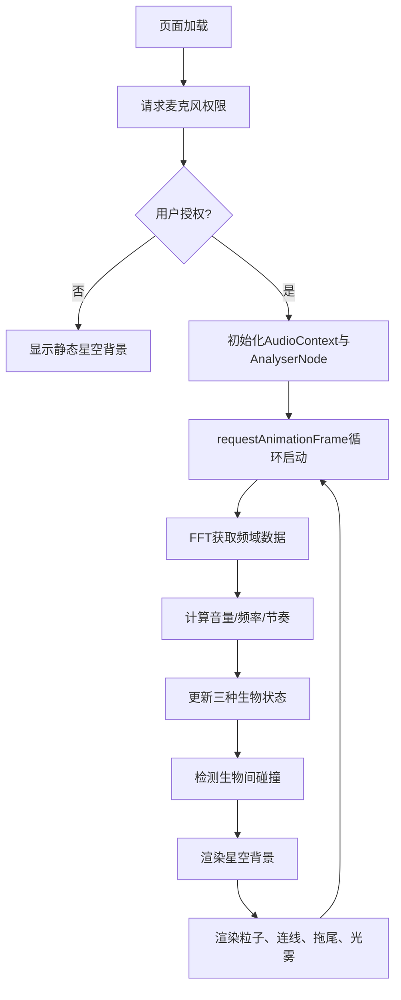

## 1. 产品概述

基于浏览器环境音实时驱动的动态奇幻生物视频壁纸。通过麦克风捕捉环境音量、频率与节奏，在全屏Canvas上呈现由粒子构成的火焰精灵、冰霜巨龙、风暴小鸟，其形态与行为随声音动态变化。

- 核心价值：将环境声音转化为沉浸式的视觉艺术体验，营造随声音互动的奇幻生物世界
- 目标用户：追求个性化桌面体验、喜爱视觉艺术与音乐互动的用户

## 2. 核心功能

### 2.1 功能模块

1. **全屏星空背景**：渐变星空、闪烁星点、底部薄雾
2. **三种奇幻粒子生物**：火焰精灵、冰霜巨龙、风暴小鸟
3. **实时音频分析**：麦克风输入、FFT傅里叶变换、音量/频率/节奏提取
4. **声音驱动动画系统**：三种声音强度级别对应不同行为模式
5. **碰撞与粒子爆发系统**：狂暴模式下生物碰撞触发光雾碎片

### 2.2 页面详情

| 页面名称 | 模块名称 | 功能描述 |
|---------|---------|---------|
| 主界面 | 星空背景层 | 垂直渐变(#0b0b2a→#1a1a4e)、150颗随机闪烁星点(1-3px, 1-3s周期)、底部150px薄雾渐变 |
| 主界面 | 火焰精灵 | 150个橙红→金黄粒子(HSL15-45)，松散团状，随声音缩放扭曲 |
| 主界面 | 冰霜巨龙 | 200个蓝紫渐变粒子(HSL200-240)，松散团状，随声音缩放扭曲 |
| 主界面 | 风暴小鸟 | 100个灰白渐变粒子(HSL0-10, 饱和度10%)，松散团状，随声音缩放扭曲 |
| 主界面 | 音频驱动引擎 | 三级音量模式切换、振幅映射缩放(1.0-2.0x)、频率映射位置偏移(0-8px) |
| 主界面 | 宁静模式(音量<20%) | 慢速漂浮(0.1px/帧)、粒子光丝连线(距离<50px, 透明度0.2) |
| 主界面 | 活跃模式(音量20%-60%) | 中心公转(0.3-0.6弧度/秒)、饱和度+15%、2帧半透明拖尾 |
| 主界面 | 狂暴模式(音量>60%) | 高速公转(1.2弧度/秒)、粒子膨胀(8-12px)、高亮(饱和度90%,亮度80%)、碰撞光雾爆发(30碎片,0.5秒) |

## 3. 核心流程

用户打开浏览器页面 → 请求麦克风权限 → 用户授权后启动音频采集 → 每帧执行：FFT分析音频数据 → 提取音量/频率/节奏特征 → 更新生物状态(位置/大小/颜色/形态) → 碰撞检测 → Canvas渲染输出

## 4. 用户界面设计

### 4.1 设计风格

- **主色调**：深蓝夜空渐变(#0b0b2a → #1a1a4e)
- **生物色系**：火焰(橙红→金黄HSL15-45)、冰霜(蓝紫HSL200-240)、风暴(灰白HSL0-10低饱和)
- **整体氛围**：神秘、奇幻、沉浸式、零UI干扰
- **无文字/无按钮**：完全依赖声音驱动，纯净视觉体验

### 4.2 页面设计概述

| 页面名称 | 模块名称 | UI元素 |
|---------|---------|-------|
| 主界面 | 星空背景 | 径向渐变+线性渐变叠加、150颗星点(随机闪烁)、底部150px半透明雾层 |
| 主界面 | 粒子生物 | 圆形粒子(3-6px正常/8-12px狂暴)、HSL动态着色、松散球体分布、2-4px随机间距 |
| 主界面 | 光丝连线 | 低透明度线段(alpha=0.2)、50px距离阈值、仅宁静模式显示 |
| 主界面 | 粒子拖尾 | 2帧历史位置、半透明衰减、仅活跃/狂暴模式显示 |
| 主界面 | 光雾爆发 | 30个径向飞散碎片、0.5秒生命周期、透明度渐变消失 |

### 4.3 响应式

- 全屏自适应：Canvas尺寸随window.resize动态更新
- 像素密度适配：使用devicePixelRatio确保高清显示
- 桌面端优先设计

### 4.4 性能要求

- 目标帧率：稳定60FPS
- 粒子总数：约450个(150+200+100) + 爆发碎片
- 优化策略：对象池复用、离屏计算、requestAnimationFrame调度
