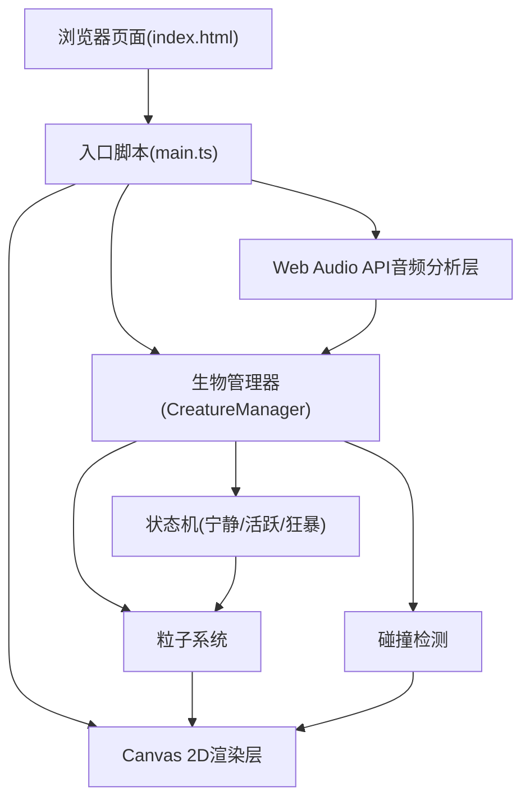

## 1. 架构设计



## 2. 技术描述

- **前端**：原生 TypeScript + Vite + Canvas 2D API（不使用Three.js等3D库）
- **初始化工具**：Vite 脚手架
- **后端**：无（纯前端单页应用）
- **数据库**：无
- **音频处理**：Web Audio API (AudioContext + AnalyserNode + FFT)

## 3. 项目文件结构

```
├── package.json          # 依赖配置(typescript, vite)
├── index.html            # 入口HTML，全屏Canvas
├── tsconfig.json         # TS配置(严格模式, ES2020, ESNext模块)
├── vite.config.js        # Vite配置(target: esnext)
└── src/
    ├── main.ts           # 主入口：Canvas初始化、音频采集、动画循环
    └── creatures.ts      # CreatureManager：三种生物、粒子系统、碰撞、渲染
```

## 4. 核心模块定义

### 4.1 类型定义

```typescript
interface Particle {
  x: number;
  y: number;
  vx: number;
  vy: number;
  baseSize: number;
  size: number;
  baseHue: number;
  hue: number;
  saturation: number;
  lightness: number;
  alpha: number;
  offsetX: number;
  offsetY: number;
  trail: { x: number; y: number }[];
}

interface Creature {
  type: 'fire' | 'ice' | 'storm';
  particles: Particle[];
  centerX: number;
  centerY: number;
  orbitAngle: number;
  orbitSpeed: number;
  driftX: number;
  driftY: number;
  scale: number;
  baseRadius: number;
}

interface BurstParticle {
  x: number;
  y: number;
  vx: number;
  vy: number;
  life: number;
  maxLife: number;
  color: string;
  size: number;
}

interface Star {
  x: number;
  y: number;
  size: number;
  twinklePhase: number;
  twinkleSpeed: number;
}

interface AudioFeatures {
  volume: number;      // 0-1
  frequency: number;   // 0-1 平均频率重心
  beat: boolean;       // 是否节拍点
}
```

### 4.2 CreatureManager 类接口

```typescript
class CreatureManager {
  constructor(canvasWidth: number, canvasHeight: number);
  createFireSprites(): Particle[];
  createIceDragon(): Particle[];
  createStormBird(): Particle[];
  update(volume: number, frequency: number, beat: boolean, dt: number): void;
  draw(ctx: CanvasRenderingContext2D): void;
  handleCollisions(): void;
  resize(width: number, height: number): void;
}
```

### 4.3 音频分析算法

- **音量(volume)**：频域数据平均值归一化到0-1
- **频率(frequency)**：频域加权平均计算频谱重心，归一化到0-1
- **节拍(beat)**：音量突变检测，当前音量 > 历史均值*1.3 且 > 0.3

## 5. 渲染管线

每帧执行顺序：
1. 绘制星空背景渐变
2. 绘制150颗闪烁星点
3. 绘制底部薄雾
4. (宁静模式)绘制粒子间光丝连线
5. 绘制粒子拖尾(活跃/狂暴模式)
6. 绘制所有粒子
7. 绘制光雾爆发碎片

## 6. 性能优化策略

- 使用 `requestAnimationFrame` 确保60FPS同步
- 粒子对象复用，避免GC压力
- 距离检测使用距离平方比较，避免`Math.sqrt`
- 画布尺寸使用 `devicePixelRatio` 缩放适配高清屏
- 连线仅在宁静模式且距离<50px时计算绘制
- 拖尾仅保留2帧历史，限制数组长度
