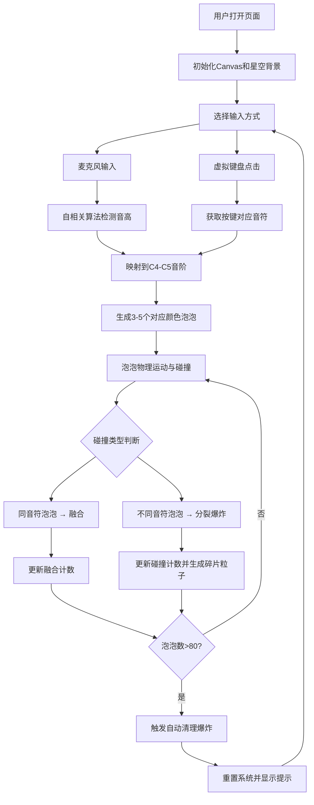

## 1. 产品概述
音乐节奏泡泡大战是一款基于音高识别和粒子系统的交互式音乐视觉化Web应用。用户通过麦克风发声或点击虚拟钢琴键盘，在深邃的星空背景中生成彩色泡泡粒子，泡泡之间通过物理碰撞产生融合、分裂和爆炸效果，形成一场绚丽的声音操控泡泡派对。

## 2. 核心功能

### 2.1 用户角色
| 角色 | 注册方式 | 核心权限 |
|------|----------|----------|
| 普通用户 | 无需注册，直接访问 | 使用所有功能，包括麦克风识别和虚拟键盘 |

### 2.2 功能模块
1. **星空背景渲染**：渐变星空、闪烁星点、底部薄雾、动态噪点纹理
2. **音频输入系统**：麦克风实时音高检测、虚拟钢琴键盘交互
3. **泡泡粒子系统**：泡泡生成、物理运动、弹性碰撞、融合分裂、爆炸特效
4. **实时状态面板**：音高显示、泡泡统计、碰撞/融合计数、清理提示
5. **性能管理**：动态降级渲染、泡泡数量限制与自动清理

### 2.3 页面详情
| 页面名称 | 模块名称 | 功能描述 |
|----------|----------|----------|
| 主界面 | 星空背景 | 全屏渐变背景、200颗闪烁星点、底部薄雾、动态噪点覆盖 |
| 主界面 | 虚拟钢琴键盘 | 两排琴键（白键+黑键）、按下高亮闪光动画、点击发声触发泡泡 |
| 主界面 | 状态面板 | 半透明毛玻璃面板、实时音高显示、泡泡/碰撞/融合统计 |
| 主界面 | 泡泡系统 | 彩色泡泡生成、重力运动、弹性碰撞、同色融合、异色分裂爆炸 |
| 主界面 | 清理机制 | 泡泡超80个自动爆炸清理、全屏闪烁、重置准备提示 |

## 3. 核心流程
用户打开页面 → 选择麦克风或键盘输入方式 → 发声/按键触发音符 → 生成对应颜色的泡泡 → 泡泡上升并发生碰撞 → 同色融合/异色分裂产生爆炸特效 → 泡泡超过80个触发自动清理 → 循环继续

## 4. 用户界面设计

### 4.1 设计风格
- **主色调**：深邃星空背景（#0f0c29 → #302b63 → #24243e 线性渐变）
- **泡泡配色**：C红(#ff4757)、D橙(#ff7f50)、E黄(#ffd93d)、F绿(#6bcb77)、G青(#4ad8d8)、A蓝(#5352ed)、B紫(#a855f7)，升半音使用同色系深色
- **交互元素**：半透明毛玻璃效果（背景rgba(255,255,255,0.1)，边框1px solid rgba(255,255,255,0.2)，圆角12px）
- **字体**：等宽字体用于数字显示，系统字体用于文本
- **动效**：requestAnimationFrame驱动的60fps流畅动画，包括星点闪烁、泡泡发光、碰撞冲击波、按键闪光、数字变化闪烁等

### 4.2 页面设计概述
| 页面名称 | 模块名称 | UI元素 |
|----------|----------|--------|
| 主界面 | 星空背景 | 全屏垂直线性渐变、200颗随机位置星点（大小1-3px，闪烁周期1-3s）、底部180px高半透明薄雾、覆盖0.05透明度1.5%密度动态噪点 |
| 主界面 | 钢琴键盘 | 底部居中，白键35px宽120px高（#e8e8e8→#ffffff渐变），黑键22px宽75px高（#1a1a1a→#333333渐变），按下时变亮+0.15s闪光 |
| 主界面 | 状态面板 | 左侧距边20px距顶20px，宽200px，毛玻璃背景，等宽数字字体(#e0e0e0)，数值变化时#ffd700闪烁0.2s |
| 主界面 | 泡泡系统 | 初始半径15-30px，发光光晕（模糊6px，透明度0.3），恢复系数0.75，重力0.2，融合半径+50%，分裂碎片3-6px，冲击波最大半径80px |

### 4.3 响应式
- 桌面端优先设计，支持1280x720到1920x1080分辨率
- 钢琴键盘在窄屏时自动缩放保持比例
- 全屏沉浸式体验，无滚动条

### 4.4 性能优化
- 同时100个泡泡+200个碎片粒子时保持55fps以上
- 粒子总数超200时自动降级：圆形改方形，降低单帧位置更新频率
- Canvas分层渲染优化
