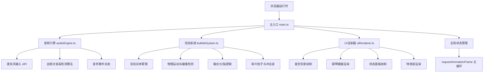

## 1. 架构设计


## 2. 技术说明
- **前端技术**：TypeScript@5 + Vite@5 + 纯Canvas 2D API
- **初始化工具**：npm create vite-init
- **后端服务**：无，纯前端应用
- **数据库**：无
- **音频处理**：Web Audio API (AudioContext, AnalyserNode, getUserMedia)

## 3. 路由定义
| 路由 | 用途 |
|------|------|
| / | 主应用界面，所有功能在此单页展示 |

## 4. 核心数据结构定义

### 4.1 音符定义
```typescript
type NoteName = 'C' | 'C#' | 'D' | 'D#' | 'E' | 'F' | 'F#' | 'G' | 'G#' | 'A' | 'A#' | 'B';
type Octave = 4 | 5;

interface Note {
  name: NoteName;
  octave: Octave;
  frequency: number;
  color: string;
}

interface NoteEvent {
  note: Note;
  timestamp: number;
  source: 'microphone' | 'keyboard';
}
```

### 4.2 泡泡实体
```typescript
interface Bubble {
  id: string;
  x: number;
  y: number;
  vx: number;
  vy: number;
  radius: number;
  color: string;
  noteName: NoteName;
  glowRadius: number;
  glowAlpha: number;
  birthTime: number;
}
```

### 4.3 粒子碎片
```typescript
interface Particle {
  id: string;
  x: number;
  y: number;
  vx: number;
  vy: number;
  radius: number;
  color: string;
  alpha: number;
  lifeTime: number;
  maxLifeTime: number;
}
```

### 4.4 冲击波
```typescript
interface Shockwave {
  id: string;
  x: number;
  y: number;
  radius: number;
  maxRadius: number;
  alpha: number;
  startTime: number;
  duration: number;
}
```

### 4.5 全局状态
```typescript
interface GameState {
  bubbles: Bubble[];
  particles: Particle[];
  shockwaves: Shockwave[];
  stars: Star[];
  collisionCount: number;
  mergeCount: number;
  currentNote: Note | null;
  isCleaning: boolean;
  cleanupMessageVisible: boolean;
  lastCleanupTime: number;
  performanceMode: 'normal' | 'degraded';
}
```

## 5. 文件结构

```
auto78/
├── .trae/
│   └── documents/
│       ├── PRD.md
│       └── TechnicalArchitecture.md
├── src/
│   ├── main.ts              # 入口：Canvas初始化、主循环、全局状态管理
│   ├── audioEngine.ts       # 麦克风音频分析、自相关音高检测、音符事件
│   ├── bubbleSystem.ts      # 泡泡生成、物理更新、碰撞检测、融合/分裂、粒子管理
│   └── uiRenderer.ts        # 星空背景、钢琴键盘、状态面板、特效渲染
├── index.html               # 入口页面，全屏视口
├── package.json             # 依赖与脚本
├── tsconfig.json            # TypeScript配置
└── vite.config.js           # Vite构建配置
```

## 6. 关键算法与实现要点

### 6.1 自相关音高检测 (audioEngine.ts)
- 使用Web Audio API获取时域音频数据
- 对信号进行自相关计算，寻找第一个显著峰值
- 根据采样率和峰值位置计算基频
- 将频率映射到最近的半音（C4-C5，误差±50Hz内）

### 6.2 泡泡物理系统 (bubbleSystem.ts)
- 每帧更新位置：y += vy, x += vx, vy += gravity
- 弹性碰撞：检测两泡泡距离，使用恢复系数0.75计算反弹速度
- 同音符融合：半径增加50%，位置取中点，速度取质量加权平均
- 异音符分裂：生成6-10个碎片，速度随机方向，颜色混合

### 6.3 碰撞检测优化
- 空间网格划分减少O(n²)检测
- 每帧只检测相邻网格内的泡泡对
- 泡泡半径膨胀预检测

### 6.4 性能降级机制
- 监控FPS和粒子总数
- 粒子数>200时切换至degraded模式
- 降级模式：圆形→方形，每2帧更新一次位置

### 6.5 渲染分层 (uiRenderer.ts)
- 背景层：星空渐变、星点、薄雾、噪点
- 主渲染层：泡泡、粒子、冲击波
- UI层：状态面板、钢琴键盘、清理提示
