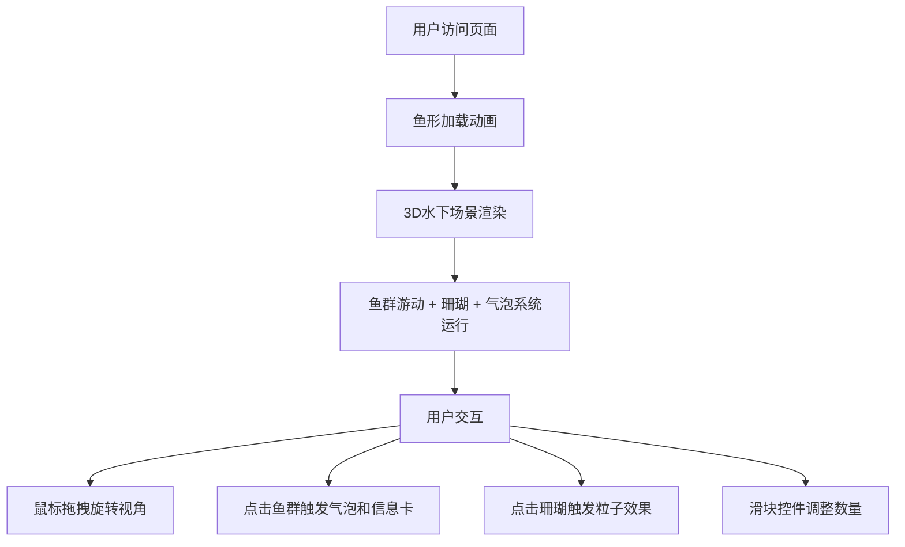

## 1. 产品概述
基于WebGL的虚拟水族箱项目，在浏览器中呈现一个充满生命力的水下3D世界。用户可以与鱼群、珊瑚、气泡等元素互动，获得沉浸式的视觉体验。

- 主要目的：创建一个视觉精美的交互式3D水下场景
- 目标用户：喜欢自然爱好者、WebGL技术演示受众
- 市场价值：展示WebGL技术在浏览器中的视觉表现能力，提供放松观赏体验

## 2. 核心功能

### 2.1 用户角色
无需注册，所有用户均为普通访客，可直接进入场景进行浏览和交互。

### 2.2 功能模块
1. **主场景页面**：3D水下世界展示、鱼群游动、珊瑚礁地形、气泡系统、水面波纹、光斑效果、加载动画、UI控制面板

### 2.3 页面详情

| 页面名称 | 模块名称 | 功能描述 |
|-----------|-------------|---------------------|
| 主场景 | 鱼群系统 | 小丑鱼（橙白条纹，随机曲线路径）、神仙鱼（蓝色渐变，珊瑚周围徘徊）、水母群（半透明粉紫，触须飘动，缓慢上下浮动），每类至少3条，身体正弦波摆动，碰撞避免 |
| 主场景 | 珊瑚礁地形 | 500个随机多面体珊瑚，颜色深蓝到珊瑚粉渐变，顶点扰动纹理，底部三分之一高度，点击触发抖动和发光粒子 |
| 主场景 | 气泡系统 | 30个半透明气泡，0.1-0.3半径随机，0.3-0.8速度上升，动态高光，到达水面破裂成3粒子消散 |
| 主场景 | 水面效果 | 半透明波纹平面，透明度0.2，波幅0.1，频率2.0，随时间波动，水底动态光斑（Caustics模拟 |
| 主场景 | 交互系统 | 鼠标拖拽旋转视角，点击鱼群触发气泡特效和信息卡片，视角阻尼过渡0.95缓动 |
| 主场景 | UI界面 | 毛玻璃效果控制面板，鱼群/气泡数量滑块（1-3倍），加载动画鱼形旋转 |

## 3. 核心流程
用户访问页面 → 显示鱼形加载动画（3秒旋转渐隐） → 进入水下3D场景 → 鼠标拖拽旋转视角 → 点击鱼群/珊瑚触发特效 → 通过滑块调整鱼群和气泡数量

## 4. 用户界面设计

### 4.1 设计风格
- **主色调**：深蓝(#0b1a2a) → 墨绿(#0d2a1a) 渐变背景
- **辅色调**：珊瑚粉(#ff7f50)、蓝色渐变、粉紫色
- **UI控件**：半透明毛玻璃效果，backdrop-filter: blur(10px)，圆角12px
- **字体**：现代无衬线字体，半透明文字
- **布局**：全屏Canvas，UI浮层式设计

### 4.2 页面设计概览

| 页面名称 | 模块名称 | UI元素 |
|-----------|-------------|-------------|
| 主场景 | 加载动画 | 鱼形图标旋转3秒后渐隐 |
| 主场景 | 3D场景 | 全屏WebGL渲染，鱼群游动，珊瑚礁地形 |
| 主场景 | 控制面板 | 左上角毛玻璃面板，鱼群/气泡数量滑块 |
| 主场景 | 信息卡片 | 点击鱼群时显示鱼群信息浮层 |

### 4.3 响应式
- 桌面优先，Canvas自适应窗口尺寸
- 移动端支持触摸拖拽旋转视角

### 4.4 3D场景指导

**环境与氛围**：
- 深蓝到墨绿的渐变背景，模拟水下环境
- 环境光+点光源组合，模拟水下光线

**光照设置**：
- 环境光：柔和蓝色调
- 方向光：从上方投射，模拟水面折射光
- 光斑效果：Caustics模拟，动态光斑在水底

**相机设置与运动**：
- PerspectiveCamera，初始视角
- 鼠标拖拽OrbitControls风格控制，阻尼0.95缓动

**构图与焦点元素**：
- 珊瑚礁地形占据底部1/3高度
- 鱼群在中上部空间游动
- 气泡从底部上升到水面Y=8处

**交互与动画**：
- 鱼体正弦波摆动
- 水母触须飘动
- 珊瑚顶点扰动
- 水面波纹波动
- 气泡破裂粒子效果

**后处理效果**：
- 水下雾效增强水下氛围
- 光斑叠加效果

**资源与性能预算**：
- 目标帧率30fps以上
- 鱼群和气泡数量可调（1-3倍）
- 优化渲染性能优先保证流畅
