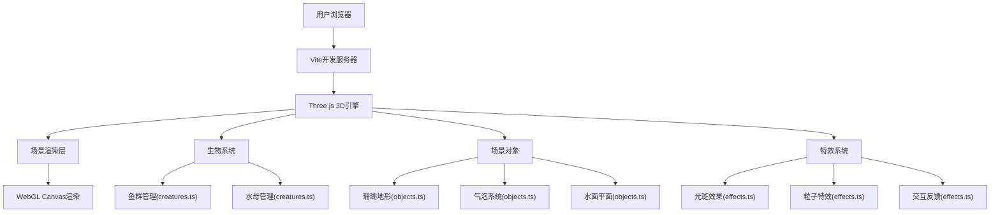

## 1. 架构设计



## 2. 技术说明
- **前端框架**: TypeScript + Three.js
- **构建工具**: Vite
- **开发语言**: TypeScript (严格模式, ES2020)
- **后端**: 无后端，纯前端WebGL应用
- **数据库**: 无需数据库

## 3. 路由定义
无需路由，单页应用，全场景渲染

## 4. API定义
无需后端API

## 5. 服务器架构图
无后端服务

## 6. 数据模型

### 6.1 核心数据结构

**鱼群数据模型**:
```typescript
interface Fish {
  type: 'clownfish' | 'angelfish' | 'jellyfish';
  mesh: THREE.Group;
  position: THREE.Vector3;
  velocity: THREE.Vector3;
  target: THREE.Vector3;
  speed: number;
  size: number;
  wigglePhase: number;
}
```

**珊瑚数据模型**:
```typescript
interface Coral {
  mesh: THREE.Mesh;
  position: THREE.Vector3;
  baseColor: THREE.Color;
  topColor: THREE.Color;
  shakePhase: number;
}
```

**气泡数据模型**:
```typescript
interface Bubble {
  mesh: THREE.Mesh;
  position: THREE.Vector3;
  velocity: number;
  radius: number;
}
```

### 6.2 项目文件结构

```
auto83/
├── package.json
├── index.html
├── tsconfig.json
├── vite.config.js
└── src/
    ├── main.ts          # 场景初始化、渲染循环、交互事件
    ├── creatures.ts     # 鱼群、水母创建与管理
    ├── objects.ts       # 珊瑚地形、气泡、水面
    └── effects.ts       # 光斑、粒子特效
```

## 7. 技术实现要点

### 7.1 渲染优化
- 使用BufferGeometry减少内存开销
- 鱼群使用InstancedMesh或合并几何体优化
- 合理设置相机远裁剪面，剔除不可见对象
- 限制粒子数量，定期回收粒子对象池

### 7.2 动画系统
- 鱼体摆动：正弦波+顶点着色器
- 珊瑚顶点扰动：噪声函数+顶点位移
- 水面波纹：ShaderMaterial实现波动
- 碰撞检测：简单距离检测避免鱼群重叠

### 7.3 交互系统
- Raycaster实现鼠标拾取
- 拖拽旋转：鼠标位置差计算旋转角度
- 阻尼缓动：lerp插值实现平滑过渡
- 点击反馈：粒子系统+信息卡片显示

### 7.4 着色器应用
- 水面波纹顶点着色器
- Caustics光斑片元着色器
- 鱼体材质自定义着色器
- 半透明水母材质
