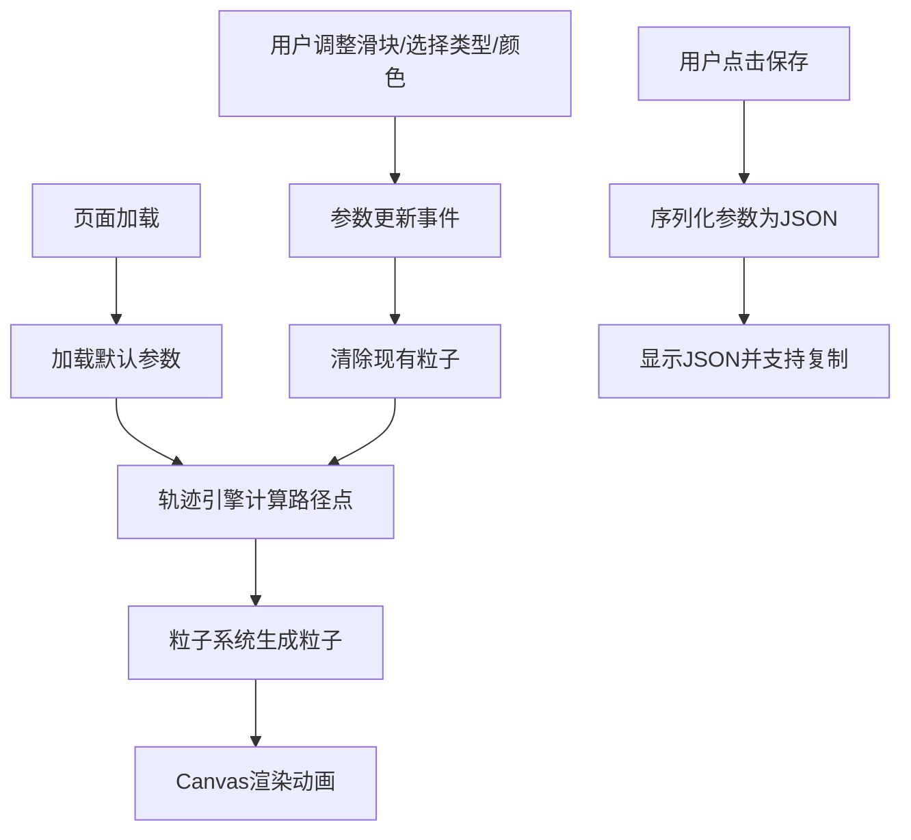

## 1. 产品概述
武器轨迹特效编辑器是一款面向独立游戏设计师的浏览器端交互式工具，用于快速调整和预览游戏中武器挥舞时的轨迹特效（剑气、锤风、法阵等），帮助设计师直观对比不同轨迹形状在攻击范围和视觉反馈上的差异。
- 核心价值：降低游戏特效设计的试错成本，提供即时可视化反馈
- 目标用户：独立游戏设计师、动作游戏美术人员、游戏原型开发者

## 2. 核心功能

### 2.1 用户角色
本产品为单用户工具，无角色区分。

### 2.2 功能模块
1. **Canvas预览区**：实时渲染武器挥动粒子动画和攻击范围覆盖层
2. **参数控制面板**：轨迹类型选择、滑块参数调节、颜色选择、配置保存
3. **轨迹计算引擎**：根据参数生成扇形/弧形/长条轨迹关键点
4. **粒子系统**：粒子池管理、生命周期更新、渐变色彩渲染

### 2.3 页面详情
| 页面名称 | 模块名称 | 功能描述 |
|-----------|-------------|---------------------|
| 主页面 | Canvas预览区 | 全屏Canvas渲染粒子动画，显示半透明红色攻击覆盖范围，尺寸跟随视口变化但不超过1920x1080 |
| 主页面 | 控制面板标题栏 | 显示"武器轨迹编辑器"标题，居中，18px粗体 |
| 主页面 | 轨迹类型选择组 | 三个圆角按钮（扇形/弧形/长条），激活态高亮，切换时立即清除粒子并淡入新动画 |
| 主页面 | 参数滑块组 | 5个滑块：扇形角度(30-180°)、弧形半径(30-80px)、长条长度(50-150px)、动画时长(0.2-1.2s)、粒子密度(10-50) |
| 主页面 | 颜色选择组 | 6个预设色块，点击选中显示白色边框和阴影，自动生成HSL偏移60°的结束色 |
| 主页面 | 保存配置模块 | 保存按钮导出JSON参数，显示JSON字符串并支持一键复制到剪贴板 |

## 3. 核心流程
用户打开页面 → 加载默认示例配置（扇形90°、橙色、0.6s、密度30）→ 用户调整参数 → 参数变更事件触发 → 轨迹引擎计算新路径点 → 粒子系统清除旧粒子并沿新路径生成新粒子序列 → Canvas实时渲染粒子渐变动画 + 攻击范围覆盖层 → 用户点击保存 → 生成JSON配置并复制

## 4. 用户界面设计

### 4.1 设计风格
- **主题色调**：暗色主题，主背景#1a1a2e，面板背景#16213e，强调色#e94560（亮红色），次级色#0f3460（深蓝）
- **按钮样式**：圆角按钮，激活态#e94560，常态#0f3460，悬停微亮，点击缩放0.95过渡0.1s
- **字体**：无衬线系统字体，标题18px粗体#e94560，标签14px#a0a0a0，正文白色
- **布局风格**：左主区域（预览）+ 右侧固定面板（320px全高），移动端面板折叠到底部80px可展开
- **滑块样式**：轨道#0f3460，拇指#e94560圆形16px

### 4.2 页面设计概述
| 页面名称 | 模块名称 | UI元素 |
|-----------|-------------|-------------|
| 主页面 | 预览区 | 全屏Canvas，深色背景，粒子动画流畅渲染，底部半透明红色攻击范围 |
| 主页面 | 控制面板 | 320px宽全高，圆角8px，0.5px边框#0f3460，内边距均匀16px |
| 主页面 | 轨迹类型组 | 三个等宽圆角按钮并排，间距8px |
| 主页面 | 滑块组 | 每个滑块带标签+数值显示，垂直间距12px |
| 主页面 | 颜色选择组 | 6个20x20px色块网格排列，间距8px |
| 主页面 | 保存区 | 90%宽按钮，下方JSON输出区带复制按钮 |

### 4.3 响应式
- **桌面端优先**（≥768px）：左侧预览区 + 右侧320px面板
- **移动端适配**（<768px）：控制面板折叠为底部80px栏，点击展开；预览区缩放适配视口；触摸优化滑块交互

### 4.4 动画与性能
- 粒子缓动：cubic-bezier(0.25, 0.1, 0.25, 1) 缓出曲线
- 粒子生命周期：透明度1→0，大小4px→8px→2px（三角波）
- 色彩渐变：主色到HSL+60°补色平滑过渡
- 性能：维持60FPS，粒子>40且FPS<55时自动降低透明度分辨率
- 过渡时长：所有UI过渡控制在0.3秒内
