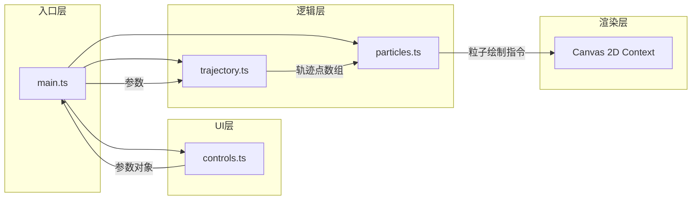

## 1. 架构设计



**文件调用关系和数据流向：**
1. **main.ts**（入口）：接收 controls.ts 的参数变更事件 → 传给 trajectory.ts 计算路径 → 将路径点传给 particles.ts → 驱动 Canvas 渲染循环
2. **controls.ts**（UI）：监听表单元素 → 组装参数对象 → 通过回调传递给 main.ts
3. **trajectory.ts**（纯函数）：接收参数 → 计算并返回轨迹关键点数组，无副作用
4. **particles.ts**（粒子系统）：接收轨迹点数组 → 生成/更新粒子池 → 输出每帧渲染状态

## 2. 技术描述
- **前端框架**：无框架，纯 TypeScript + 原生 Canvas 2D API
- **构建工具**：Vite 5.x
- **语言**：TypeScript 5.x（严格模式，目标 ES2020，模块 ESNext）
- **样式**：原生 CSS（内联在 index.html 中），CSS 变量统一主题色
- **无后端、无数据库、无外部服务依赖**

## 3. 项目文件结构
```
/
├── package.json          # 依赖声明 (typescript, vite) 与启动脚本
├── vite.config.js        # Vite 基础构建配置
├── tsconfig.json         # TS 严格模式配置
├── index.html            # 入口页面 (#preview 容器 + #panel 侧边栏)
└── src/
    ├── main.ts           # 入口：初始化Canvas与控制面板，串联各模块
    ├── trajectory.ts     # 轨迹计算模块（纯函数）
    ├── particles.ts      # 粒子系统模块
    └── controls.ts       # 控制面板 UI 模块
```

## 4. 数据模型与类型定义

### 4.1 核心类型
```typescript
// 轨迹类型
type TrajectoryType = 'fan' | 'arc' | 'bar';

// 编辑器参数
interface EditorParams {
  type: TrajectoryType;
  fanAngle: number;       // 扇形角度 30-180 度
  arcRadius: number;      // 弧形半径 30-80 px
  barLength: number;      // 长条长度 50-150 px
  duration: number;       // 动画时长 0.2-1.2 s
  density: number;        // 粒子密度 10-50
  color: string;          // 主色 HEX
}

// 2D 点
interface Point2D {
  x: number;
  y: number;
}

// 粒子
interface Particle {
  x: number;
  y: number;
  vx: number;
  vy: number;
  birth: number;          // 出生时间戳 (ms)
  life: number;           // 存活时长 (ms)
  startColor: HSL;
  endColor: HSL;
}

// HSL 颜色
interface HSL {
  h: number;
  s: number;
  l: number;
}
```

## 5. 模块职责与 API

### 5.1 trajectory.ts（轨迹计算）
纯函数模块，无状态、无副作用。
```typescript
// 根据参数计算轨迹关键点
export function computeTrajectory(
  params: EditorParams,
  centerX: number,
  centerY: number
): Point2D[];

// 辅助：扇形轨迹点
function computeFan(centerX, centerY, radius, angleDeg, steps): Point2D[];

// 辅助：弧形轨迹点
function computeArc(centerX, centerY, radius, steps): Point2D[];

// 辅助：长条轨迹点
function computeBar(centerX, centerY, length, steps): Point2D[];
```

### 5.2 particles.ts（粒子系统）
带内部状态的类，管理粒子池与渲染。
```typescript
export class ParticleSystem {
  constructor(ctx: CanvasRenderingContext2D);
  setTrajectory(points: Point2D[], params: EditorParams): void;  // 设置新轨迹并清除旧粒子
  update(now: number): void;                                      // 每帧更新粒子
  render(): void;                                                 // 渲染当前粒子
  clear(): void;                                                  // 立即清除所有粒子
  getActiveCount(): number;                                       // 当前活跃粒子数
  setFps(fps: number): void;                                      // 传入 FPS 用于性能自适应
}
```

### 5.3 controls.ts（控制面板 UI）
```typescript
export function createControls(
  container: HTMLElement,
  defaultParams: EditorParams,
  onChange: (params: EditorParams) => void,
  onSave: (params: EditorParams) => void
): void;
```

## 6. 性能策略
- **粒子池复用**：预先分配粒子对象池，避免 GC 抖动
- **FPS 监控**：每 500ms 计算一次 FPS，粒子数 > 40 且 FPS < 55 时将透明度插值从 8 级降为 4 级
- **Canvas 尺寸限制**：与视口同步但最大不超过 1920×1080（使用 devicePixelRatio 取 min）
- **RAF 驱动**：使用 requestAnimationFrame，标签页隐藏时暂停

## 7. 色彩工具
- HEX → HSL 转换函数
- HSL → `hsl(h,s%,l%)` 字符串函数
- 主色偏移 60° 生成补色（hue +60，mod 360）
