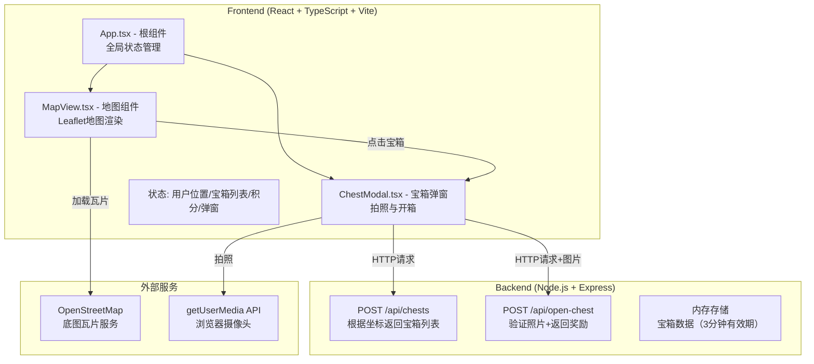
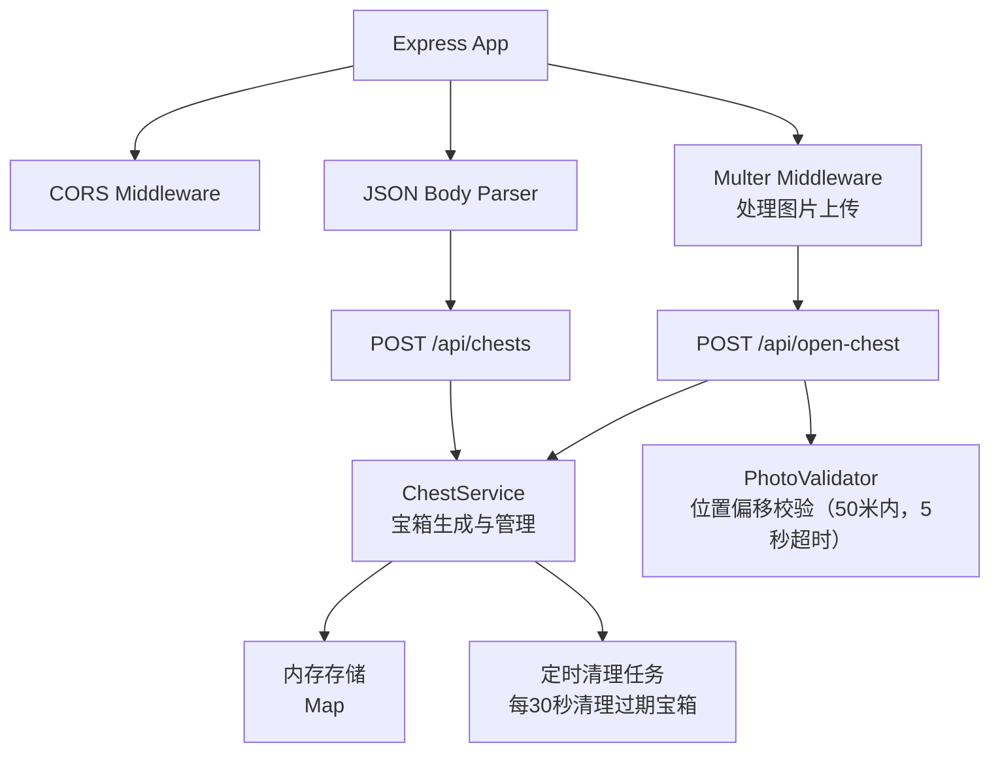
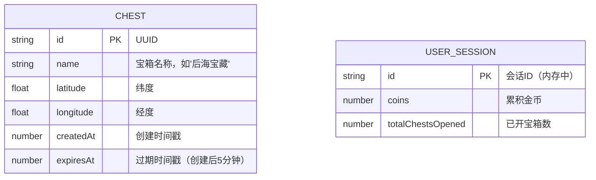

## 1. 架构设计



## 2. 技术描述
- **前端**：React 18 + TypeScript + Vite
- **UI框架**：原生CSS + CSS Modules样式（不使用UI组件库，自定义暗色主题）
- **地图库**：Leaflet 1.9 + OpenStreetMap瓦片
- **状态管理**：React useState/useReducer（轻量级状态，无需zustand）
- **后端**：Express 4.x
- **文件上传**：Multer
- **跨域**：CORS中间件
- **唯一标识**：UUID
- **数据存储**：内存变量（宝箱列表，3分钟过期清理）

## 3. 路由定义
| 路由 | 用途 |
|------|------|
| / | 首页，地图与游戏主界面 |

## 4. API 定义

### 4.1 POST /api/chests
根据用户坐标返回附近宝箱列表。

**请求体：**
```typescript
interface GetChestsRequest {
  latitude: number;
  longitude: number;
}
```

**响应体：**
```typescript
interface Chest {
  id: string;
  name: string;
  latitude: number;
  longitude: number;
  createdAt: number;
  expiresAt: number;
}

interface GetChestsResponse {
  success: boolean;
  chests: Chest[];
}
```

### 4.2 POST /api/open-chest
验证照片位置偏移并返回开箱结果。

**请求体（multipart/form-data）：**
```
image: 文件（640x480 JPEG/PNG）
chestId: string
latitude: number（用户拍摄时的坐标）
longitude: number（用户拍摄时的坐标）
```

**响应体：**
```typescript
interface OpenChestResponse {
  success: boolean;
  message: string;
  coins?: number;  // 5-15随机金币
  reward?: {
    type: 'coins' | 'skin_fragment' | 'points';
    amount: number;
    name: string;
  };
}
```

## 5. 服务器架构图



## 6. 数据模型

### 6.1 数据模型定义



### 6.2 数据定义语言
（内存存储，无数据库DDL，以下为TypeScript接口定义）

```typescript
interface Chest {
  id: string;
  name: string;
  latitude: number;
  longitude: number;
  createdAt: number;
  expiresAt: number;
}

interface UserState {
  coins: number;
  position: {
    latitude: number;
    longitude: number;
  } | null;
  openedChests: string[];
}
```
