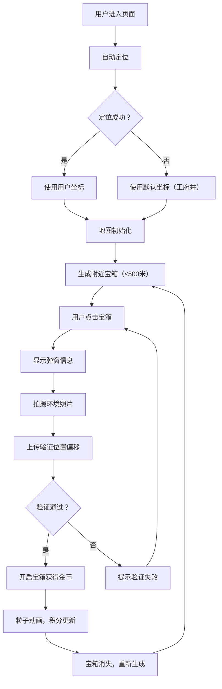

## 1. 产品概述
基于位置签到打卡的虚拟城市寻宝游戏，用户通过在现实世界中移动探索，发现并开启附近的虚拟宝箱，获取虚拟奖励。
- 主要目的：结合LBS（基于位置服务）与游戏化机制，鼓励用户户外探索
- 目标用户：喜欢探索城市、追求游戏化体验的年轻用户
- 产品价值：将现实世界与虚拟游戏结合，创造沉浸式城市探索体验

## 2. 核心功能

### 2.1 用户角色
| 角色 | 注册方式 | 核心权限 |
|------|----------|----------|
| 普通用户 | 无需注册，直接使用 | 探索宝箱、开启宝箱、累积积分 |

### 2.2 功能模块
1. **地图页面**：用户位置标记、宝箱标记、地图交互
2. **宝箱弹窗**：宝箱信息展示、距离计算、拍照验证、开箱操作
3. **积分系统**：金币累积、积分显示、奖励动画

### 2.3 页面详情
| 页面名称 | 模块名称 | 功能描述 |
|----------|----------|----------|
| 地图主页面 | 用户定位模块 | 自动获取用户位置，失败则使用默认坐标（北京王府井39.917, 116.397） |
| 地图主页面 | 用户标记模块 | 蓝色脉冲圆圈标记用户位置，半径20米，2秒呼吸动画 |
| 地图主页面 | 宝箱标记模块 | 金色箱子图标（24x24像素），3秒旋转动画，悬停显示说明 |
| 地图主页面 | 积分显示模块 | 右上角圆角胶囊样式，渐变背景（#ff6b6b→#feca57），显示累积金币 |
| 宝箱弹窗 | 信息展示模块 | 宝箱名称、距离（精确到米，每5秒刷新）、剩余存在时间（5分钟） |
| 宝箱弹窗 | 拍照验证模块 | 调用getUserMedia拍摄640x480环境照片，上传验证位置偏移（50米内） |
| 宝箱弹窗 | 开箱模块 | 验证通过后开启宝箱，获得5-15随机金币 |
| 宝箱弹窗 | 奖励动画模块 | 10个金色粒子从宝箱位置飞向积分图标，4-8像素，0.8秒飞行，渐变透明 |

## 3. 核心流程
用户进入页面 → 系统自动定位 → 地图加载并标记用户位置 → 附近生成随机宝箱（距用户≤500米） → 用户点击宝箱 → 弹窗显示宝箱信息与距离 → 用户拍摄环境照片 → 后端校验位置偏移（50米内，超时5秒） → 验证成功，开箱获得金币 → 触发粒子动画，积分更新 → 宝箱消失，别处重新生成 → 循环探索

## 4. 用户界面设计

### 4.1 设计风格
- **暗色主题**：主背景#1a1a2e，卡片背景#16213e，强调色#e94560和#0f3460
- **主/辅色**：金色（宝箱）#ffd700，蓝色（用户位置）#3498db
- **按钮样式**：圆角按钮，悬停缩放scale(1.05)，过渡0.2s ease-out
- **字体**：现代无衬线字体，积分文字加粗16px，颜色#2d3436
- **布局风格**：桌面端地图占80%宽度居中，手机端全屏显示
- **弹窗样式**：毛玻璃效果rgba(20,20,30,0.85)，blur(8px)，圆角12px

### 4.2 页面设计概述
| 页面名称 | 模块名称 | UI元素 |
|----------|----------|--------|
| 地图主页面 | 用户标记 | 蓝色脉冲圆圈，半径20米，2秒呼吸动画 |
| 地图主页面 | 宝箱标记 | 金色箱子图标，24x24像素，3秒旋转动画 |
| 地图主页面 | 积分胶囊 | 右上角，渐变背景#ff6b6b→#feca57，圆角胶囊 |
| 宝箱弹窗 | 弹窗容器 | 半透明毛玻璃背景，圆角12px，居中显示 |
| 宝箱弹窗 | 信息区域 | 宝箱名称、距离、倒计时，清晰排版 |
| 宝箱弹窗 | 拍照区域 | 摄像头预览、拍照按钮、状态提示 |
| 宝箱弹窗 | 开启按钮 | 强调色背景，悬停缩放效果 |
| 全局 | 粒子动画 | 金色粒子拖尾，从宝箱飞向积分图标 |

### 4.3 响应式
- 桌面端：地图占页面80%宽度，居中显示，弹窗居中且宽度适中（400px）
- 移动端：地图全屏覆盖，弹窗全屏覆盖，适配触摸操作
- 触摸优化：按钮最小尺寸44x44px，点击区域充足

### 4.4 性能要求
- 页面加载后2秒内完成地图初始化
- 宝箱列表刷新间隔不超过3秒（使用setInterval）
- 距离信息每5秒刷新一次
- 粒子动画流畅60fps
