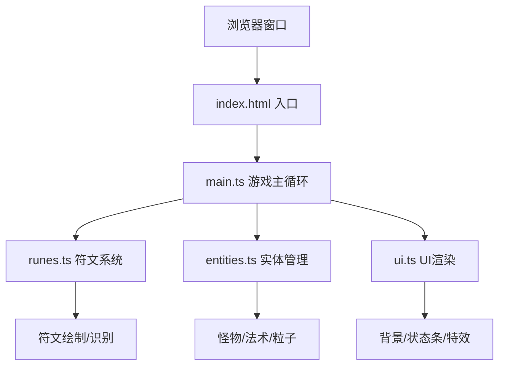

## 1. 架构设计



## 2. 技术说明

- **前端框架**：纯 TypeScript + 原生 Canvas API（无第三方图形库）
- **构建工具**：Vite 5.x
- **语言目标**：ES2020，严格模式 TypeScript
- **渲染方式**：单 Canvas 2D Context 分层绘制
- **性能策略**：对象池复用、实体总数限制（≤300）、requestAnimationFrame 驱动

## 3. 模块职责

| 文件 | 职责 |
|-----|-----|
| `src/main.ts` | 游戏入口：Canvas初始化、主循环、事件绑定、全局状态管理 |
| `src/runes.ts` | 符文系统：3种符文路径定义、笔迹记录、形状匹配算法、绘制状态机 |
| `src/entities.ts` | 实体管理：怪物配置(JSON)、生成移动、法术效果、粒子系统、碰撞检测 |
| `src/ui.ts` | UI渲染：石板背景、HP/MP条、金币、法术库、传送门、屏幕特效 |

## 4. 核心数据结构

### 4.1 符文定义
```typescript
interface RunePattern {
  id: string;
  name: string;
  description: string;
  strokeCount: number;
  strokes: Point[][];  // 标准笔划路径
  spellType: 'fire' | 'ice' | 'lightning';
}
```

### 4.2 怪物配置
```typescript
interface MonsterConfig {
  type: 'slime' | 'skeleton' | 'bat';
  hp: number;
  speed: number;
  gold: number;
  color: string;
  size: number;
}
```

### 4.3 游戏状态
```typescript
interface GameState {
  hp: number;
  maxHp: number;
  mp: number;
  maxMp: number;
  gold: number;
  combo: number;
  monsters: Monster[];
  particles: Particle[];
  spells: Spell[];
}
```

## 5. 性能约束

- 目标帧率：≥ 30fps
- 同屏实体上限：怪物 + 粒子 + 法术 ≤ 300
- 超出回收策略：FIFO 回收最早生成的粒子
- 绘制优化：离屏 Canvas 缓存静态背景纹理
