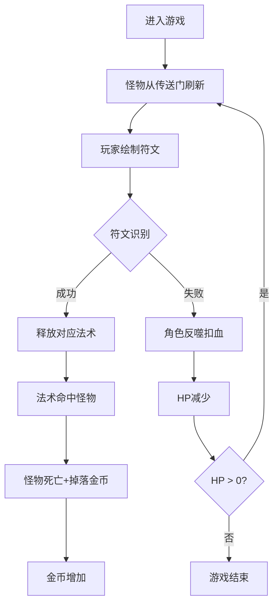

## 1. 产品概述

魔法对抗游戏是一款浏览器端的符文手势施法游戏，玩家扮演法师通过绘制符文图案释放法术消灭不断涌来的怪物。
- 核心玩法：鼠标手势识别 + 实时战斗 + 资源管理（HP/MP/金币）
- 目标用户：休闲游戏玩家、魔法题材爱好者

## 2. 核心功能

### 2.1 功能模块
1. **符文绘制系统**：中央绘制区、手势识别、3种符文图案检测
2. **战斗系统**：怪物生成、移动AI、碰撞检测、施法效果、伤害计算
3. **UI界面系统**：状态条、金币计数、法术库、传送门特效、石板背景
4. **粒子效果系统**：法术爆炸、怪物破碎、屏幕闪烁特效

### 2.2 页面详情
| 页面名称 | 模块名称 | 功能描述 |
|---------|---------|---------|
| 游戏主界面 | 符文绘制区 | 200x200方形区域，支持鼠标拖拽绘制、笔迹显示、识别反馈 |
| 游戏主界面 | 角色状态栏 | HP/MP进度条、连击计数显示 |
| 游戏主界面 | 怪物战场 | 左右传送门刷怪、怪物移动、碰撞区域 |
| 游戏主界面 | 法术库 | 3种法术图标展示、悬停提示名称和描述 |
| 游戏主界面 | 金币计数器 | 左下角金币数量显示、获取时跳动动画 |
| 游戏主界面 | 背景系统 | 石板纹理、旋转符文线条装饰 |

## 3. 核心流程

玩家进入游戏 → 怪物从左右传送门刷出 → 玩家在绘制区拖拽画符文 → 系统识别符文图案 → 识别成功释放对应法术(火球/冰环/闪电) → 法术消灭怪物获得金币 → 识别失败角色受反噬扣血 → HP归零游戏结束

## 4. 用户界面设计

### 4.1 设计风格
- **主色调**：暗黑奇幻风，主背景 #1a0f0a，石板底 #2a1a0e
- **强调色**：琥珀色 #e8b85a（文字UI），棕色 #8b4513（边框按钮），橙红 #ff6b35（重要数值）
- **特效色**：金色 #FFD700（符文笔迹/金币），绿色 #00ff88（正确反馈），红色 #ff3333（错误反馈）
- **字体**：奇幻风格衬线体，连击数字使用火焰风格字体
- **布局**：中央绘制区 + 右侧状态面板 + 左下资源面板 + 左右两侧传送门

### 4.2 页面设计概览
| 页面名称 | 模块名称 | UI元素 |
|---------|---------|---------|
| 游戏主界面 | 石板背景 | #2a1a0e底色 + 半透明符文线条纹理 + 每10秒旋转360度 |
| 游戏主界面 | 符文绘制区 | 200x200方形，#ffffff33半透明白边，发光金色笔迹#ffd700带3px blur |
| 游戏主界面 | HP/MP条 | HP从#ff4444渐变到#ff8888，MP从#4444ff渐变到#8888ff，0.3秒平滑过渡 |
| 游戏主界面 | 传送门 | 紫色漩涡，径向渐变+旋转弧形线条动画 |
| 游戏主界面 | 法术图标 | 圆形带描边，悬停显示法术名称和描述 |
| 游戏主界面 | 金币计数器 | 金色#FFD700，获取时跳动动画 |

### 4.3 响应式
- 桌面端优先，全屏Canvas自适应窗口大小
- 鼠标交互优化，不考虑移动端触控

### 4.4 动效设计
- 背景符文纹理：每10秒缓慢旋转360度
- 怪物死亡：10-20个与怪物同色碎片飞散，持续0.6秒
- 火球爆炸：橙色粒子，半径60px
- 冰环效果：蓝色冻结，半径100px，减速3秒
- 角色受伤：屏幕边缘红光闪烁（透明度0.2→0，持续0.5秒）
- 符文识别错误：屏幕闪烁红色0.3秒
