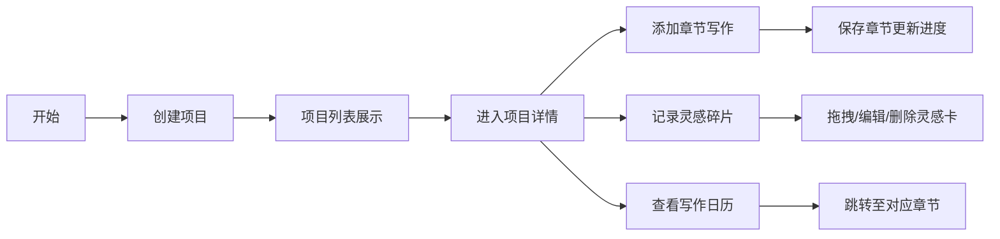

## 1. 产品概述
创意写作流程管理Web应用，解决写作者在长篇小说或项目写作中缺乏可视化进度追踪和灵感碎片整理的问题。
- 面向对象：小说作者、内容创作者、学术写作者
- 核心价值：通过可视化进度追踪、灵感碎片管理和写作日历，帮助作者高效管理创作流程

## 2. 核心功能

### 2.1 功能模块
1. **项目管理模块**：创建项目、项目列表展示、搜索过滤、项目详情
2. **章节编辑模块**：章节添加、富文本编辑、字数统计、进度条
3. **灵感碎片板模块**：灵感卡片创建、拖拽移动、编辑、删除动画
4. **写作日历模块**：日历视图、章节标记、悬停预览、跳转功能

### 2.2 页面详情
| 页面名称 | 模块名称 | 功能描述 |
|-----------|-------------|---------------------|
| 主应用 | 项目列表 | 创建项目、两列网格展示、搜索过滤（300ms防抖） |
| 主应用 | 项目详情 | 进度条展示、章节列表管理、章节富文本编辑器 |
| 主应用 | 灵感碎片板 | 瀑布流布局、双击创建、拖拽移动、长按删除 |
| 主应用 | 写作日历 | 日历视图、章节圆点标记、悬停显示、点击跳转 |

## 3. 核心流程
用户创建项目 → 进入项目详情 → 添加章节进行写作（实时字数统计）→ 在灵感板记录创作灵感 → 通过写作日历回顾历史创作。

## 4. 用户界面设计

### 4.1 设计风格
- **主色调**：淡米白（#F5F0E8）背景，深灰（#2D2D2D）文字
- **强调色**：温暖琥珀色（#D4A373）
- **卡片样式**：圆角12px，轻微阴影 `box-shadow: 0 2px 8px rgba(0,0,0,0.06)`
- **交互效果**：悬停时阴影加深并上移3px，过渡0.3秒
- **特殊样式**：灵感卡片有3px颜色左边框，字数统计用淡绿色高亮

### 4.2 页面设计概述
| 页面名称 | 模块名称 | UI元素 |
|-----------|-------------|-------------|
| 主应用 | 项目列表 | 两列网格、渐变遮罩封面、搜索框、创建按钮 |
| 主应用 | 项目详情 | 顶部进度条、章节列表、富文本编辑器、字数统计 |
| 主应用 | 灵感碎片板 | 瀑布流布局、彩色标签卡片、拖拽效果、删除动画 |
| 主应用 | 写作日历 | 月历网格、圆点标记、悬停提示、点击跳转 |

### 4.3 响应式设计
- **桌面端**：三栏布局（项目列表 | 章节编辑器 | 灵感碎片板）
- **平板端（<768px）**：上下结构（上方编辑区，下方灵感板和日历）
- **移动端**：单栏全宽布局，折叠式导航

### 4.4 性能指标
- 章节保存和字数更新响应时间 < 100ms
- 灵感卡片拖拽帧率 ≥ 30fps
- 左侧导航栏折叠动画：300ms缓动
- 删除动画：缩小淡出效果
