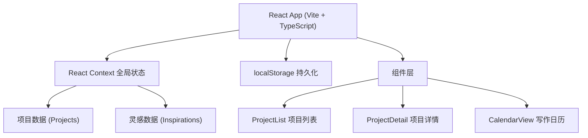
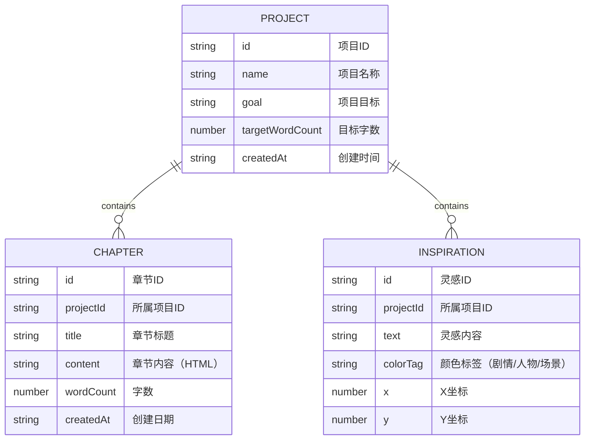

## 1. 架构设计



## 2. 技术描述
- **前端框架**：React 18 + TypeScript
- **构建工具**：Vite 5
- **状态管理**：React Context
- **数据持久化**：localStorage
- **样式方案**：纯CSS（无UI库，自定义设计系统）

## 3. 路由定义
此应用为单页应用（SPA），使用内部状态管理视图切换，无需URL路由。

| 视图 | 描述 |
|-------|------|
| 主页 | 项目列表展示 |
| 项目详情 | 章节编辑器 + 灵感碎片板 + 写作日历 |

## 4. 数据模型

### 4.1 数据模型定义



### 4.2 TypeScript 类型定义

```typescript
interface Project {
  id: string;
  name: string;
  goal: string;
  targetWordCount: number;
  createdAt: string;
}

interface Chapter {
  id: string;
  projectId: string;
  title: string;
  content: string;
  wordCount: number;
  createdAt: string;
}

interface Inspiration {
  id: string;
  projectId: string;
  text: string;
  colorTag: 'plot' | 'character' | 'scene';
  x: number;
  y: number;
}

type ColorTag = 'plot' | 'character' | 'scene';
```

## 5. 文件结构

```
.
├── package.json
├── vite.config.js
├── tsconfig.json
├── index.html
└── src/
    ├── main.tsx
    ├── App.tsx
    ├── components/
    │   ├── ProjectList.tsx
    │   ├── ProjectDetail.tsx
    │   └── CalendarView.tsx
    └── utils/
        └── storage.ts
```

## 6. 性能优化方案

1. **localStorage读写优化**：使用debounce（防抖）减少写入频率，章节保存使用即时写入确保数据安全
2. **拖拽性能**：使用CSS `transform` 实现拖拽，避免回流重绘，确保帧率≥30fps
3. **搜索防抖**：300ms防抖处理搜索输入，避免频繁过滤
4. **动画优化**：使用CSS transitions/animations实现删除缩小淡出效果，GPU加速
5. **字数统计**：实时计算但仅在保存时持久化，减少不必要的localStorage写入
