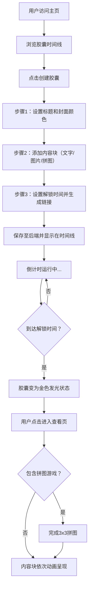

## 1. 产品概述
时间胶囊是一个在浏览器中创建并分享动态回忆的在线平台，用户可以用富媒体形式（文字、图片、互动拼图）封装一段回忆，设置未来解锁时间，在指定时刻打开查看或分享给他人。
- 解决用户无法以富媒体形式封装情感回忆并进行延时情感传递的问题
- 目标用户为需要记录珍贵回忆、给未来的自己或他人发送信息的人群
- 产品价值：创造独特的时间延迟情感体验，通过互动元素增强回忆的仪式感

## 2. 核心功能

### 2.1 功能模块
1. **时间线主页**：胶囊卡片列表、解锁倒计时、状态展示、悬停动效
2. **胶囊创建向导**：三步表单（标题封面→内容块→解锁时间与分享链接）
3. **胶囊查看页**：全屏沉浸模式、渐变背景、内容块动画展示
4. **迷你拼图游戏**：3x3随机拼图、拖拽交换、完成检测、操作统计

### 2.2 页面详情
| 页面名称 | 模块名称 | 功能描述 |
|---------|---------|---------|
| 时间线主页 | 胶囊卡片网格 | 按解锁时间排序展示所有胶囊，支持桌面端两列/移动端单列布局 |
| 时间线主页 | 倒计时组件 | 每秒实时更新未解锁胶囊的剩余时间（xx天xx小时xx分钟） |
| 时间线主页 | 胶囊状态展示 | 灰色半透明加锁/金色发光解锁两种视觉状态 |
| 创建向导 | 标题与封面设置 | 输入胶囊标题，从预设8色调色板选择封面颜色 |
| 创建向导 | 内容块编辑 | 添加/删除/拖拽排序内容块（文字卡片、图片上传、拼图游戏） |
| 创建向导 | 解锁时间设置 | 精确到分钟的未来时间选择器，生成唯一8位分享链接 |
| 胶囊查看页 | 沉浸式背景 | 从封面色到#111的径向渐变背景 |
| 胶囊查看页 | 内容块展示 | 淡入上移动画（stagger 0.15s）、毛玻璃文字卡片、缩放图片效果 |
| 迷你拼图 | 游戏交互 | 3x3网格拼图，支持手动/自动打乱，拖拽交换拼图块 |
| 迷你拼图 | 完成检测 | 自动检测拼图完整性，完成后触发解锁事件，记录步数和时间 |

## 3. 核心流程
用户从主页进入，可浏览已有胶囊或点击创建新胶囊。创建向导引导用户依次设置标题封面、添加内容块、设置解锁时间并生成分享链接。创建完成后胶囊出现在时间线中，未解锁时显示倒计时。到达解锁时间后胶囊变为金色发光状态，用户点击进入沉浸式查看页，内容块依次动画呈现。若胶囊包含拼图游戏，需完成拼图方可查看完整内容。

## 4. 用户界面设计
### 4.1 设计风格
- 主背景色：#1a1a2e（深色模式），次级背景：#16213e
- 霓虹色系点缀：#00d2ff亮蓝、#ff6b6b珊瑚红、#ffd93d亮黄
- 按钮风格：圆角设计，悬停时0.3s过渡（缩放1.05倍或背景色渐变）
- 字体：现代无衬线字体，标题使用粗体，正文使用常规字重
- 布局风格：卡片式布局，桌面端两列网格（卡片宽320px），移动端单列自适应
- 图标风格：简约线性图标，状态图标使用实心霓虹色

### 4.2 页面设计概览
| 页面名称 | 模块名称 | UI元素 |
|---------|---------|---------|
| 时间线主页 | 胶囊卡片 | 封面色背景条、标题文字、创建时间、倒计时标签、悬停上浮3px+阴影加深0.3s ease-out |
| 创建向导 | 步骤指示器 | 三步进度条，当前步骤高亮霓虹蓝 |
| 创建向导 | 调色板 | 8色圆形色块，选中状态带霓虹发光边框 |
| 创建向导 | 内容块列表 | 可拖拽排序，每类内容块有独特图标和预览 |
| 胶囊查看页 | 背景 | 从封面色到#111的径向渐变，全屏沉浸 |
| 胶囊查看页 | 内容卡片 | 毛玻璃效果（backdrop-filter: blur(8px)），淡入上移动画 |
| 胶囊查看页 | 图片展示 | 柔和阴影，悬停放大1.05倍，0.4s过渡 |
| 迷你拼图 | 拼图块 | 拖拽高亮边框，交换动画，完成时金色闪光效果 |

### 4.3 响应式设计
- 桌面端优先（>=768px）：两列网格布局，胶囊卡片固定宽度320px
- 移动端（<768px）：单列列表布局，卡片宽度100%自适应
- 触控优化：拼图游戏支持触摸拖拽，按钮最小点击区域48x48px

## 5. 性能要求
- 首页时间线首次渲染时间：≤1.5秒（50个胶囊卡片时）
- 拼图游戏拖拽帧率：≥55fps
- 图片自动压缩：上传后自动转换为webp格式，最大2MB
- 倒计时更新：使用requestAnimationFrame或setInterval优化，避免不必要的重渲染
