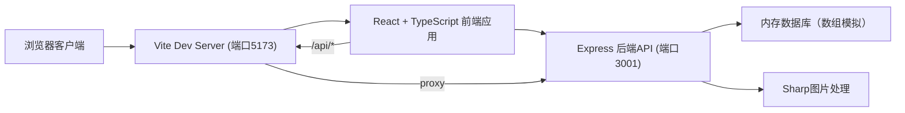
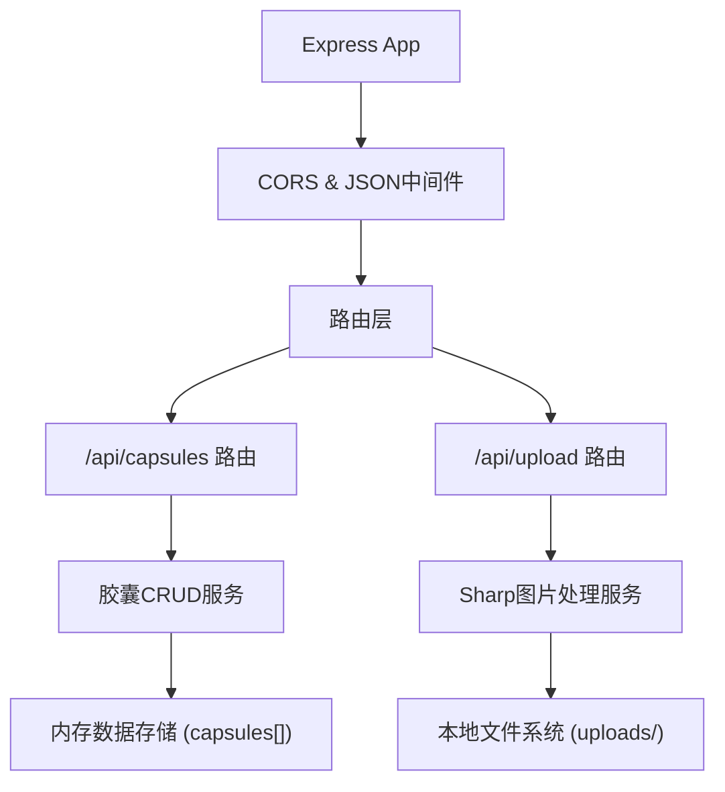
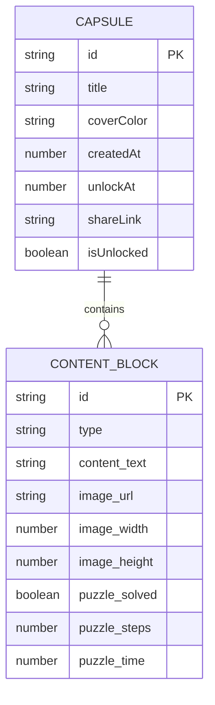

## 1. 架构设计



## 2. 技术栈说明
- 前端：React 18 + TypeScript + Vite 5
- 构建工具：Vite 5（含@vitejs/plugin-react）
- 后端：Express 4 + TypeScript
- 图片处理：Sharp（压缩转换为webp）
- 跨域处理：CORS中间件
- ID生成：uuid（v4）
- 路由：React Router（轻量hash路由或自定义状态路由）
- 状态管理：React useState/useReducer + Context API
- 样式方案：CSS Modules + 原生CSS变量

## 3. 路由定义
| 路由路径 | 页面/组件 | 用途 |
|---------|----------|------|
| / | CapTimeLine | 时间线主页，展示所有胶囊 |
| /create | CapCreateWizard | 创建新胶囊向导 |
| /capsule/:id | CapViewer | 胶囊查看页（沉浸式全屏） |
| /api/capsules (GET) | Express API | 获取所有胶囊列表 |
| /api/capsules/:id (GET) | Express API | 获取单个胶囊详情 |
| /api/capsules (POST) | Express API | 创建新胶囊 |
| /api/upload (POST) | Express API | 图片上传并压缩处理 |

## 4. API 数据定义

### TypeScript 类型定义
```typescript
type ContentBlockType = 'text' | 'image' | 'puzzle';

interface TextBlock {
  id: string;
  type: 'text';
  content: string; // Markdown文本，最多500字
}

interface ImageBlock {
  id: string;
  type: 'image';
  url: string;      // 处理后webp图片路径
  width: number;
  height: number;
}

interface PuzzleBlock {
  id: string;
  type: 'puzzle';
  solved: boolean;        // 是否已完成
  steps: number;          // 操作步数
  timeSpent: number;      // 耗时(秒)
  unlockRequired: boolean; // 是否需要完成才能解锁内容
}

type ContentBlock = TextBlock | ImageBlock | PuzzleBlock;

interface Capsule {
  id: string;             // 唯一ID (时间戳+随机字符串，8位)
  title: string;          // 胶囊标题
  coverColor: string;     // 封面颜色(HEX)
  contentBlocks: ContentBlock[];
  createdAt: number;      // 创建时间戳
  unlockAt: number;       // 解锁时间戳
  shareLink: string;      // 分享链接
  isUnlocked: boolean;    // 是否已解锁
}
```

### 请求/响应格式
```
GET /api/capsules
Response: { capsules: Capsule[] }

GET /api/capsules/:id
Response: { capsule: Capsule } | { error: string }

POST /api/capsules
Request: { title, coverColor, contentBlocks, unlockAt }
Response: { capsule: Capsule }

POST /api/upload (multipart/form-data)
Request: FormData { image: File }
Response: { url: string, width: number, height: number }
```

## 5. 后端架构



## 6. 数据模型

### 6.1 ER 图


### 6.2 内存数据结构
后端使用内存数组模拟数据库，结构如下：
```typescript
// 存储所有胶囊
const capsules: Capsule[] = [];

// 上传的图片映射：id -> 文件路径
const imageStore: Map<string, { path: string; width: number; height: number }> = new Map();
```

## 7. 文件结构
```
/
├── package.json
├── index.html
├── tsconfig.json
├── vite.config.js
└── src/
    ├── server.ts              # Express后端
    ├── App.tsx                # 主组件+路由
    ├── types.ts               # TypeScript类型定义
    ├── styles/
    │   └── global.css         # 全局样式与CSS变量
    └── components/
        ├── CapTimeLine.tsx    # 时间线组件
        ├── CapCreateWizard.tsx # 创建向导
        ├── CapViewer.tsx      # 胶囊查看
        └── MiniPuzzle.tsx     # 拼图游戏
```

## 8. 性能优化策略
- 倒计时组件：useEffect + setInterval，仅更新数字部分，避免整列表重渲染
- 拼图拖拽：使用transform而非top/left，开启GPU加速（will-change）
- 图片：Sharp压缩为webp，设置合理quality（75-85），前端懒加载
- 列表渲染：React key使用稳定唯一ID，避免不必要的DOM重建
- CSS动画：优先使用transform和opacity，避免触发layout/paint
