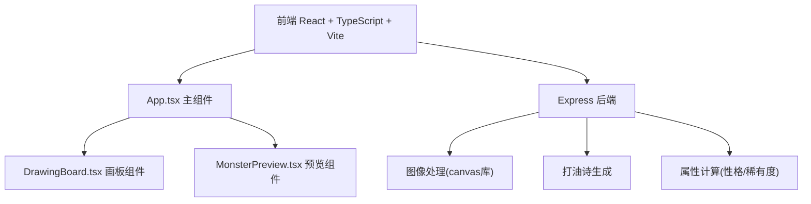
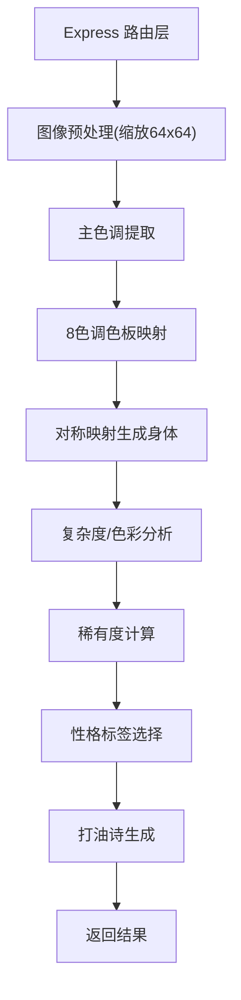

## 1. 架构设计



## 2. 技术说明
- 前端：React@18 + TypeScript + Vite
- 构建工具：Vite
- 后端：Express@4 + Node.js
- 图像处理：canvas (node-canvas)
- 文件上传：multer

## 3. 路由定义
| 路由 | 用途 |
|-------|---------|
| / | 创作主页面 |
| POST /api/generate | 处理涂鸦生成小怪兽 |

## 4. API定义

```typescript
// 请求类型
interface GenerateRequest {
  imageData: string; // base64编码的图片数据
}

// 响应类型
interface GenerateResponse {
  pixels: number[][];     // 64x64 调色板索引矩阵
  palette: string[];      // 8色调色板
  personality: string[];   // 性格标签 2-3个
  rarity: 'common' | 'rare' | 'epic' | 'legendary';
  poem: string[];           // 四句打油诗
}
```

## 5. 服务端架构



## 6. 项目文件结构
```
package.json
index.html
tsconfig.json
vite.config.js
src/
  App.tsx
  components/
    DrawingBoard.tsx
    MonsterPreview.tsx
server/
  index.ts
```
