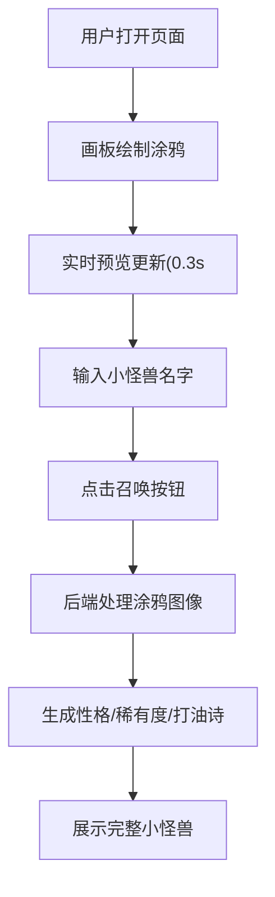

## 1. 产品概述
像素风小怪兽涂鸦创作平台，用户通过手绘涂鸦自动生成独一无二的像素风小怪兽，支持属性展示、打油诗生成、图鉴存储和社交分享。
- 核心目的：提供创意娱乐、趣味创作，将用户涂鸦艺术结合AI生成像素风小怪兽
- 目标用户：喜欢创意涂鸦、像素艺术爱好者、休闲娱乐用户
- 市场价值：低门槛创意工具，社交传播性强，适合娱乐社交平台

## 2. 核心功能

### 2.1 功能模块
1. **创作主界面**：左右分栏布局，左侧画板，右侧预览
2. **涂鸦画板**：支持多种笔刷、撤销、清空
3. **实时预览**：0.3秒自动更新，像素化过渡动画
4. **小怪兽生成**：根据涂鸦计算性格、稀有度、打油诗

### 2.3 页面详情
| 页面名称 | 模块名称 | 功能描述 |
|-----------|-------------|---------------------|
| 创作主页面 | 画板模块 | 400x400白色画板，10x10浅灰网格，支持三种笔刷切换 |
| 创作主页面 | 工具栏 | 撤销(20步)、清空、普通笔/点状笔/虚线笔 |
| 创作主页面 | 实时预览区 | 64x64像素小怪兽预览，0.3秒自动更新 |
| 创作主页面 | 召唤区 | 名字输入、召唤按钮、性格标签、稀有度、打油诗 |

## 3. 核心流程
用户打开页面 → 在左侧画板绘制涂鸦 → 右侧实时预览生成的像素小怪兽 → 输入名字 → 点击"召唤小怪兽" → 显示完整小怪兽属性和打油诗

## 4. 用户界面设计
### 4.1 设计风格
- 主色调：#FF6B6B 到 #FF8E53 渐变（召唤按钮）
- 背景色：白色画板，浅灰网格(#eee/#ccc 工具栏高亮
- 字体：简洁现代的无衬线字体
- 按钮风格：圆角12px，悬停上移2px+阴影
- 像素风像素小怪兽展示

### 4.2 页面设计概述
| 页面名称 | 模块名称 | UI元素 |
|-----------|-------------|-------------|
| 创作主页面 | 画板模块 | 400x400白色画板，10x10网格辅助线 |
| 创作主页面 | 工具栏 | 水平排列，浅灰背景，按钮高亮过渡0.2s |
| 创作主页面 | 预览区 | 64x64像素画布，像素化扩散动画0.5s |
| 创作主页面 | 信息区 | 名字输入框、渐变召唤按钮、属性展示 |

### 4.3 响应式
桌面端优先，左右分栏固定宽度布局

