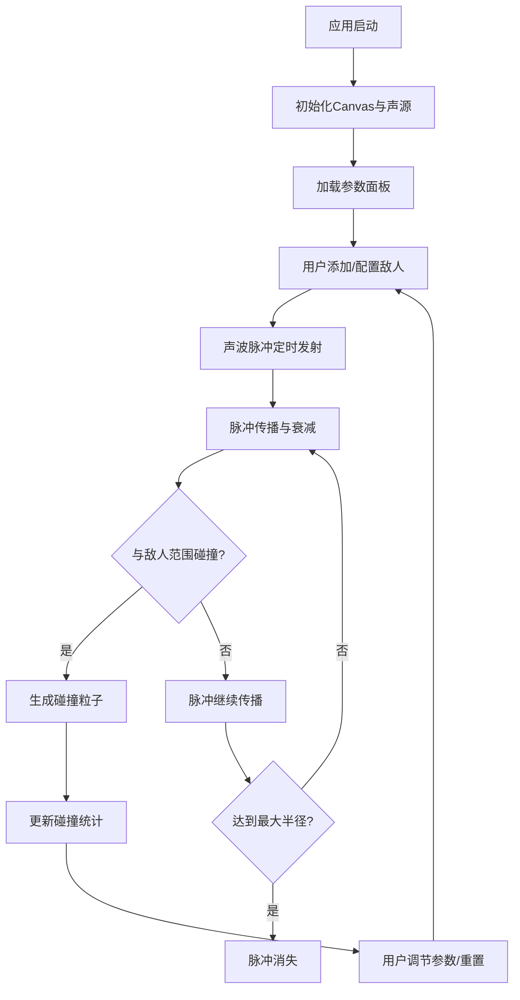

## 1. 产品概述
交互式声波可视化潜行雷达编辑器，用于模拟基于听觉反馈的潜行类游戏机制。玩家在黑暗森林中通过声音判断并避开动态巡逻的敌人，提供直观的声波可视化与交互测试工具。

- 核心用途：游戏设计师测试声波潜行机制，直观展示声源传播、敌人巡逻路径与碰撞反馈
- 目标用户：独立游戏设计师、游戏开发者、技术美术
- 市场价值：降低潜行游戏机制原型开发成本，提供可交互的可视化调试环境

## 2. 核心功能

### 2.1 用户角色
| 角色 | 注册方式 | 核心权限 |
|------|---------|---------|
| 设计师用户 | 无需注册 | 完整编辑、模拟、参数调整功能 |

### 2.2 功能模块
1. **主画布区域**：声源显示、敌人放置、声波脉冲传播、碰撞粒子特效
2. **参数控制面板**：脉冲参数调节、敌人增删、场景重置
3. **状态统计面板**：实时FPS、敌人数量、碰撞次数、碰撞强度
4. **图例说明区**：符号含义说明

### 2.3 页面详情
| 页面名称 | 模块名称 | 功能描述 |
|---------|---------|---------|
| 主编辑器 | 声源标记 | Canvas中央蓝色呼吸圆点，每2秒缩放1.0-1.1倍 |
| 主编辑器 | 敌人系统 | 最多10个，橙红色圆点+声波范围环，沿随机折线巡逻 |
| 主编辑器 | 声波脉冲 | 每0.5秒发射，半径0→300px，透明度0.8→0.1线性衰减 |
| 主编辑器 | 碰撞检测 | 脉冲接触敌人范围边界触发金色火花粒子 |
| 主编辑器 | 粒子特效 | 对象池管理，最多300粒子，0.4秒生命周期 |
| 参数面板 | 滑块控制 | 脉冲间隔(0.3-2.0s)、最大半径(150-500px)、粒子数(5-30) |
| 参数面板 | 敌人管理 | 添加按钮随机生成、Delete键删除选中敌人 |
| 参数面板 | 重置按钮 | 清空所有敌人，重置计数器 |
| 状态显示 | 统计面板 | 敌人数量、累计碰撞、最后碰撞强度、FPS(低于45红色警示) |
| 状态显示 | 图例说明 | 左侧半透明面板解释各符号含义 |

## 3. 核心流程
设计师打开应用 → Canvas中央显示声源 → 点击添加敌人按钮或拖拽放置敌人 → 调节参数控制面板 → 观察声波脉冲传播与敌人巡逻 → 脉冲碰撞产生粒子反馈 → 左上角实时统计碰撞数据 → 右下角显示帧率 → 可随时重置场景或删除敌人

## 4. 用户界面设计

### 4.1 设计风格
- 主色调：深墨绿色#1a2a1a背景 + 浅绿色#aaffaa文字
- 强调色：橙红色#FF6B35（敌人）、蓝色#00aaff（声源）、金黄色#FFD700（粒子/碰撞）
- 字体：monospace等宽字体，统一14px字号（半径数值12px）
- 布局：全屏Canvas主区域 + 底部控制面板 + 左上角状态 + 左下图例
- 交互风格：简洁专业，游戏编辑器氛围，深色科技感

### 4.2 页面设计总览
| 页面名称 | 模块名称 | UI元素 |
|---------|---------|--------|
| 主编辑器 | Canvas背景 | 深墨绿色#1a2a1a + 10x10深灰网格(透明度0.08) |
| 主编辑器 | 声源标记 | 蓝色直径12px圆点，#00aaff高光，2秒呼吸缩放动画 |
| 主编辑器 | 敌人标记 | 橙红色直径8px圆点，下方12px半透明半径数值 |
| 主编辑器 | 敌人声波环 | 外圈#FF6B35，内圈透明度0.15的环形指示器 |
| 主编辑器 | 声波脉冲 | 半透明白色渐变圆形，线宽1.5px |
| 主编辑器 | 碰撞闪烁 | Canvas边缘金红色#FFD700，透明度0.3，持续0.1秒 |
| 参数面板 | 控制面板 | 底部区域，1px #333分隔线与Canvas隔开 |
| 状态显示 | 统计面板 | 左上角浅绿色文字，monospace 14px |
| 状态显示 | 图例面板 | 左侧#1a2a1a底色透明度0.6的半透明面板 |

### 4.3 响应式
桌面优先设计，Canvas自适应窗口大小，控制面板保持固定底部布局。

### 4.4 性能约束
- 目标帧率：60FPS，稳定50FPS以上
- 粒子上限：300个（对象池管理）
- 敌人上限：10个
- 同时传播脉冲：不超过3个
