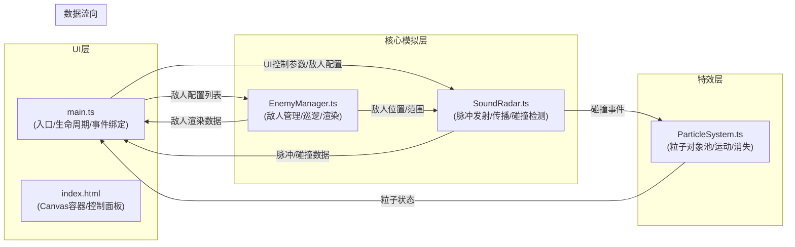

## 1. 架构设计



## 2. 技术说明
- 前端：TypeScript + Vite（原生Canvas 2D，无UI框架）
- 初始化工具：Vite vanilla-ts模板
- 后端：无（纯前端应用）
- 数据库：无（运行时内存状态）

## 3. 文件结构与职责

| 文件路径 | 职责说明 | 调用关系 |
|---------|---------|---------|
| `package.json` | 依赖与脚本配置（typescript、vite） | - |
| `vite.config.js` | Vite基础构建配置 | - |
| `tsconfig.json` | TS严格模式，ES2020目标，ESNext模块 | - |
| `index.html` | 入口页面，全屏Canvas容器+底部参数面板 | 引入main.ts |
| `src/main.ts` | Canvas初始化、应用生命周期、鼠标/UI事件、渲染循环调度 | 调用SoundRadar/EnemyManager/ParticleSystem，接收其输出并绘制 |
| `src/SoundRadar.ts` | 声源脉冲发射、传播衰减、碰撞检测核心引擎 | 从main.ts获取参数与敌人数据，向main.ts返回碰撞事件与脉冲状态 |
| `src/EnemyManager.ts` | 敌人创建/删除、巡逻路径、声波范围渲染 | 从main.ts接收敌人配置列表，向SoundRadar提供敌人数据，向main.ts返回渲染数据 |
| `src/ParticleSystem.ts` | 碰撞粒子创建、运动、消失（对象池） | 从SoundRadar/main.ts接收碰撞事件，向main.ts返回粒子渲染状态 |

## 4. 核心数据模型

### 4.1 TypeScript类型定义
```typescript
// 敌人配置
interface Enemy {
  id: number;
  x: number;
  y: number;
  radius: number;        // 声波范围半径 20-100px
  path: Point[];         // 巡逻路径点 3-5个
  targetIndex: number;   // 当前目标路径点索引
  speed: number;         // 移动速度 0.5-1.5 px/帧
  pauseTime: number;     // 到达路径点后暂停剩余时间 ms
  selected: boolean;
}

// 声波脉冲
interface SoundPulse {
  x: number;
  y: number;
  radius: number;
  maxRadius: number;
  alpha: number;
  speed: number;         // px/帧
  active: boolean;
}

// 碰撞粒子
interface Particle {
  x: number;
  y: number;
  vx: number;
  vy: number;
  size: number;
  initialSize: number;
  life: number;          // 剩余生命 ms
  maxLife: number;
  active: boolean;
  color: string;         // #FFD700 到 #FF8C00 渐变
}

// 碰撞事件
interface CollisionEvent {
  x: number;
  y: number;
  intensity: number;     // 0.0-1.0 穿透深度归一化
  enemyId: number;
}

// 应用状态
interface AppState {
  pulseInterval: number;    // 脉冲发射间隔 0.3-2.0s
  pulseMaxRadius: number;   // 脉冲最大半径 150-500px
  particleCount: number;    // 碰撞粒子数 5-30
  collisionCount: number;   // 累计碰撞次数
  lastCollisionIntensity: number;
  canvasEdgeFlashTime: number; // 边缘闪烁剩余时间 ms
}
```

## 5. 核心算法说明

### 5.1 声波脉冲传播
- 每 `pulseInterval` 毫秒发射新脉冲，同时活跃脉冲不超过3个
- 每帧半径增加 `speed`（默认2px/帧），透明度从0.8线性衰减至0.1
- 达到 `maxRadius` 后标记为非活跃并从数组中移除

### 5.2 敌人巡逻
- 初始化随机生成3-5个路径点（在Canvas范围内）
- 每帧向当前目标路径点移动，到达后随机暂停1-3秒
- 暂停结束后切换到下一个路径点（循环）

### 5.3 碰撞检测
- 每帧遍历所有活跃脉冲与所有敌人
- 计算脉冲圆心与敌人圆心距离 `d`
- 当 `|d - enemy.radius|` 在阈值内（脉冲外缘接触敌人范围边界）时触发碰撞
- 碰撞强度 = 穿透深度 / 阈值，归一化到0.0-1.0
- 接触点坐标 = 沿两圆心连线从敌人心向脉冲圆心方向偏移 `enemy.radius`

### 5.4 粒子系统
- 对象池预分配300个Particle对象
- 碰撞时从池中获取10-20个粒子，初始化位置为碰撞点
- 速度随机方向1-4px/帧，尺寸2-4px，颜色从#FFD700线性渐变到#FF8C00
- 每帧更新位置，生命从0.4秒递减，尺寸线性放大到1.5倍，透明度随生命衰减
- 生命结束后归还对象池

## 6. 性能优化策略
- 对象池管理粒子，避免频繁GC
- 同时活跃脉冲限制为3个，超出则丢弃最早发射的
- 碰撞检测提前用距离平方比较避免开方
- 渲染循环使用requestAnimationFrame，deltaTime计算保证跨帧率一致性
