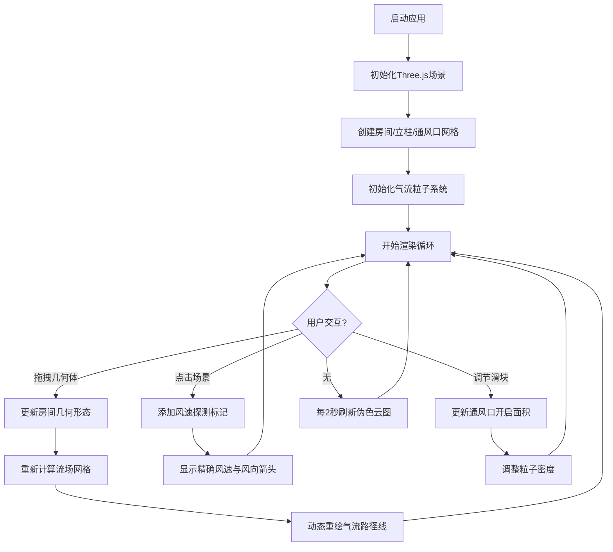

## 1. 产品概述

建筑气流交互式可视化应用，为暖通工程师和建筑设计师提供直观的三维气流模拟工具，解决通风方案评估中空气流动路径、速度分布和涡流区域难以可视化的问题。

- 面向用户：暖通工程师、建筑设计师、建筑性能分析师
- 核心价值：将抽象的气流数据转化为可交互的三维可视化，加速通风方案设计与优化决策

## 2. 核心功能

### 2.1 功能模块
1. **三维场景模块**：房间几何建模、墙体/立柱/通风口渲染、相机控制
2. **气流模拟模块**：基于网格的流场计算、粒子系统运动、流线动态渲染
3. **交互控制模块**：拖拽调整通风口/挡板、点击探测风速风向、云图刷新
4. **控制面板模块**：关键点风速显示、参数调节滑块、探测标记管理

### 2.2 功能详情

| 模块名称 | 功能名称 | 功能描述 |
|---------|---------|---------|
| 三维场景 | 房间建模 | 6x4x3米房间，浅灰色半透明墙体，深灰色背景 |
| 三维场景 | 通风口/立柱 | 150x50cm通风口(亮蓝色边框)，20x20cm方形立柱，3x10cm地面缝隙 |
| 三维场景 | 拖拽交互 | 鼠标拖拽调整面板/挡板/通风口的位置和尺寸 |
| 气流模拟 | 粒子系统 | 浅青色粒子，2x2px尺寸，5px最小间距，10帧拖尾淡出 |
| 气流模拟 | 流线渲染 | 颜色映射(蓝0.5m/s→红5.0m/s)，密度随通风口面积线性变化 |
| 气流模拟 | 流场计算 | 20x15x10网格，考虑通风口方向和立柱遮挡，遇墙反弹 |
| 交互控制 | 点探测 | 点击任意位置显示30px圆形标记，精确风速(0.01m/s)和风向箭头 |
| 控制面板 | 关键点风速 | 6个关键点实时数值：通风口中心/立柱前后/缝隙上方/左上/右下 |
| 控制面板 | 伪色云图 | 底面Jet色图(深蓝→暗红，0-5m/s)，10x10cm网格，2秒刷新，半透明叠加 |
| 控制面板 | 参数调节 | 滑块调节通风口开启面积，扁平风格，hover上浮效果 |

## 3. 核心流程

## 4. 用户界面设计

### 4.1 设计风格
- 主色调：深灰色背景(#2a2a2a)，控制面板(#1e1e1e)
- 强调色：亮蓝色(#00bfff)通风口边框，浅青色(#e0ffff)气流粒子
- 墙体：浅灰色(#d0d0d0)半透明(透明度0.3)
- 云图：Jet色图(深蓝→绿→黄→红)映射风速0-5m/s
- 按钮/滑块：扁平风格，圆角设计，hover时translateY(-2px)，0.2s过渡

### 4.2 页面布局

| 区域 | 位置 | 尺寸 | 内容 |
|-----|------|------|------|
| 3D场景 | 左侧 | 自适应(4:3宽高比) | 房间三维视图，气流粒子，伪色云图 |
| 控制面板 | 右侧固定 | 宽度280px | 关键点风速列表、参数滑块、说明文本 |

### 4.3 响应式
- 桌面端优先设计
- 窗口大小变化时自动调整3D场景尺寸，保持4:3宽高比
- 控制面板固定右侧，不随场景缩放

### 4.4 3D场景指导
- 背景：纯色深灰(#2a2a2a)，无HDRI
- 光照：环境光+方向光，确保墙体半透明和粒子清晰可见
- 相机：PerspectiveCamera，初始角度俯视45°，OrbitControls支持旋转缩放
- 交互：拖拽调整几何体，射线拾取检测点击位置
- 性能：粒子数量控制在合理范围，目标帧率≥45fps，交互响应≤100ms
