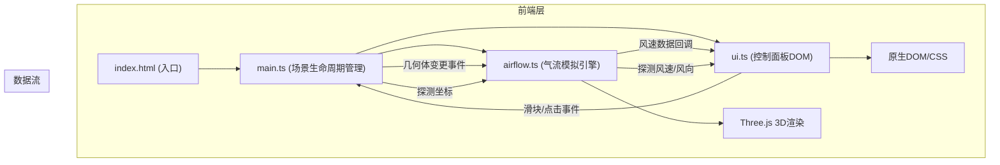

## 1. 架构设计



## 2. 技术描述

- **前端框架**: 原生TypeScript (无React/Vue，按用户需求)
- **3D引擎**: three@^0.160.0
- **构建工具**: vite@^5.0.0
- **语言**: TypeScript@^5.3.0 (严格模式，target ES2020，module ESNext)
- **样式**: 原生CSS (内联/标签式，无Tailwind)
- **初始化**: 手动配置，不使用脚手架模板

## 3. 项目文件结构

| 文件路径 | 职责 |
|---------|------|
| package.json | 依赖声明：three, typescript, vite；启动脚本 |
| index.html | 页面入口，含#3d-container和#control-panel容器 |
| tsconfig.json | TypeScript严格模式配置 |
| vite.config.js | Vite构建配置(base: ./) |
| src/main.ts | 场景/相机/渲染器初始化、房间网格创建、事件协调、主循环 |
| src/airflow.ts | 气流网格系统(20x15x10)、粒子系统、流场计算、速度查询API |
| src/ui.ts | 控制面板DOM构建、6关键点风速显示、探测标记、滑块事件回调 |

## 4. 核心模块API定义

### 4.1 airflow.ts 导出接口

```typescript
export interface AirflowSystem {
  init(scene: THREE.Scene, roomConfig: RoomConfig): void;
  update(delta: number): void;
  updateRoomGeometry(config: RoomConfig): void;
  getVelocityAt(position: THREE.Vector3): { speed: number; direction: THREE.Vector3 };
  getKeyPointVelocities(): KeyPointReading[];
  getContourData(): ContourCell[];
  setVentOpenRatio(ratio: number): void;
  dispose(): void;
}

export interface RoomConfig {
  width: number;
  height: number;
  depth: number;
  vent: { position: THREE.Vector3; width: number; height: number; openRatio: number };
  gap: { position: THREE.Vector3; width: number; height: number };
  pillar: { position: THREE.Vector3; size: number };
}

export interface KeyPointReading {
  name: string;
  position: THREE.Vector3;
  speed: number;
}

export interface ContourCell {
  x: number;
  z: number;
  speed: number;
}
```

### 4.2 ui.ts 导出接口

```typescript
export interface UIController {
  init(container: HTMLElement, callbacks: UICallbacks): void;
  updateKeyPointReadings(readings: KeyPointReading[]): void;
  updateContourOverlay(data: ContourCell[]): void;
  showProbe(position2D: { x: number; y: number }, speed: number, direction: { x: number; y: number }): void;
  hideProbe(): void;
}

export interface UICallbacks {
  onVentRatioChange: (ratio: number) => void;
  onSceneClick: (normalizedX: number, normalizedY: number) => void;
}
```

## 5. 关键技术实现说明

### 5.1 气流网格模拟
- 将房间划分为20×15×10的三维网格(对应6m×4m×3m，每格30cm)
- 每个网格单元存储速度向量，初始化时基于通风口方向注入初速度
- 立柱位置的网格标记为阻挡，粒子遇到时反弹
- 粒子沿当前所在网格的速度向量移动，相邻网格间做线性插值

### 5.2 粒子系统
- 使用THREE.Points + BufferGeometry实现高性能粒子渲染
- 每个粒子存储当前位置、历史位置(用于拖尾)、当前速度
- 粒子最小间距通过网格哈希检测，过近时重定位
- 颜色根据速度值在蓝色(0.5m/s)到红色(5.0m/s)之间线性插值

### 5.3 伪色云图
- 地面平面按10cm网格细分(60×40格)
- 每格根据该位置高度10cm处的风速采样
- 使用Jet色图：深蓝(0)→蓝→青→绿→黄→橙→暗红(5m/s)
- CanvasTexture动态生成并每2秒更新，半透明(alpha=0.6)叠加到地面

### 5.4 交互拾取
- THREE.Raycaster用于鼠标点击与拖拽检测
- 可拖拽对象(通风口、挡板)自定义userData标记
- 点击探测时：射线与房间求交→获取3D坐标→查询气流系统→更新UI标记
