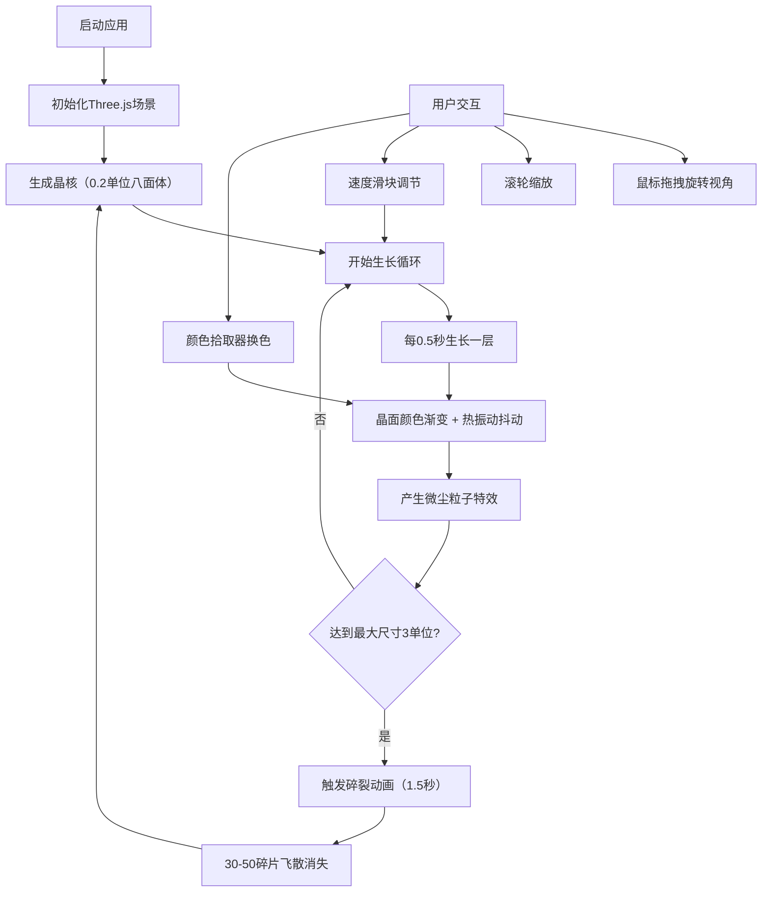

## 1. 产品概述
虚拟矿物晶体生长模拟器——一个基于Three.js的3D可视化应用，让用户沉浸式观察硅酸盐矿物在三维空间中的结晶过程，如同在显微镜下目睹微型造山运动。

- 主要用途：科学教育、晶体生长可视化、矿物学展示
- 目标用户：学生、矿物爱好者、科研人员、对自然现象感兴趣的公众
- 产品价值：将抽象的晶体生长过程具象化，提供交互式学习体验

## 2. 核心功能

### 2.1 功能模块
1. **3D晶体生长场景**：晶核生成、逐层生长、颜色渐变、热振动抖动、碎裂动画
2. **视角交互系统**：鼠标拖拽旋转、滚轮缩放
3. **控制面板**：生长速度滑块、矿物颜色拾取器
4. **粒子特效系统**：漂浮微尘粒子、碎裂碎片
5. **UI界面**：顶部控制栏、底部提示条、深色未来感风格

### 2.2 功能详情
| 模块名称 | 功能描述 |
|---------|---------|
| 晶体生长 | 从直径0.2单位八面体晶核开始，每0.5秒向外生长一层晶格平面，最大边长3单位 |
| 颜色变化 | 晶面从#D4C5A9（乳白）逐步加深到#8B7D5B（深褐），支持用户自定义8种矿物色 |
| 热振动 | 每个晶面轻微抖动（振幅0.01单位，频率0.3Hz）模拟原子吸附 |
| 碎裂动画 | 达到最大尺寸后爆裂成30-50块碎片，飞散消失后重新生长 |
| 速度控制 | 右侧垂直滑块控制0.1x-5.0x生长速度 |
| 颜色选择 | 底部颜色拾取器支持8种预设矿物色，0.8秒平滑过渡 |
| 微尘粒子 | 30颗1-3px微尘缓慢游走，半秒淡入淡出 |

## 3. 核心流程

## 4. 用户界面设计

### 4.1 设计风格
- **主色调**：纯黑背景 #0a0a0a，深灰控制栏 #1a1a1a
- **强调色**：青色 #00CED1（环境光晕、阴影）
- **晶体色**：8种预设矿物色（萤石紫#7B68EE、黄铁矿金#FFD700、蓝铜矿蓝#4169E1等）
- **按钮风格**：圆角矩形（圆角6px），悬停放大1.05倍，浅青色阴影（偏移2px，模糊6px，透明度0.3）
- **视觉效果**：毛玻璃模糊（8px）、微粒噪点叠加（透明度0.08）、左右青色环境光晕
- **整体风格**：深色未来感、科技感、沉浸式

### 4.2 页面布局
| 区域 | 元素 | 位置 |
|-----|------|------|
| 顶部 | 半透明控制栏（标题、状态信息） | 顶部横跨全屏 |
| 中央 | 3D晶体渲染场景 | 全屏Canvas |
| 右侧 | 垂直生长速度滑块（0.1x-5.0x） | 右侧垂直居中 |
| 底部 | 颜色拾取器（8色色板） + 提示文字 | 底部居中 |
| 背景 | 微粒噪点纹理 + 左右青色光晕 | 全屏背景 |

### 4.3 3D场景指引
- **环境**：纯黑背景，无外部光照依赖，使用自发光材质
- **光照**：环境光 + 方向光，突出晶体玻璃质感和边缘光泽
- **相机**：PerspectiveCamera，初始距离8单位，可俯仰-30°~60°，Y轴360°旋转
- **材质**：MeshPhysicalMaterial，半透明、高粗糙度、清漆层模拟玻璃光泽
- **后期**：轻微泛光效果增强晶体发光感
- **性能**：60FPS目标，实例化渲染优化碎片和粒子

### 4.4 响应式
- Desktop-first设计，全屏Canvas自适应窗口大小
- UI控件相对定位，适配不同分辨率
