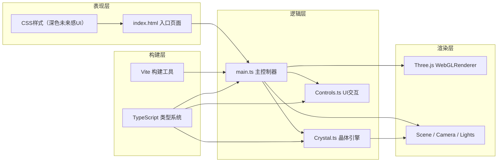

## 1. 架构设计



## 2. 技术描述
- **前端框架**：原生 TypeScript（无UI框架），直接操作DOM和Three.js
- **3D引擎**：Three.js r160+，使用 MeshPhysicalMaterial 实现玻璃质感
- **构建工具**：Vite 5.x，提供HMR和快速构建
- **语言**：TypeScript 5.x，严格模式，目标ES2020
- **样式**：原生CSS + CSS变量，实现毛玻璃和动画效果
- **无后端**：纯前端应用，无需服务器

## 3. 文件结构

| 文件路径 | 用途 |
|---------|------|
| `package.json` | 项目依赖和脚本（three、typescript、vite、@types/three） |
| `index.html` | 入口页面，包含Canvas容器、控制栏、滑块、颜色拾取器 |
| `tsconfig.json` | TypeScript配置（严格模式、ES2020、ESNext模块） |
| `vite.config.js` | Vite基础构建配置 |
| `src/main.ts` | 初始化场景/相机/渲染器，主循环，UI事件绑定 |
| `src/Crystal.ts` | 晶体类：生长逻辑、颜色渐变、碎裂动画、微尘粒子系统 |
| `src/Controls.ts` | 滑块和颜色拾取器交互逻辑，与Crystal通信 |

## 4. 核心类与接口

### Crystal 类
```typescript
interface CrystalConfig {
  seedSize: number;        // 晶核尺寸 0.2
  maxSize: number;         // 最大尺寸 3.0
  growthInterval: number;  // 生长间隔(ms) 500
  colorStart: string;      // 起始颜色 #D4C5A9
  colorEnd: string;        // 结束颜色 #8B7D5B
  vibrateAmp: number;      // 振动振幅 0.01
  vibrateFreq: number;     // 振动频率 0.3Hz
}

interface CrystalCallbacks {
  onGrowthComplete?: () => void;
  onShatterComplete?: () => void;
}
```

主要方法：
- `constructor(scene, config)`: 初始化晶体
- `setGrowthSpeed(multiplier)`: 设置生长速度倍率
- `setColor(hexColor)`: 设置主色调（带过渡动画）
- `update(deltaTime)`: 每帧更新（生长、振动、粒子）
- `shatter()`: 触发碎裂动画
- `reset()`: 重置为晶核状态
- `dispose()`: 清理资源

### Controls 类
```typescript
interface ControlsConfig {
  speedMin: number;      // 0.1
  speedMax: number;      // 5.0
  speedDefault: number;  // 1.0
  colorPalette: string[]; // 8种预设矿物色
}
```

主要方法：
- `constructor(container, config, handlers)`: 绑定DOM元素和事件
- `setSpeedDisplay(value)`: 更新速度显示
- `setActiveColor(index)`: 设置当前选中色

## 5. 性能优化策略

1. **晶体网格复用**：生长时缩放现有几何体而非重建
2. **材质共享**：所有晶面共享材质实例，仅更新uniform变量
3. **粒子池化**：微尘和碎片使用对象池，避免频繁GC
4. **矩阵更新优化**：仅在需要时更新矩阵世界
5. **帧率自适应**：deltaTime驱动动画，确保不同设备速度一致
6. **WebGL状态最小化**：减少draw call和材质切换

## 6. 动画系统

### 晶体生长
- 基于时间累加器，每达到生长间隔触发一层生长
- 使用THREE.Color.lerp实现颜色平滑渐变
- sin函数驱动顶点振动实现热振动效果

### 碎裂动画
- 预破碎几何体或使用InstancedMesh生成碎片
- 物理模拟：初速度随机方向，重力+空气阻力
- 透明度渐变缩小至消失，总时长1.5秒

### 颜色过渡
- 0.8秒RGB线性插值，每帧更新材质颜色
- 使用requestAnimationFrame确保平滑过渡

### 微尘粒子
- Points + BufferGeometry，30个顶点
- 柏林噪声或随机游走算法生成轨迹
- 透明度sin波动实现淡入淡出
