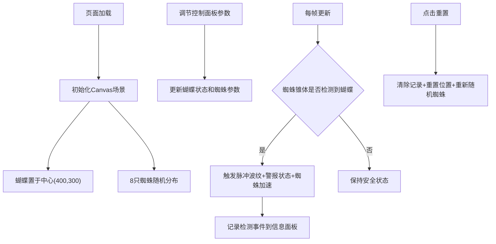

## 1. 产品概述

生物荧光蝴蝶潜行模拟器是一款面向独立游戏设计师的交互式调试工具，用于可视化测试荧光系统和敌人AI行为。用户可在Canvas画布上操控发光蝴蝶，部署最多8只带扇形感知区域的巡逻蜘蛛，实时观察荧光亮度、颜色变化与敌人检测的交互效果。

- 目标用户：独立游戏设计师、潜行解谜游戏开发者
- 核心价值：提供可交互的可视化调试环境，快速验证荧光潜行机制的设计合理性

## 2. 核心特性

### 2.1 功能模块

1. **Canvas渲染场景**：蝴蝶发光体（径向渐变+呼吸动画）、蜘蛛（扇形感知区域+巡逻移动）、检测脉冲波纹、FPS显示
2. **左侧控制面板**：蝴蝶亮度滑块、蝴蝶发光半径滑块、蜘蛛感知范围/角度调节、状态指示灯、重置按钮
3. **右侧信息面板**：闪烁次数统计、平均亮度统计、检测事件时间线表格（最多20条记录）

### 2.2 页面详情

| 页面名称 | 模块名称 | 功能描述 |
|-----------|-------------|---------------------|
| 主页面 | Canvas场景 | 800x600画布，中心蝴蝶，最多8只随机蜘蛛，检测时触发脉冲波纹 |
| 主页面 | 控制面板 | 亮度滑块(0.1-1.0)、半径滑块(20-50px)、蜘蛛参数调节、状态指示灯、重置按钮 |
| 主页面 | 信息面板 | 闪烁次数、平均亮度、检测记录表（时间戳/亮度/颜色） |

## 3. 核心流程

用户进入页面 → Canvas自动初始化（蝴蝶在中心，8只蜘蛛随机分布） → 调节控制面板参数（亮度/半径/蜘蛛感知参数） → 观察蝴蝶荧光变化和蜘蛛巡逻行为 → 蜘蛛感知锥体扫过蝴蝶时触发检测 → 脉冲波纹扩散、状态变红、蜘蛛加速3秒 → 记录检测事件到信息面板 → 可随时点击重置按钮恢复初始状态

## 4. 用户界面设计

### 4.1 设计风格
- **主色调**：暗色主题，背景#0a0b10，面板#1a1c23，边框#2a2d3a
- **强调色**：荧光绿色#00FF88，用于交互元素和状态指示
- **蝴蝶调色板**：#00FF00、#00FFFF、#FF00FF、#FFFF00、#FF6600、#FF3366
- **按钮风格**：圆角6px，点击缩放0.95倍后弹性恢复
- **滑块轨道**：从暗淡灰到荧光绿的线性渐变
- **字体**：无衬线等宽字体，确保数字显示清晰

### 4.2 页面设计概述

| 页面名称 | 模块名称 | UI元素 |
|-----------|-------------|-------------|
| 主页面 | Canvas场景 | 径向渐变发光蝴蝶、微光晕效果（模糊60px）、半透明扇形感知区域（白色虚线轮廓+脉动细线）、脉冲扩散波纹、左上角FPS显示 |
| 主页面 | 控制面板 | 荧光绿状态指示灯、带渐变轨道的圆角滑块、数值显示标签、圆角重置按钮（点击缩放动画） |
| 主页面 | 信息面板 | 大字号统计数字、圆角表格（最多20条记录，自动滚动删除最旧记录） |

### 4.3 响应式设计
- 桌面优先设计，屏幕宽度≥768px时三栏布局：左侧控制面板 + 中央Canvas + 右侧信息面板
- 屏幕宽度<768px时，控制面板和信息面板折叠为汉堡菜单，Canvas自适应全屏宽度
- 触摸设备优化：滑块加大触控区域，按钮增加点击反馈

## 5. 性能约束
- 不少于10只蜘蛛同时活跃时，Canvas绘制帧率稳定在45FPS以上
- 蝴蝶发光呼吸动画和蜘蛛移动更新间隔不超过16ms
- 检测记录表最多保留20条，超出后自动删除最旧记录
