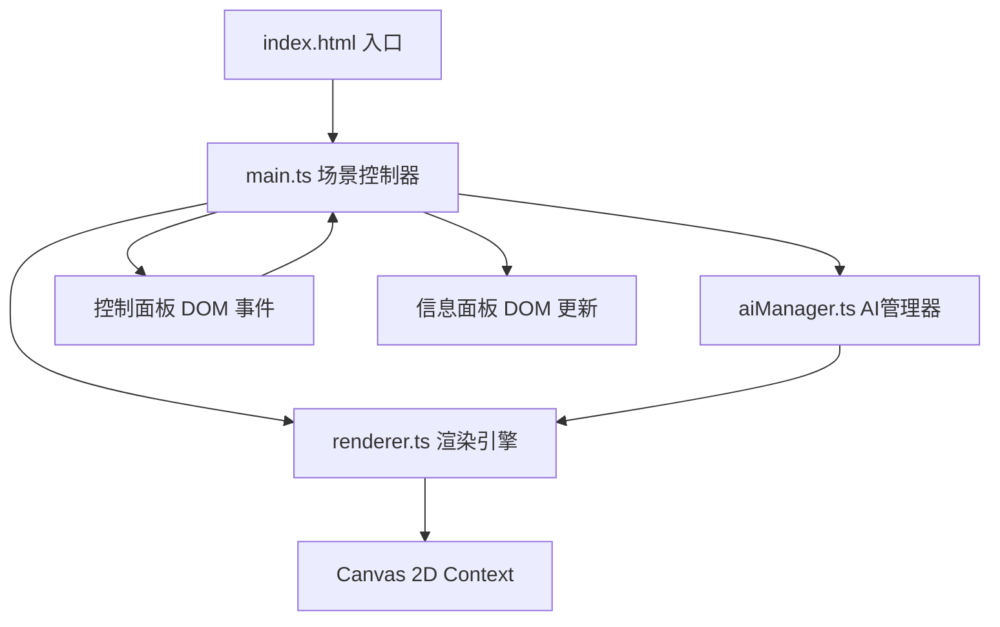

## 1. 架构设计



- **表现层（View）**：Canvas画布渲染、HTML控制面板和信息面板UI
- **逻辑层（Controller）**：main.ts协调数据流，管理场景生命周期
- **业务层（Service）**：renderer.ts负责所有Canvas绘制，aiManager.ts负责蜘蛛AI和碰撞检测

## 2. 技术栈描述
- **前端框架**：原生TypeScript（不使用React/Vue），按用户指定的文件结构组织
- **构建工具**：Vite 5.x
- **类型系统**：TypeScript 5.x，严格模式，目标ES2020，模块ESNext
- **渲染技术**：Canvas 2D API
- **状态管理**：main.ts中维护集中式状态对象，通过函数参数传递
- **样式方案**：内联CSS + HTML内联<style>标签，无需CSS预处理器

## 3. 文件结构与调用关系

| 文件路径 | 职责 | 输入 | 输出 | 调用方 |
|---------|------|------|------|--------|
| package.json | 项目配置与依赖 | - | - | npm |
| vite.config.js | Vite构建配置 | - | - | vite |
| tsconfig.json | TypeScript编译配置 | - | - | tsc |
| index.html | 入口页面，包含Canvas容器、控制面板、信息面板的DOM结构 | - | DOM结构 | 浏览器 |
| src/main.ts | 场景控制器：初始化Canvas、绑定事件、管理主循环、协调数据流向 | 控制面板参数、DOM事件 | 渲染指令、AI更新指令、UI更新 | index.html |
| src/renderer.ts | 渲染引擎：绘制蝴蝶发光体、蜘蛛感知区域、脉冲波纹、FPS | 蝴蝶状态、蜘蛛数组、检测状态、时间戳 | Canvas绘制调用 | main.ts |
| src/aiManager.ts | AI管理器：蜘蛛巡逻移动、感知锥体检测、警报状态管理 | 蝴蝶位置/亮度、时间戳 | 蜘蛛位置/朝向、检测结果 | main.ts |

### 数据流向
1. 用户操作控制面板 → DOM事件触发 → main.ts更新状态对象
2. main.ts每帧调用aiManager.update(butterfly, deltaTime) → 返回更新后的蜘蛛数组和检测结果
3. main.ts将状态传递给renderer.render(ctx, state) → 执行Canvas绘制
4. main.ts根据检测结果更新信息面板DOM

## 4. 数据模型定义

### 4.1 核心类型

```typescript
// 蝴蝶状态
interface Butterfly {
  x: number;           // 位置X
  y: number;           // 位置Y
  radius: number;      // 发光半径 20-50px
  brightness: number;  // 亮度 0.1-1.0
  color: string;       // 当前荧光色（6色调色板）
  colorTimer: number;  // 颜色切换计时器
  breathPhase: number; // 呼吸动画相位
}

// 蜘蛛状态
interface Spider {
  id: number;
  x: number;           // 位置X
  y: number;           // 位置Y
  angle: number;       // 朝向角度（弧度）
  detectionRange: number;  // 感知范围 60-160px
  detectionAngle: number;  // 感知角度（弧度）30-120度
  moveDirection: number;   // 移动方向（弧度）
  moveTimer: number;       // 方向改变计时器
  speed: number;           // 当前移动速度
  pulsePhase: number;      // 感知区域脉动相位
}

// 检测脉冲波纹
interface DetectionPulse {
  x: number;
  y: number;
  color: string;
  startTime: number;
  duration: number;  // 0.5秒
}

// 检测记录
interface DetectionRecord {
  timestamp: number;
  brightness: number;
  color: string;
}

// 全局场景状态
interface SceneState {
  butterfly: Butterfly;
  spiders: Spider[];
  pulses: DetectionPulse[];
  records: DetectionRecord[];
  isAlert: boolean;
  alertEndTime: number;
  fpsHistory: number[];
}
```

## 5. 关键算法

### 5.1 感知锥体检测算法
```
对于每只蜘蛛：
  1. 计算蜘蛛到蝴蝶的向量 dx = butterfly.x - spider.x, dy = butterfly.y - spider.y
  2. 计算距离 distance = sqrt(dx*dx + dy*dy)
  3. 如果 distance > spider.detectionRange * butterfly.brightness → 未检测
  4. 计算蝴蝶相对蜘蛛的角度 targetAngle = atan2(dy, dx)
  5. 计算角度差 angleDiff = normalizeAngle(targetAngle - spider.angle)
  6. 如果 abs(angleDiff) < spider.detectionAngle / 2 → 检测成功
```

### 5.2 蝴蝶呼吸动画
```
每帧更新：
  breathPhase += deltaTime * PI (频率0.5Hz)
  breathOffset = sin(breathPhase) * 0.1 (幅度0.1)
  effectiveRadius = butterfly.radius * (1 + breathOffset)
```

### 5.3 蜘蛛随机巡逻
```
每2秒：
  moveDirection = random(0, 2*PI)
  speed = random(5, 10) 像素/步
每帧：
  如果警报状态 → speed *= 2
  x += cos(moveDirection) * speed * deltaTime
  y += sin(moveDirection) * speed * deltaTime
  边界检测：碰到画布边缘则反弹方向
```

## 6. 性能优化策略

1. **批量绘制**：所有蜘蛛感知区域一次性设置fillStyle，减少状态切换
2. **离屏Canvas**：蝴蝶发光体预渲染到离屏Canvas，每帧仅做变换绘制
3. **帧率控制**：使用requestAnimationFrame，通过deltaTime确保动画速度独立于帧率
4. **对象池**：DetectionPulse对象复用，避免频繁GC
5. **记录裁剪**：检测记录超过20条时立即删除最旧记录，限制数组长度
6. **CSS优化**：面板使用transform和opacity实现动画，避免重排
