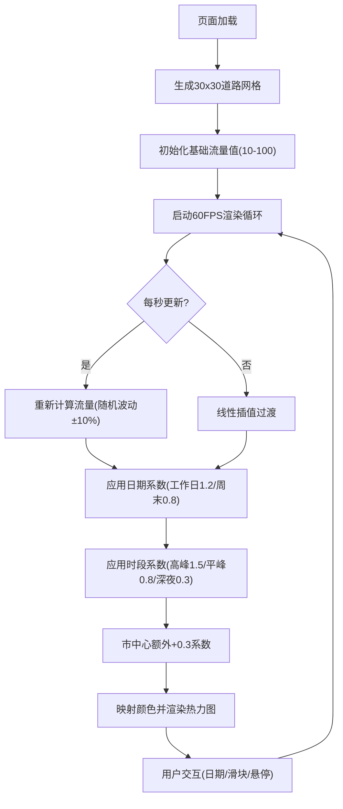

## 1. 产品概述

基于Canvas的动态城市交通流量热力图可视化应用，用于实时展示城市道路拥堵状态的时空变化。用户可通过日期选择器和时段滑块观察不同时间维度下的交通流量变化规律，帮助理解城市交通的动态模式。

## 2. 核心功能

### 2.1 功能模块

1. **主画布区域**：30x30虚拟城市道路网格、动态热力图叠加、实时动画渲染
2. **日期控制面板**：周一至周日选择，工作日/周末流量差异化
3. **时段控制面板**：0-23时垂直滑块，模拟早晚高峰流量波动
4. **图例展示**：右下角颜色渐变条，标注畅通/缓行/拥堵三档
5. **悬停交互**：鼠标悬停道路显示实时流量数值标签

### 2.2 页面详情

| 页面名称 | 模块名称 | 功能描述 |
|-----------|-------------|---------------------|
| 主页面 | 虚拟城市网格 | 30x30网格道路网络，网格间距20px，基础流量随机10-100 |
| 主页面 | 热力图渲染 | 流量映射颜色渐变：绿(#00FF00)→黄(#FFFF00)→红(#FF0000)，贝塞尔曲线插值 |
| 主页面 | 交通模拟 | 每秒重新计算流量（±10%随机波动），帧间线性插值平滑过渡 |
| 主页面 | 日期选择器 | 下拉框7天选项，工作日系数1.2，周末0.8，市中心额外+0.3 |
| 主页面 | 时段滑块 | 垂直滑块0-23，早高峰(7-9)/晚高峰(17-19)系数1.5，其他0.8，深夜(22-5)0.3 |
| 主页面 | 图例 | 垂直渐变条，低/中/高三档标注 |
| 主页面 | 悬停标签 | 鼠标悬停道路显示白色流量数值标签 |
| 主页面 | 响应式布局 | Canvas保持16:9，<600px时控制面板折叠为汉堡菜单 |

## 3. 核心流程

用户进入页面 → 自动生成虚拟城市道路网络并启动交通模拟 → 默认当前日期和时段渲染热力图 → 用户切换日期观察工作日/周末差异 → 用户拖动时段滑块观察早晚高峰变化 → 鼠标悬停查看具体道路流量数值

## 4. 用户界面设计

### 4.1 设计风格

- **主背景色**：#1a1a2e（深蓝暗色主题）
- **道路网格色**：#2d2d44
- **热力渐变色**：#00FF00 → #FFFF00 → #FF0000
- **控制面板**：#16213e 半透明(0.8)，圆角8px，阴影0 4px 12px rgba(0,0,0,0.5)
- **字体颜色**：#e0e0e0（灰白色）
- **动画过渡**：0.2秒淡入

### 4.2 页面设计概览

| 模块 | UI元素 |
|-----------|-------------|
| 左上角 | 日期选择下拉框，半透明深色卡片，圆角8px |
| 右上角 | 垂直时段滑块(0-23)，旁侧显示当前时段数值 |
| 右下角 | 垂直颜色渐变图例，标注"低/中/高" |
| 中央区域 | 全屏Canvas，16:9比例，城市网格+热力图 |
| 鼠标悬停 | 白色小标签跟随鼠标显示流量数值 |
| 移动端(<600px) | 控制面板折叠为汉堡菜单 |

### 4.3 响应式设计

桌面优先设计，Canvas宽度随窗口变化保持16:9比例。窗口宽度小于600px时，控制面板折叠为可展开的汉堡菜单，点击展开后显示所有控件。
