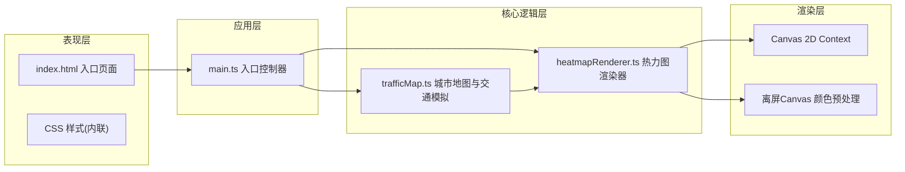

## 1. 架构设计



## 2. 技术选型说明

- **前端框架**：纯 TypeScript（无UI框架）
- **构建工具**：Vite 5.x
- **渲染技术**：Canvas 2D API + 离屏Canvas预处理
- **无第三方地图库**：自主实现虚拟城市网格生成与渲染

## 3. 文件结构定义

```
auto99/
├── package.json          # 项目配置 (typescript, vite)
├── index.html            # 入口页面 (Canvas容器+控制面板)
├── tsconfig.json         # TypeScript配置 (严格模式, ES2020, ESNext)
├── vite.config.js        # Vite基础配置
└── src/
    ├── main.ts           # 应用入口，初始化Canvas，管理生命周期
    └── core/
        ├── trafficMap.ts     # 虚拟城市网格生成、道路网络、交通模拟更新
        └── heatmapRenderer.ts # 热力图渲染、颜色映射、贝塞尔渐变插值
```

## 4. 核心数据模型

### 4.1 道路数据结构

```typescript
interface RoadSegment {
    x: number;              // 网格X坐标 (0-29)
    y: number;              // 网格Y坐标 (0-29)
    isHorizontal: boolean;  // 是否为横向道路
    baseFlow: number;       // 基础流量 (10-100)
    currentFlow: number;    // 当前计算流量
    displayFlow: number;    // 插值平滑后显示流量
    targetFlow: number;     // 目标流量(每秒更新)
}
```

### 4.2 交通状态

```typescript
interface TrafficState {
    roads: RoadSegment[][];     // 道路网格 (60x30水平 + 30x60垂直)
    selectedDay: number;        // 0-6 (周一至周日)
    selectedHour: number;       // 0-23
    lastUpdateTime: number;     // 上次流量更新时间戳
    interpolationProgress: number; // 0-1 插值进度
}
```

### 4.3 渲染配置

```typescript
interface RenderConfig {
    gridSize: number;       // 30
    cellSize: number;       // 20px
    canvasWidth: number;    // 动态计算(16:9)
    canvasHeight: number;
    offsetX: number;        // 居中偏移
    offsetY: number;
}
```

## 5. 核心算法

### 5.1 日期系数计算

```
工作日(周一至周五): 系数 = 1.2
周末(周六至周日): 系数 = 0.8
市中心(坐标12-18的5x5范围): 额外系数 +0.3
最终系数 = 基础系数 + (是否市中心 ? 0.3 : 0)
```

### 5.2 时段系数计算

```
早高峰(7-9时):   系数 = 1.5
晚高峰(17-19时): 系数 = 1.5
深夜(22-5时):    系数 = 0.3
其他时段:        系数 = 0.8
时段间使用正弦函数平滑过渡
```

### 5.3 颜色映射(贝塞尔曲线插值)

```
控制点: P0(#00FF00), P1(#88FF00), P2(#FFFF00), P3(#FF8800), P4(#FF0000)
输入: flowRatio ∈ [0, 1]
输出: RGB插值颜色
三次贝塞尔曲线分两段: [0, 0.5]和[0.5, 1]
```

### 5.4 流量更新与平滑

```
每秒更新:
  targetFlow = baseFlow * (1 + random(-0.1, 0.1)) * dayFactor * hourFactor
  
每帧渲染:
  displayFlow = lerp(currentFlow, targetFlow, deltaTime / 1000)
  currentFlow = displayFlow
```

## 6. 性能优化策略

1. **离屏Canvas预渲染渐变**: 启动时在离屏Canvas绘制完整色带，渲染时直接取像素值，避免每帧计算贝塞尔插值
2. **脏矩形渲染**: 仅重绘流量变化的道路区域
3. **requestAnimationFrame**: 严格60FPS帧率控制
4. **对象池复用**: 避免频繁创建临时对象引发GC
