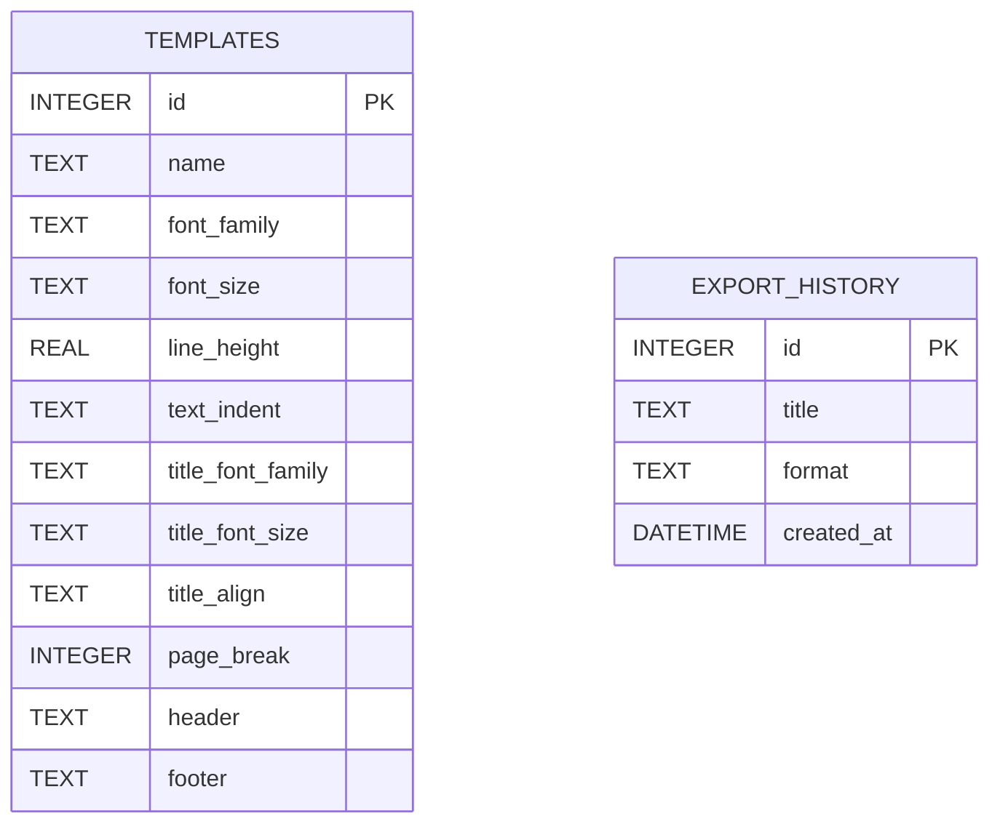
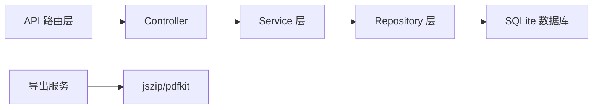

## 1. 架构设计

```mermaid
flowchart TB
    subgraph "前端 (Frontend"
        A["React + TypeScript"] --> B["Zustand 状态管理"]
        A --> C["Vite 构建工具"]
        B --> D["Editor 组件"]
        B --> E["Preview 组件"]
        B --> F["TemplateSelector 组件"]
        B --> G["ExportButton 组件"]
    end
    
    subgraph "后端 (Backend)"
        H["Express + TypeScript"] --> I["SQLite 数据库"]
        H --> J["模板CRUD API"]
        H --> K["文本临时存储"]
        H --> L["导出服务 (epub/PDF生成"]
    end
    
    subgraph "外部服务"
        M["jszip (epub打包"]
        N["pdfkit (PDF生成"]
    end
    
    A -->|HTTP请求
```

## 2. 技术描述

- **前端**: React@18 + TypeScript + Vite + Zustand
- **后端**: Express@4 + TypeScript + SQLite3
- **数据库**: SQLite（存储模板和导出历史
- **构建工具**: Vite
- **状态管理**: Zustand
- **导出库**: jszip (epub), pdfkit (PDF)
- **初始化工具**: vite-init

## 3. 项目文件结构

```
├── package.json
├── vite.config.js
├── tsconfig.json
├── index.html
├── src/
│   ├── App.tsx
│   ├── components/
│   │   ├── Editor.tsx
│   │   ├── Preview.tsx
│   │   ├── TemplateSelector.tsx
│   │   └── ExportButton.tsx
│   └── store/
│       └── useStore.ts
└── server/
    └── index.ts
```

## 4. 路由定义

| 路由 | 用途 |
|-------|---------|
| / | 主应用页面 |
| /api/templates | 获取模板列表 (GET) |
| /api/templates/:id | 获取/更新/删除模板 (GET/PUT/DELETE) |
| /api/text | 临时存储文本 (POST) |
| /api/export/epub | 导出epub (POST) |
| /api/export/pdf | 导出PDF (POST) |

## 5. API 定义

```typescript
// 模板类型
interface Template {
  id: number;
  name: string;
  fontFamily: string;
  fontSize: string;
  lineHeight: number;
  textIndent: string;
  titleFontFamily: string;
  titleFontSize: string;
  titleAlign: string;
  pageBreak: boolean;
  header?: string;
  footer?: string;
}

// 文本存储类型
interface TextStorage {
  id: string;
  content: string;
  templateId: number;
  createdAt: Date;
}

// 导出请求
interface ExportRequest {
  content: string;
  template: Template;
  format: 'epub' | 'pdf';
  title: string;
}

// 导出响应
// 文件流 (blob)
```

## 6. 数据模型

### 6.1 数据模型定义



### 6.2 DDL 语句

```sql
CREATE TABLE IF NOT EXISTS templates (
    id INTEGER PRIMARY KEY AUTOINCREMENT,
    name TEXT NOT NULL,
    font_family TEXT NOT NULL,
    font_size TEXT NOT NULL,
    line_height REAL NOT NULL,
    text_indent TEXT NOT NULL,
    title_font_family TEXT NOT NULL,
    title_font_size TEXT NOT NULL,
    title_align TEXT NOT NULL,
    page_break INTEGER DEFAULT 1,
    header TEXT,
    footer TEXT
);

CREATE TABLE IF NOT EXISTS export_history (
    id INTEGER PRIMARY KEY AUTOINCREMENT,
    title TEXT NOT NULL,
    format TEXT NOT NULL,
    created_at DATETIME DEFAULT CURRENT_TIMESTAMP
);

-- 插入预设模板
INSERT INTO templates (name, font_family, font_size, line_height, text_indent, title_font_family, title_font_size, title_align, page_break, header, footer)
VALUES 
('经典文学', 'SimSun', '14px', 1.8, '2em', 'SimHei', '24px', 'center', 1, '书名 - 章节', NULL),
('现代畅销', '"Noto Serif SC", serif', '11pt', 1.5, '1.5em', '"Noto Serif SC", serif', '24pt', 'left', 1, NULL, '页码');
```

## 7. 后端架构


