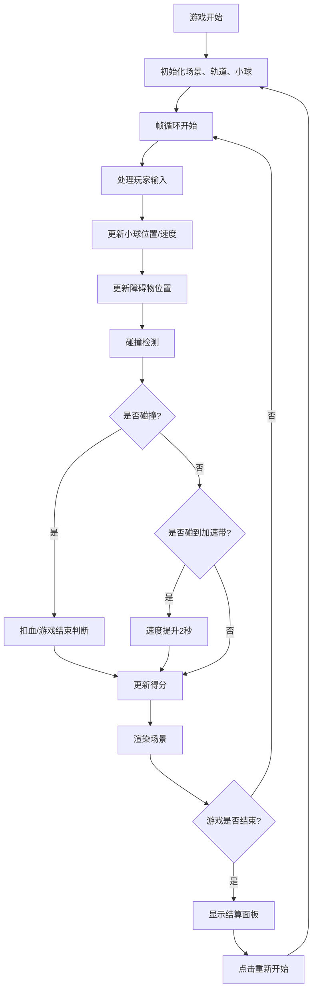

## 1. 产品概述

节奏跑酷游戏是一款基于音乐节拍的休闲跑酷类游戏，玩家操控弹跳小球在动态轨道上前进，通过跳跃和闪避躲避障碍物，配合音乐节拍获得高分。

- 核心玩法：操控小球跳跃、左右闪避，躲避障碍物并收集加速带
- 目标用户：休闲游戏玩家，喜欢节奏类游戏的用户
- 产品价值：提供轻松有趣的节奏跑酷体验，视觉效果随游戏进程动态变化

## 2. 核心功能

### 2.1 功能模块

1. **游戏主界面**：全屏Canvas渲染，包含3D透视轨道、小球、障碍物、加速带
2. **玩家控制系统**：键盘/点击输入，控制小球跳跃和左右移动
3. **障碍物系统**：三类障碍物（矮方块、高墙、移动锯片），对象池管理
4. **场景动态系统**：背景颜色渐变、轨道分段生成与回收
5. **UI界面系统**：得分、连击数、血量条、结算面板
6. **碰撞检测系统**：几何碰撞检测，无物理引擎依赖

### 2.2 页面详情

| 页面名称 | 模块名称 | 功能描述 |
|----------|----------|----------|
| 游戏主界面 | 3D轨道渲染 | CSS伪3D透视效果，居中宽600px，两侧发光渐变线条 |
| 游戏主界面 | 小球渲染 | 半径20px圆形，双层光晕效果，跳跃脉冲动画 |
| 游戏主界面 | 障碍物系统 | 矮方块（可跳跃）、高墙（需闪避）、移动锯片（扣血） |
| 游戏主界面 | 加速带系统 | 半透明蓝色条带，流动光效，速度提升效果 |
| HUD界面 | 得分显示 | 右侧实时显示得分，白色粗体带投影 |
| HUD界面 | 连击显示 | 金色连击数，>5时放大动画 |
| HUD界面 | 血量条 | 顶部中央三颗心形图标，受伤抖动变灰 |
| 结算界面 | 结算面板 | 深色半透明遮罩，显示最终得分、最高纪录、重新开始按钮 |

## 3. 核心流程

## 4. 用户界面设计

### 4.1 设计风格

- **设计方向**：赛博朋克霓虹风格，深色背景配合发光元素
- **主色调**：深蓝(#0d1b2a)起始，随得分渐变过渡
- **强调色**：小球主色#ff6b6b，轨道发光#00d4ff到#7b2ff7，加速带#1e88e5，障碍物#e53935/#6a1b9a
- **字体**：无衬线字体，粗体标题，数字强调
- **动画风格**：流畅过渡，ease-in-out缓动，脉冲效果

### 4.2 页面设计概览

| 页面/模块 | UI元素 | 设计细节 |
|-----------|--------|----------|
| 背景 | 渐变背景 | 从#0d1b2a开始，每100分渐变新色调，2秒过渡动画 |
| 轨道 | 3D透视路 | 居中600px宽，CSS伪3D，两侧发光线条#00d4ff→#7b2ff7 |
| 小球 | 圆形+光晕 | 半径20px，#ff6b6b，内层光晕25px/0.6，外层35px/0.3，跳跃时缩放0.9→1.2→1 |
| 矮方块 | 红色方块 | 高30px宽50px，#e53935，可跳跃越过 |
| 高墙 | 紫色方块 | 高80px宽60px，#6a1b9a，需左右闪避 |
| 锯片 | 旋转六边形 | 直径40px，横向来回移动，扣血 |
| 加速带 | 蓝色条带 | 宽120px高20px，#1e88e5，流动光效，速度提升 |
| 得分 | 文字 | 右侧白色粗体28px，轻微投影 |
| 连击 | 文字 | 金色#ffd54f，>5时0.5秒放大动画 |
| 血量条 | 心形图标 | 顶部中央，3颗24px心形，受伤抖动0.3秒变灰 |
| 结算面板 | 弹窗 | 400x280px，圆角20px，#1a1a2e背景，渐变色边框 |
| 按钮 | 重新开始 | 悬停缩放1.1倍，颜色反转 |

### 4.3 性能要求

- 60fps运行，帧间隔≤16.7ms
- 轨道使用对象池模式，避免频繁DOM创建
- 碰撞检测使用简单几何计算
- 支持低端设备流畅运行

### 4.4 交互设计

- **键盘控制**：空格/上箭头跳跃，左右箭头闪避
- **点击控制**：点击屏幕跳跃，左右区域点击闪避
- **加速带效果**：速度200→350px/s，持续2秒，边缘径向模糊
- **连击系统**：连续躲避障碍物增加连击，碰撞重置
- **得分规则**：基础距离分 + 障碍物躲避分 + 连击加成
