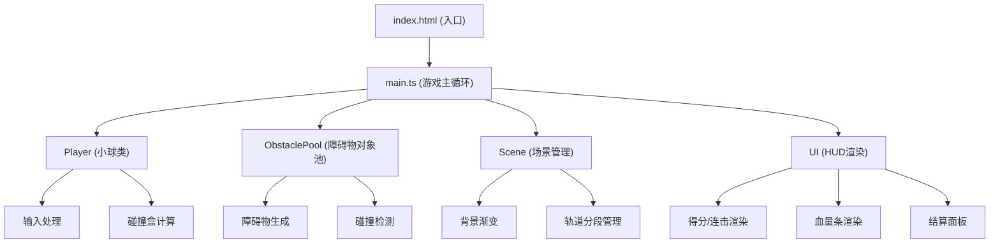

## 1. 架构设计



## 2. 技术栈说明

- **前端框架**：纯原生TypeScript + HTML5 Canvas（无UI框架）
- **构建工具**：Vite 5.x
- **类型系统**：TypeScript 5.x，严格模式，target ES2020
- **渲染引擎**：原生Canvas 2D API
- **性能优化**：对象池模式、增量渲染、requestAnimationFrame

## 3. 项目文件结构

| 文件路径 | 用途说明 |
|----------|----------|
| `package.json` | 项目依赖：typescript, vite, @types/node |
| `vite.config.js` | Vite配置，输出到dist |
| `tsconfig.json` | TypeScript配置，严格模式 |
| `index.html` | 入口HTML，全屏无滚动 |
| `src/main.ts` | 游戏主循环，状态管理，帧调度 |
| `src/player.ts` | 小球类：位置、速度、跳跃、碰撞盒、渲染、输入 |
| `src/obstacle.ts` | 障碍物类与对象池：生成、回收、碰撞检测 |
| `src/scene.ts` | 场景渲染：轨道、背景渐变、分段管理 |
| `src/ui.ts` | HUD渲染：得分、连击、血量条、结算面板 |

## 4. 核心数据结构

### 4.1 游戏状态

```typescript
interface GameState {
  score: number;
  highScore: number;
  combo: number;
  lives: number;
  speed: number;
  boosted: boolean;
  boostTimer: number;
  gameOver: boolean;
  lastTime: number;
  deltaTime: number;
}
```

### 4.2 小球属性

```typescript
interface PlayerState {
  x: number;
  y: number;
  baseY: number;
  velocityY: number;
  isJumping: boolean;
  jumpProgress: number;
  scale: number;
  lane: number; // -1, 0, 1 三车道
  targetLane: number;
  width: number;
  height: number;
}
```

### 4.3 障碍物类型

```typescript
type ObstacleType = 'low_block' | 'high_wall' | 'saw';

interface Obstacle {
  type: ObstacleType;
  x: number;
  y: number;
  z: number; // 深度，用于伪3D
  width: number;
  height: number;
  lane: number;
  active: boolean;
  rotation?: number;
  direction?: number; // 锯片移动方向
}
```

## 5. 核心算法

### 5.1 伪3D透视投影

```typescript
// 将3D坐标(z深度)投影到2D屏幕
function project3D(x: number, y: number, z: number): { x: number; y: number; scale: number } {
  const focalLength = 500;
  const scale = focalLength / (focalLength + z);
  const screenX = centerX + (x - centerX) * scale;
  const screenY = centerY + (y - centerY) * scale;
  return { x: screenX, y: screenY, scale };
}
```

### 5.2 矩形碰撞检测

```typescript
function checkCollision(a: Rect, b: Rect): boolean {
  return (
    a.x < b.x + b.width &&
    a.x + a.width > b.x &&
    a.y < b.y + b.height &&
    a.y + a.height > b.y
  );
}
```

### 5.3 对象池模式

```typescript
class ObjectPool<T> {
  private pool: T[] = [];
  private create: () => T;
  private reset: (obj: T) => void;
  
  acquire(): T {
    return this.pool.pop() || this.create();
  }
  
  release(obj: T): void {
    this.reset(obj);
    this.pool.push(obj);
  }
}
```

### 5.4 颜色渐变插值

```typescript
function lerpColor(color1: string, color2: string, t: number): string {
  // RGB颜色线性插值
  const c1 = hexToRgb(color1);
  const c2 = hexToRgb(color2);
  const r = Math.round(c1.r + (c2.r - c1.r) * t);
  const g = Math.round(c1.g + (c2.g - c1.g) * t);
  const b = Math.round(c1.b + (c2.b - c1.b) * t);
  return `rgb(${r}, ${g}, ${b})`;
}
```

## 6. 性能优化策略

1. **对象池**：障碍物和轨道分段使用对象池，避免频繁GC
2. **增量渲染**：只重绘变化区域，使用离屏Canvas缓存静态元素
3. **requestAnimationFrame**：使用浏览器原生帧调度，自动适应刷新率
4. **几何碰撞**：AABB矩形碰撞检测，O(1)复杂度
5. **分层渲染**：背景、轨道、障碍物、小球、UI分层绘制
6. **节流控制**：输入处理和碰撞检测按固定时间步长执行

## 7. 输入处理

- **键盘事件**：keydown事件监听，支持同时按键
- **触摸/点击**：点击屏幕跳跃，左右半屏点击控制车道
- **事件防抖**：防止快速连续点击导致异常跳跃
