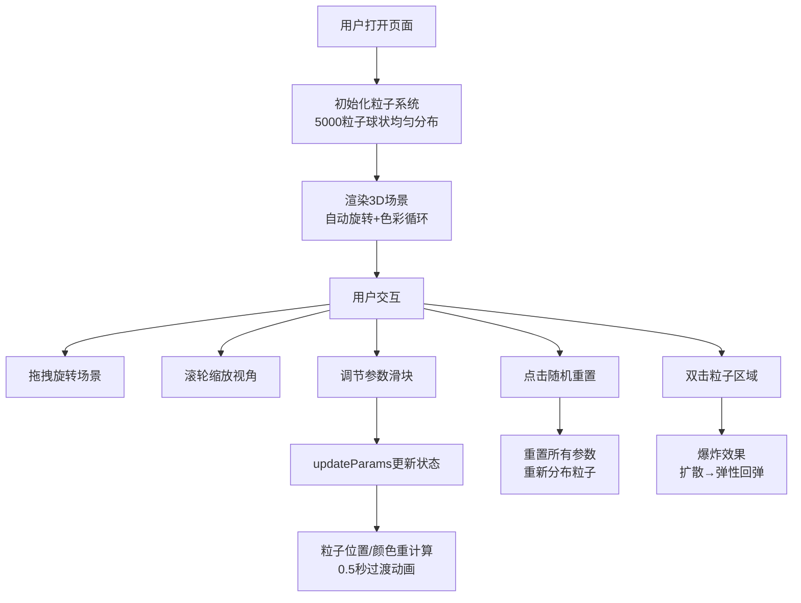

## 1. 产品概述

3D粒子雕塑交互系统是一个基于Web的创意设计工具，让用户通过鼠标拖拽和参数调节，实时创建并浏览由数千个彩色粒子构成的动态雕塑造型。

- **主要用途**：创意设计、视觉艺术、交互体验展示
- **目标用户**：设计师、艺术创作者、交互爱好者
- **核心价值**：通过直观的参数调节和实时预览，快速生成独特的3D粒子艺术效果

## 2. 核心功能

### 2.1 功能模块

1. **3D粒子场景**：5000个粒子构成的动态雕塑，支持鼠标拖拽旋转、滚轮缩放
2. **参数控制面板**：分布半径、旋转速度、颜色周期、粒子大小四个可调参数
3. **随机重置功能**：一键重置粒子位置和色相
4. **双击爆炸效果**：鼠标双击触发粒子爆炸回弹动画
5. **色彩循环系统**：HSV色环动态色彩流动效果

### 2.2 页面详情

| 页面名称 | 模块名称 | 功能描述 |
|----------|----------|----------|
| 主页面 | 3D粒子场景 | 5000粒子球状分布、自动旋转、色彩循环、双击爆炸、OrbitControls交互 |
| 主页面 | 控制面板 | 四个参数滑块（分布半径、旋转速度、颜色周期、粒子大小）、随机重置按钮 |

## 3. 核心流程

## 4. 用户界面设计

### 4.1 设计风格

- **主题风格**：科幻暗色风格，深空背景
- **主色调**：深紫色 #6c63ff（强调色），深空色 #0a0a1a（背景）
- **字体**：现代无衬线字体，等宽字体显示数值
- **控制面板**：半透明玻璃态效果，圆角设计
- **动效**：平滑过渡、弹性缓动、粒子流动

### 4.2 页面设计概述

| 页面名称 | 模块名称 | UI元素 |
|----------|----------|--------|
| 主页面 | 3D粒子场景 | 全屏深空背景、5000彩色粒子、动态旋转、彩虹色流动 |
| 主页面 | 控制面板 | 半透明深色卡片、四个滑块组、重置按钮、实时数值显示 |

### 4.3 响应式设计

- **桌面端**：控制面板宽280px，位于左上角
- **移动端**（<768px）：控制面板宽度95%，位于底部，高度压缩
- **触摸优化**：支持触摸拖拽、双指缩放

### 4.4 3D场景设计

- **环境**：深空色背景 #0a0a1a，无外部光源（粒子自发光）
- **相机**：PerspectiveCamera，初始距离合适
- **控制器**：OrbitControls，缩放范围 0.5-5.0
- **粒子材质**：PointsMaterial，size 0.08，vertexColors
- **后处理**：无额外后处理以保持60FPS性能
- **性能预算**：5000粒子，60FPS，每帧一次位置更新

## 5. 性能约束

- 粒子数量：5000个
- 帧率目标：60FPS
- 位置更新频率：不超过每帧一次
- 颜色计算：requestAnimationFrame控制
- 参数重计算：16ms内完成
