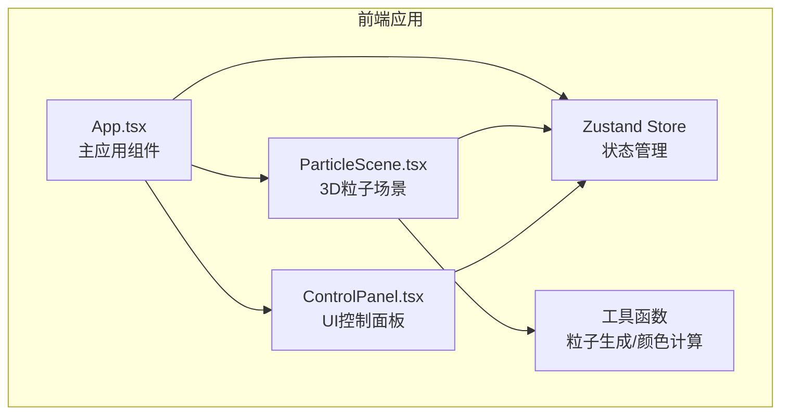

## 1. 架构设计



## 2. 技术选型

- **前端框架**：React 18 + TypeScript
- **构建工具**：Vite
- **3D引擎**：Three.js + @react-three/fiber + @react-three/drei
- **状态管理**：Zustand
- **样式方案**：内联样式 + CSS变量（无需tailwind，粒子项目以3D为主）

## 3. 文件结构

```
src/
├── App.tsx              # 主应用组件
├── store/
│   └── useParticleStore.ts  # Zustand状态管理
├── scene/
│   └── ParticleScene.tsx    # 3D粒子场景组件
├── ui/
│   └── ControlPanel.tsx     # UI控制面板组件
└── utils/
    ├── particleUtils.ts     # 粒子生成与计算工具
    └── colorUtils.ts        # 颜色计算工具
```

## 4. 数据流向

### 4.1 状态结构

```typescript
interface ParticleState {
  // 参数
  radius: number;           // 分布半径 (2-8)
  rotationSpeed: number;    // 旋转速度 (0-3)
  colorPeriod: number;      // 颜色周期 (1-10秒)
  particleSize: number;     // 粒子大小 (0.02-0.2)
  
  // 粒子数据
  positions: Float32Array;  // 粒子位置 [x,y,z * 5000]
  baseHues: Float32Array;   // 粒子基础色相 [0-360 * 5000]
  
  // 动画状态
  isExploding: boolean;     // 是否正在爆炸
  explosionProgress: number; // 爆炸进度 0-1
  
  // 操作方法
  updateParams: (params: Partial<Params>) => void;
  resetRandom: () => void;
  triggerExplosion: () => void;
}
```

### 4.2 数据流

1. **初始化**：App.tsx 创建 store → 生成初始粒子数据
2. **参数调节**：ControlPanel → updateParams → store 更新 → ParticleScene 重渲染
3. **动画循环**：ParticleScene useFrame → 更新旋转/颜色 → 写入 bufferGeometry
4. **重置**：ControlPanel 点击 → resetRandom → 重新生成粒子数据 → 缩放动画
5. **爆炸**：双击场景 → triggerExplosion → 位置插值动画 → 弹性回弹

## 5. 核心算法

### 5.1 粒子分布算法

- 球状均匀分布：使用球面坐标系随机生成
- 防重叠：最小间距0.3，采用简单拒绝采样
- 性能优化：预计算位置数组，避免频繁GC

### 5.2 色彩循环算法

- HSV色环：基于时间 + 基础色相计算当前色相
- 周期控制：色相增量 = (time / period) * 360
- 性能优化：每帧批量计算，使用 typed array

### 5.3 爆炸动画

- 扩散阶段：位置 = 当前位置 + 归一化方向 * 半径
- 回弹阶段：弹性缓动函数 easeOutElastic
- 时长：0.6秒回弹

## 6. 性能优化策略

1. **BufferGeometry**：使用单个 BufferGeometry 管理所有粒子
2. **TypedArray**：位置和颜色数据使用 Float32Array
3. **GPU计算**：尽可能在 shader 中计算（或 useFrame 中批量更新）
4. **节流更新**：参数变化时才重计算粒子位置
5. **对象池**：避免频繁创建销毁对象

## 7. 依赖列表

```json
{
  "react": "^18.2.0",
  "react-dom": "^18.2.0",
  "@react-three/fiber": "^8.15.0",
  "@react-three/drei": "^9.88.0",
  "three": "^0.158.0",
  "zustand": "^4.4.0",
  "typescript": "^5.2.0",
  "vite": "^5.0.0",
  "@vitejs/plugin-react": "^4.2.0",
  "@types/react": "^18.2.0",
  "@types/react-dom": "^18.2.0",
  "@types/three": "^0.158.0"
}
```
