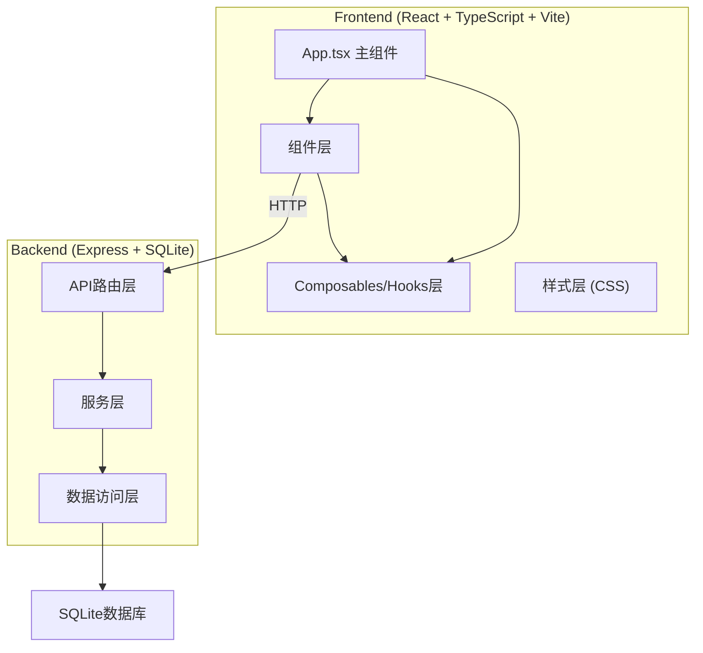
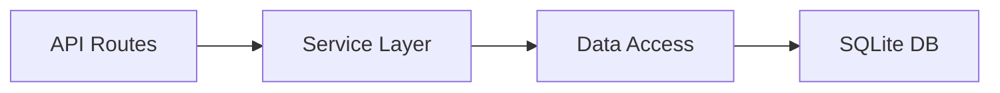
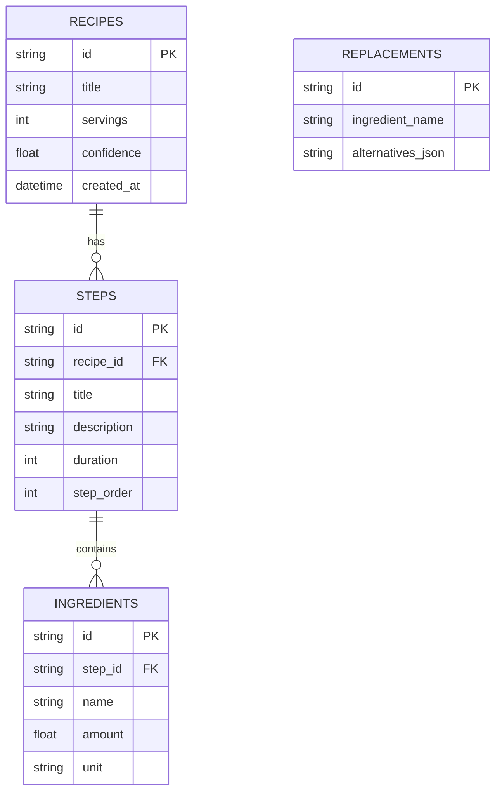

## 1. 架构设计



## 2. 技术描述

- **前端框架**：React 18 + TypeScript
- **构建工具**：Vite 5 + @vitejs/plugin-react
- **样式方案**：原生CSS + CSS变量（暖色调主题）
- **后端框架**：Express 4
- **数据库**：SQLite3
- **唯一ID生成**：uuid
- **严格模式**：TypeScript strict模式，target ES2020

## 3. 目录结构

```
.
├── package.json
├── index.html
├── vite.config.js
├── tsconfig.json
├── src/
│   ├── App.tsx              # 主组件，全局状态管理
│   ├── main.tsx             # 入口文件
│   ├── index.css            # 全局样式与CSS变量
│   ├── components/
│   │   ├── UploadPanel.tsx  # 图片上传与识别面板
│   │   ├── StepCard.tsx     # 单步骤卡片（含倒计时）
│   │   ├── Navbar.tsx       # 顶部导航栏（份量滑块+替换按钮）
│   │   ├── RecipeList.tsx   # 菜谱步骤列表
│   │   ├── ReplaceModal.tsx # 食材替换模态框
│   │   └── ExportButton.tsx # 底部导出按钮
│   ├── composables/
│   │   ├── useOcr.ts        # OCR识别模拟hook
│   │   └── useTimer.ts      # 倒计时管理hook
│   ├── types/
│   │   └── recipe.ts        # 类型定义
│   └── utils/
│       └── exportHtml.ts    # 导出HTML工具函数
└── src/server/
    └── index.ts             # Express后端入口
```

## 4. 路由定义

| 路由 | 用途 |
|------|------|
| / | 主页面，上传+展示+交互 |

## 5. API定义

### 5.1 类型定义

```typescript
interface RecipeStep {
  id: string;
  title: string;
  description: string;
  duration: number; // 秒
  ingredients: Ingredient[];
}

interface Ingredient {
  id: string;
  name: string;
  amount: number;
  unit: string;
  replaced?: boolean;
  originalName?: string;
}

interface Recipe {
  id: string;
  title: string;
  servings: number;
  steps: RecipeStep[];
  confidence: number;
  createdAt: string;
}

interface IngredientReplace {
  ingredient: string;
  alternatives: { name: string; ratio: number }[];
}
```

### 5.2 接口列表

| 方法 | 路径 | 描述 |
|------|------|------|
| GET | /api/recipes | 获取所有菜谱模板 |
| GET | /api/recipes/:id | 获取单个菜谱详情 |
| POST | /api/recipes | 保存新菜谱模板 |
| PUT | /api/recipes/:id | 更新菜谱模板 |
| DELETE | /api/recipes/:id | 删除菜谱模板 |
| GET | /api/replacements | 获取食材替换建议 |

## 6. 服务器架构



## 7. 数据模型

### 7.1 ER图



### 7.2 DDL语句

```sql
CREATE TABLE IF NOT EXISTS recipes (
  id TEXT PRIMARY KEY,
  title TEXT NOT NULL,
  servings INTEGER NOT NULL DEFAULT 1,
  confidence REAL NOT NULL DEFAULT 0,
  created_at DATETIME DEFAULT CURRENT_TIMESTAMP
);

CREATE TABLE IF NOT EXISTS steps (
  id TEXT PRIMARY KEY,
  recipe_id TEXT NOT NULL,
  title TEXT NOT NULL,
  description TEXT NOT NULL,
  duration INTEGER NOT NULL DEFAULT 0,
  step_order INTEGER NOT NULL,
  FOREIGN KEY (recipe_id) REFERENCES recipes(id) ON DELETE CASCADE
);

CREATE TABLE IF NOT EXISTS ingredients (
  id TEXT PRIMARY KEY,
  step_id TEXT NOT NULL,
  name TEXT NOT NULL,
  amount REAL NOT NULL,
  unit TEXT NOT NULL,
  FOREIGN KEY (step_id) REFERENCES steps(id) ON DELETE CASCADE
);

CREATE TABLE IF NOT EXISTS replacements (
  id TEXT PRIMARY KEY,
  ingredient_name TEXT UNIQUE NOT NULL,
  alternatives_json TEXT NOT NULL
);

-- 初始替换数据
INSERT OR IGNORE INTO replacements (id, ingredient_name, alternatives_json) VALUES
('1', '鸡蛋', '[{"name": "鸭蛋", "ratio": 1}, {"name": "鹌鹑蛋", "ratio": 5}]'),
('2', '牛奶', '[{"name": "豆浆", "ratio": 1}, {"name": "椰奶", "ratio": 1}]'),
('3', '白糖', '[{"name": "蜂蜜", "ratio": 0.8}, {"name": "红糖", "ratio": 1}]'),
('4', '面粉', '[{"name": "全麦面粉", "ratio": 1}, {"name": "玉米淀粉", "ratio": 0.7}]'),
('5', '黄油', '[{"name": "植物油", "ratio": 0.8}, {"name": "椰子油", "ratio": 1}]');
```
