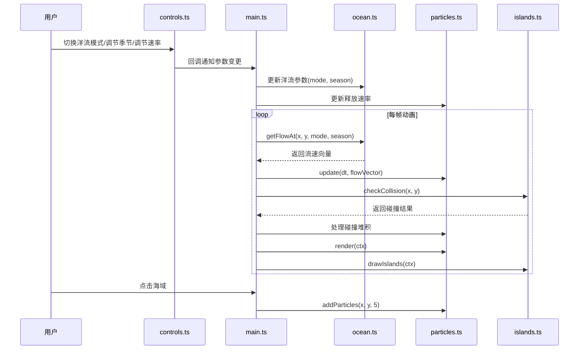

## 1. 架构设计

```mermaid
flowchart TD
    "index.html" --> "main.ts"
    "main.ts" --> "ocean.ts"
    "main.ts" --> "particles.ts"
    "main.ts" --> "controls.ts"
    "main.ts" --> "islands.ts"
    "controls.ts -->|回调通知| main.ts"
    "main.ts -->|更新参数| ocean.ts"
    "main.ts -->|更新速率| particles.ts"
    "ocean.ts -->|getFlowAt| particles.ts"
    "islands.ts -->|checkCollision| particles.ts"
```

## 2. 技术说明

- **前端**: TypeScript + Canvas 2D API（原生，不使用第三方渲染库）
- **构建工具**: Vite
- **运行时**: ES2020
- **包管理**: npm
- **后端**: 无

### 依赖

- typescript
- vite
- @types/node

### 文件组织

| 文件 | 职责 |
|-----|------|
| package.json | 项目依赖和启动脚本 |
| vite.config.js | Vite构建配置，输出到dist |
| tsconfig.json | 严格模式，target ES2020 |
| index.html | 入口页面，全屏无滚动 |
| src/main.ts | 应用入口，初始化Canvas、控制面板、粒子系统和动画循环 |
| src/ocean.ts | 洋流模拟，三种预设模式数据生成和向量场插值，暴露getFlowAt(x,y,mode,season) |
| src/particles.ts | 粒子系统，粒子池管理、运动更新、碰撞检测、生死周期和渲染，暴露addParticles(x,y,count)和update(dt) |
| src/controls.ts | 控制面板UI，DOM交互和回调通知，暴露创建和绑定方法 |
| src/islands.ts | 岛屿生成与渲染，随机静态岛屿数据，暴露drawIslands(ctx)和checkCollision(x,y) |

## 3. 路由定义

单页应用，无路由，仅一个Canvas全屏页面。

## 4. 模块间调用关系



## 5. 核心算法

### 5.1 洋流向量场

- 三种预设模式使用数学函数（正弦、余弦组合）生成二维向量场
- 每种模式定义中心点、旋转方向、流速分布函数
- 季节偏移通过参数调整流速强度和路径偏移
- 向量场插值使用双线性插值在网格点间计算

### 5.2 粒子运动

- 每帧通过getFlowAt获取当前位置流速向量
- 速度上限80px/s
- 位置更新: pos += vel * dt
- 尾迹存储最近15px位置历史
- 5秒后alpha从1.0渐变到0.0
- 粒子池上限500，FIFO淘汰

### 5.3 碰撞检测

- 岛屿为椭圆形，使用椭圆方程判断点是否在内部
- 粒子碰撞后停止移动，堆积计数
- 堆积超10个变橙色并闪烁（0.5s周期sin波alpha）

### 5.4 视角变换

- 使用Canvas 2D变换矩阵模拟3D透视
- Y轴旋转通过cos/sin变换实现
- 缩放通过scale变换实现
