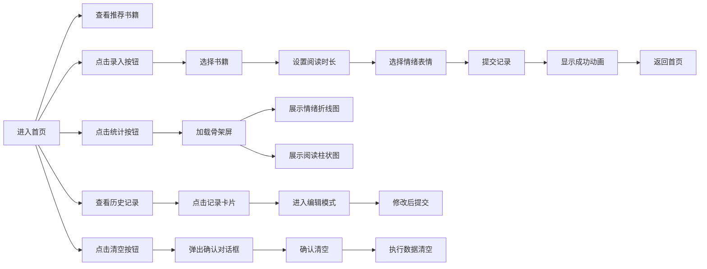

## 1. 产品概述

本产品是一款面向家庭教育场景的在线阅读日记与情绪追踪分析应用，帮助家长通过游戏化方式记录和分析孩子每日的阅读习惯与情绪变化，进而提供个性化的阅读推荐。

- 核心目标：通过持续记录阅读行为与情绪关联，帮助家长发现孩子的阅读偏好，培养良好阅读习惯
- 目标用户：关注孩子阅读成长的家长群体
- 产品价值：将阅读记录转化为可视化数据，通过智能推荐提升孩子阅读兴趣

## 2. 核心功能

### 2.1 功能模块

1. **首页**：智能推荐书籍卡片、历史记录列表、数据清空功能
2. **日记录入页**：书籍选择、时长设置、情绪表情选择、提交保存
3. **统计页**：情绪变化折线图、阅读时长柱状图

### 2.2 页面详情

| 页面名称 | 模块名称 | 功能描述 |
|----------|----------|----------|
| 首页 | 推荐卡片区 | 根据最近3条情绪模式推荐适合的书籍类型 |
| 首页 | 历史记录列表 | 时间倒序展示所有日记记录，支持点击编辑 |
| 首页 | 清空按钮 | 弹出确认对话框，支持清空所有记录 |
| 日记录入页 | 书籍选择 | 下拉框选择预设书籍（至少5本） |
| 日记录入页 | 时长设置 | 滑块设置阅读时长（5-60分钟） |
| 日记录入页 | 情绪选择 | 5种表情选择器（开心、平静、无聊、烦躁、哭泣） |
| 日记录入页 | 提交动画 | 成功后显示勾号扩散动画 |
| 统计页 | 情绪折线图 | 最近7天情绪分布，X轴日期Y轴等级1-5 |
| 统计页 | 阅读柱状图 | 每日阅读时长统计，蓝色柱体带tooltip |

## 3. 核心流程

## 4. 用户界面设计

### 4.1 设计风格
- **设计方向**：暖色调亲子风格，温馨可爱
- **主背景色**：#fff8e1（浅米色）
- **导航栏背景**：#ffcc80（橙黄渐变色）
- **主文字色**：#5d4037（深棕色）
- **强调色**：#42a5f5（蓝色-图表）、#f44336（红色-删除确认）、#9e9e9e（灰色-取消按钮）
- **卡片样式**：圆角设计，悬停时上浮并加深阴影
- **字体**：温暖友好的无衬线字体，标题18px加粗

### 4.2 页面设计概述

| 页面名称 | 模块名称 | UI 元素 |
|----------|----------|----------|
| 首页 | 导航栏 | 高度60px，橙黄渐变背景，左上角应用名称 |
| 首页 | 推荐卡片区 | 卡片宽200px高280px，圆角12px，随机渐变封面，悬停上浮5px |
| 首页 | 历史记录列表 | 卡片宽100%高80px，白色背景圆角10px，内边距12px，可滚动 |
| 首页 | 底部切换栏 | 录入/统计切换按钮 |
| 日记录入页 | 表单区域 | 书籍下拉框、时长滑块、5个彩色emoji表情选择器 |
| 日记录入页 | 提交反馈 | 勾号从中心扩散动画，时长0.5秒 |
| 统计页 | 图表区域 | 折线图（线宽2px，圆点6px）、柱状图（#42a5f5，圆角4px） |
| 统计页 | 加载状态 | 三个灰色矩形脉冲动画骨架屏 |
| 全局 | 确认对话框 | 半透明黑色遮罩，宽320px圆角16px，双按钮设计 |

### 4.3 响应式设计
- **设计方式**：Desktop-first，移动端自适应
- **断点**：768px
- **移动端适配**：
  - 导航栏变为汉堡菜单，点击展开下滑菜单
  - 推荐卡片变为单列展示
  - 录入表单变为全屏模态框
  - 触摸交互优化

### 4.4 动画与交互细节
- 表情选择：点击后放大0.2秒再恢复
- 卡片悬停：0.2秒ease-out平移动画，阴影加深
- 提交成功：勾号从中心扩散动画0.5秒
- 确认按钮：点击时缩小0.1秒
- Tooltip：出现动画0.2秒
- 骨架屏：灰色矩形脉冲动画
- 滚动条：宽度6px，圆角3px，颜色#ffcc80
