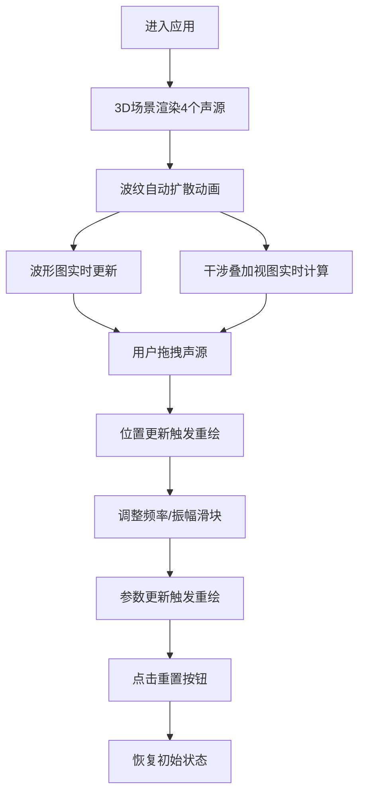

## 1. 产品概述

三维声波干涉可视化应用，帮助音乐制作初学者直观理解声波相位关系与干涉效应。通过交互式3D场景展示多个声源的声波传播、叠加与干涉现象。

## 2. 核心功能

### 2.1 功能模块
1. **三维声场景**：支持添加最多4个声源，每个声源显示为半透明彩色球体，可在三维空间中拖拽移动，波纹实时扩散展示
2. **波形图区**：实时展示4个声源各自的时域波形图，显示频率和振幅参数
3. **干涉叠加视图**：展示4个声波在一条直线上的叠加结果波形，并标注相长/相消干涉区域
4. **控制面板**：调整每个声源的频率(50-1000Hz)和振幅(0.1-1.0)，自定义声源颜色，重置场景

### 2.2 页面详情

| 页面名称 | 模块名称 | 功能描述 |
|----------|----------|----------|
| 主页面 | 3D声场景 | 半透明球体声源、彩色波纹扩散、鼠标拖拽移动、网格地面 |
| 主页面 | 波形图区 | 4个独立波形图(240x120px)、实时绘制时域波形、标注频率振幅值 |
| 主页面 | 干涉叠加区 | 叠加波形展示(960x200px)、相长干涉区域(绿色半透明)、相消干涉区域(红色半透明)标注 |
| 主页面 | 控制栏 | 频率/振幅滑块、颜色选择器、场景重置按钮 |

## 3. 核心流程

用户打开应用 → 查看默认4个声源的波纹扩散 → 拖拽声源改变位置观察波形变化 → 调整频率/振幅参数 → 观察干涉叠加视图的变化 → 点击重置按钮恢复初始状态

## 4. 用户界面设计

### 4.1 设计风格
- **主色调**：暗色主题 `#0d1117`，控制面板毛玻璃效果 `rgba(30,41,59,0.7)`
- **文字**：白色 `#e2e8f0`，字号14px
- **声源默认色**：`#ff6b6b`、`#48dbfb`、`#feca57`、`#a29bfe`
- **按钮风格**：圆形重置按钮，圆角50%，悬停/点击状态颜色变化，缩放动画
- **布局**：三区域垂直排列（3D场景60%、波形图20%、干涉叠加20%）
- **动画**：所有过渡0.3s ease-in-out，波纹每秒扩大2单位，1.5秒扩散周期

### 4.2 页面设计概览

| 页面名称 | 模块名称 | UI元素 |
|----------|----------|--------|
| 主页面 | 3D声场景 | 透视相机(50度FOV)、半透明网格地面、半透明彩色球体声源、环形波纹扩散动画 |
| 主页面 | 波形图区 | 4个Canvas并排、深色背景`#1a1a2e`、白色边框、圆角4px、频率振幅标注 |
| 主页面 | 干涉叠加区 | 大号Canvas、背景`#0d1117`、白色叠加波形、绿色/红色半透明干涉区域标注 |
| 主页面 | 控制栏 | 毛玻璃面板、滑块控件、颜色选择器、圆形重置按钮(右上角) |

### 4.3 响应式设计
- Desktop-first设计
- 宽度<768px时变为单列布局
- 3D场景宽度自适应
- 波形图宽高自适应
- 干涉叠加区高度自适应

### 4.4 3D场景指导
- **环境**：纯黑背景，半透明网格地面营造科技感
- **光照**：环境光 + 点光源，声源球体自发光效果
- **相机**：PerspectiveCamera (FOV 50°, near 0.1, far 100)，初始位置合理观察4个声源
- **交互**：OrbitControls视角控制、声源球体拖拽移动
- **动画**：波纹环形扩散，透明度从0.8递减至0，半径每秒扩大2单位，1.5秒周期
- **性能**：目标≥30fps，4声源时≥24fps
