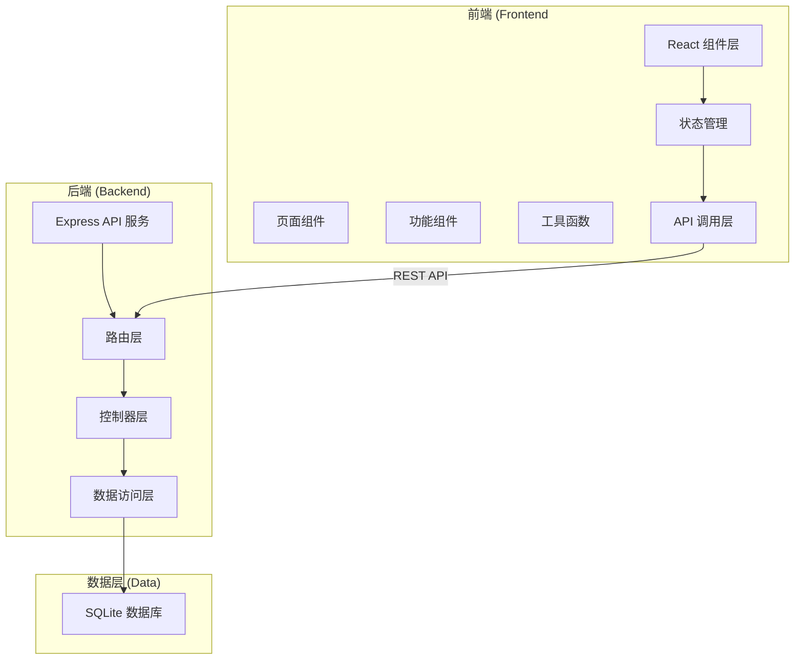
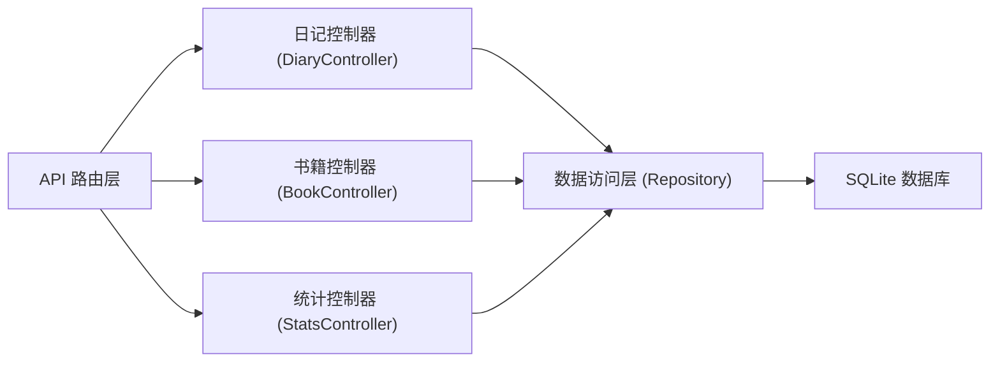
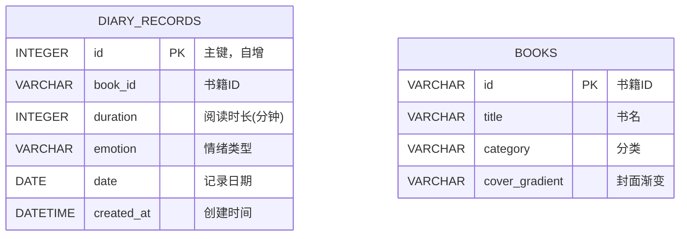

## 1. 架构设计



## 2. 技术描述

- **前端**：React@18 + TypeScript + Vite
- **后端**：Express@4 + TypeScript
- **数据库**：SQLite (sqlite3)
- **图表库**：Chart.js + react-chartjs-2
- **样式方案**：CSS Modules / 原生CSS变量
- **状态管理**：React useState + useEffect
- **路由管理**：React Router DOM
- **HTTP客户端**：Fetch API
- **构建工具**：Vite

## 3. 项目文件结构

```
auto1/
├── package.json              # 项目依赖和脚本
├── vite.config.js          # Vite构建配置
├── tsconfig.json          # TypeScript配置（严格模式）
├── index.html            # 入口HTML
├── src/
│   ├── App.tsx           # 主应用组件，路由管理
│   ├── main.tsx          # React入口文件
│   ├── components/
│   │   ├── DiaryEntry.tsx      # 日记录入表单组件
│   │   ├── EmotionChart.tsx    # 情绪与阅读统计图表组件
│   │   ├── DiaryList.tsx       # 历史记录列表组件
│   │   ├── RecommendCard.tsx     # 推荐书籍卡片组件
│   │   ├── ConfirmModal.tsx      # 确认对话框组件
│   │   ├── Header.tsx          # 头部导航组件
│   │   └── LoadingSkeleton.tsx  # 加载骨架屏组件
│   ├── pages/
│   │   ├── HomePage.tsx        # 首页
│   │   ├── EntryPage.tsx       # 日记录入页
│   │   └── StatsPage.tsx       # 统计页
│   ├── types/
│   │   └── index.ts           # 类型定义
│   ├── utils/
│   │   ├── api.ts              # API调用函数
│   │   └── recommend.ts       # 推荐算法
│   │   └── date.ts            # 日期处理工具
│   └── index.css             # 全局样式
├── src/server.ts             # Express后端服务
└── shared/
    └── types.ts            # 前后端共享类型
```

**数据流向：
1. 用户操作 → 页面组件 → 功能组件 → API调用 → Express路由 → 控制器 → SQLite → 返回数据 → 状态更新 → UI渲染

## 4. 路由定义

| 前端路由 | 页面 |
|---------|------|
| `/` | 首页（推荐+历史记录） |
| `/entry` | 日记录入页 |
| `/stats` | 统计页 |

## 5. API 定义

### 类型定义：

```typescript
// DiaryRecord {
  id?: number;
  bookId: string;
  duration: number;
  emotion: 'happy' | 'calm' | 'bored' | 'irritated' | 'crying';
  date: string;
  createdAt?: string;
}

EmotionLevel = 1 | 2 | 3 | 4 | 5;

DailyStats {
  date: string;
  emotionLevel: EmotionLevel;
  duration: number;
  emotion: string;
}

Book {
  id: string;
  title: string;
  category: 'adventure' | 'interactive' | 'classic';
  coverGradient: string;
}

Recommendation {
  books: Book[];
  reason: string;
}
```

### API 接口：

| 方法 | 路径 | 描述 | 请求 | 响应 |
|------|------|------|------|------|
| GET | `/api/books` | 获取预设书籍列表 | - | `{ books: Book[] }` |
| GET | `/api/diary` | 获取所有日记记录 | - | `{ records: DiaryRecord[] }` |
| POST | `/api/diary` | 创建日记记录 | `{ bookId, duration, emotion }` | `{ success: boolean, record: DiaryRecord }` |
| PUT | `/api/diary/:id` | 更新日记记录 | `{ bookId, duration, emotion }` | `{ success: boolean, record: DiaryRecord }` |
| GET | `/api/diary/stats` | 获取最近7天统计数据 | - | `{ stats: DailyStats[] }` |
| GET | `/api/diary/recommendation` | 获取智能推荐 | - | `Recommendation` |
| POST | `/api/diary/clear` | 清空所有记录 | - | `{ success: boolean }` |

## 6. 服务端架构



## 7. 数据模型

### 7.1 ER图



### 7.2 DDL 语句

```sql
CREATE TABLE IF NOT EXISTS books (
    id VARCHAR(50) PRIMARY KEY,
    title VARCHAR(200) NOT NULL,
    category VARCHAR(50) NOT NULL,
    cover_gradient VARCHAR(200) NOT NULL
);

CREATE TABLE IF NOT EXISTS diary_records (
    id INTEGER PRIMARY KEY AUTOINCREMENT,
    book_id VARCHAR(50) NOT NULL,
    duration INTEGER NOT NULL,
    emotion VARCHAR(20) NOT NULL,
    date DATE NOT NULL,
    created_at DATETIME DEFAULT CURRENT_TIMESTAMP,
    FOREIGN KEY (book_id) REFERENCES books(id)
);

CREATE INDEX IF NOT EXISTS idx_diary_date ON diary_records(date);
CREATE INDEX IF NOT EXISTS idx_diary_created ON diary_records(created_at DESC);

-- 初始化预设书籍数据
INSERT OR IGNORE INTO books (id, title, category, cover_gradient) VALUES
('book-001', '小王子', 'adventure', 'linear-gradient(135deg, #667eea 0%, #764ba2 100%)'),
('book-002', '夏洛的网', 'adventure', 'linear-gradient(135deg, #f093fb 0%, #f5576c 100%)'),
('book-003', '神奇校车', 'interactive', 'linear-gradient(135deg, #4facfe 0%, #00f2fe 100%)'),
('book-004', '猜猜我有多爱你', 'interactive', 'linear-gradient(135deg, #43e97b 0%, #38f9d7 100%)'),
('book-005', '绿野仙踪', 'adventure', 'linear-gradient(135deg, #fa709a 0%, #fee140 100%)'),
('book-006', '爷爷一定有办法', 'interactive', 'linear-gradient(135deg, #a8edea 0%, #fed6e3 100%)'),
('book-007', '海底两万里', 'adventure', 'linear-gradient(135deg, #ffecd2 0%, #fcb69f 100%)');
```

### 7.3 情绪等级映射

| 情绪 | emoji | 等级 | 颜色 |
|------|-------|------|------|
| happy | 😊 | 5 | #4caf50 |
| calm | 😌 | 4 | #2196f3 |
| bored | 😐 | 3 | #ff9800 |
| irritated | 😠 | 2 | #f44336 |
| crying | 😢 | 1 | #9c27b0 |

## 8. 性能要求

- 录入提交反馈：≤ 500ms
- 统计图表加载：≤ 1000ms
- 后端响应时间：≤ 200ms
- 骨架屏展示：数据请求期间显示

## 9. 各文件调用关系

```
App.tsx (路由管理)
├── Header.tsx (导航)
├── HomePage.tsx
│   ├── RecommendCard.tsx (推荐卡片)
│   └── DiaryList.tsx (历史记录)
│   └── ConfirmModal.tsx (确认对话框)
│   └── api.ts → GET /api/diary
│   └── api.ts → GET /api/diary/recommendation
│   └── recommend.ts (推荐算法)
├── EntryPage.tsx
│   └── DiaryEntry.tsx (录入表单)
│       └── api.ts → GET /api/books
│       └── api.ts → POST /api/diary
│       └── api.ts → PUT /api/diary/:id
└── StatsPage.tsx
    └── EmotionChart.tsx (统计图表)
        └── api.ts → GET /api/diary/stats
        └── Chart.js (图表渲染)

server.ts (Express服务)
├── routes/api.ts
│   ├── controllers/
│   │   ├── bookController.ts
│   │   ├── diaryController.ts
│   │   └── statsController.ts
│   └── db.ts (SQLite连接)
```
