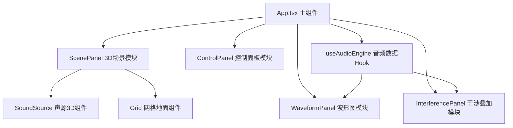

## 1. 架构设计



## 2. 技术说明

- **前端框架**：React@18 + TypeScript@5 + Vite@5
- **3D渲染**：three@0.160 + @react-three/fiber@8 + @react-three/drei@9
- **2D绘制**：HTML5 Canvas API
- **样式方案**：原生CSS（使用CSS变量管理主题色）
- **状态管理**：React useState/useRef（轻量场景，无需Redux）

## 3. 文件结构

| 文件路径 | 用途 |
|----------|------|
| `package.json` | 项目依赖与脚本配置 |
| `vite.config.js` | Vite开发服务器配置（端口3000，@别名） |
| `tsconfig.json` | TypeScript编译配置（strict模式，ES2020） |
| `index.html` | 应用入口HTML |
| `src/App.tsx` | 主组件，组合所有模块，管理全局声源状态 |
| `src/components/ScenePanel.tsx` | 3D场景渲染组件，Canvas容器 |
| `src/components/SoundSource.tsx` | 单个声源3D物体，波纹渲染与拖拽 |
| `src/components/WaveformPanel.tsx` | 4个时域波形图Canvas绘制 |
| `src/components/InterferencePanel.tsx` | 干涉叠加波形与区域标注 |
| `src/components/ControlPanel.tsx` | 声源参数控制面板 |
| `src/hooks/useAudioEngine.ts` | 声波采样数据生成Hook |
| `src/styles/global.css` | 全局样式与主题变量 |
| `src/types/index.ts` | TypeScript类型定义 |

## 4. 类型定义

```typescript
interface SoundSource {
  id: number;
  position: { x: number; y: number; z: number };
  frequency: number;      // 50-1000Hz, step 10
  amplitude: number;      // 0.1-1.0, step 0.1
  color: string;          // hex color
}

interface WaveformData {
  sourceId: number;
  samples: number[];      // 时域采样数据
}

interface InterferenceData {
  combined: number[];     // 叠加波形
  constructiveRegions: Array<{start: number; end: number}>;
  destructiveRegions: Array<{start: number; end: number}>;
}
```

## 5. 核心数据模型

### 5.1 声源状态
- 固定4个声源，不可增删
- 初始位置：(-4,0,0), (-1.33,0,0), (1.33,0,0), (4,0,0)
- 初始频率：220Hz
- 初始振幅：0.5

### 5.2 采样数据
- 采样率：60帧/秒
- 每个波形图显示约2个完整周期
- 干涉叠加视图显示叠加波形全范围

### 5.3 波纹动画
- 每个声源维护波纹队列
- 波纹每1.5秒生成新环
- 半径：每秒扩大2单位
- 透明度：0.8 → 0 线性衰减
- 半径上限：3单位（超过即销毁）
