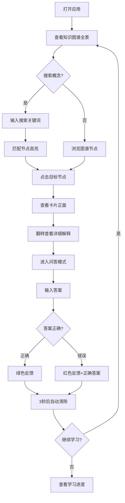

## 1. 产品概述

知识图谱卡片式问答学习应用，让用户通过翻转卡片的方式，在一个互联的知识图谱中学习概念之间的关系。目标用户为自主学习者、学生和知识工作者，产品通过可视化图谱展示概念间关联，结合翻转卡片和问答机制强化记忆效果。

- 主旨：将碎片化知识组织为图谱结构，通过交互式卡片和问答机制实现高效学习
- 价值：提供比传统线性学习更直观、更有效的知识掌握方式

## 2. 核心功能

### 2.1 用户角色
| 角色 | 注册方式 | 核心权限 |
|------|----------|----------|
| 普通用户 | 无需注册 | 浏览图谱、翻转卡片、参与问答、查看学习进度 |

### 2.2 功能模块
1. **知识图谱主页**：力导向图谱展示，节点交互（悬浮、点击、高亮），搜索过滤
2. **卡片详情面板**：翻转卡片查看概念详情，进入问答模式
3. **问答学习**：基于当前概念的问答，支持文本和语音输入，即时反馈
4. **学习进度统计**：已学习卡片数、正确率、圆形进度条

### 2.3 页面详情
| 页面名称 | 模块名称 | 功能描述 |
|----------|----------|----------|
| 知识图谱主页 | 力导向图谱 | Canvas绘制力导向图，节点为圆形卡片（半径30-50px），颜色按类别区分（科学#4fc3f7、历史#ff8a65、文学#aed581、艺术#ba68c8），边线2px #e0e0e0，悬浮显示概念名提示框（背景#333，圆角8px，淡入0.2s），点击高亮节点及直接相连节点和边（高亮节点扩大+发光，高亮边#ff7043变粗3px） |
| 知识图谱主页 | 搜索功能 | 顶部中央搜索框（宽400px，高44px，圆角22px，背景#f5f5f5，左侧放大镜图标），实时过滤图谱节点，匹配节点放大20%保持原色，不匹配节点灰色透明度0.3且连线虚线，下拉列表最多5个匹配结果（高40px，概念名+类别标签） |
| 卡片详情面板 | 翻转卡片 | 右侧面板（宽400px，背景#ffffff，圆角16px，内边距24px，右侧阴影，滑入动画0.3s），正面显示概念名（24px粗体#333）和简短定义（16px#666），翻转按钮（120x40px，圆角20px，背景#1976d2，悬浮#1565c0），3D翻转动画rotateY 0.6s，背面显示详细解释（可滚动），"开始问答"按钮 |
| 问答模式 | 问答面板 | 问题展示，文本输入框（宽100%，高48px，圆角8px，边框#ccc聚焦#1976d2），语音输入按钮（圆形直径40px，背景#4caf50），提交按钮，反馈区（正确绿色框#e8f5e9，错误红色框#ffebee），3秒自动清除 |
| 学习进度 | 状态栏 | 底部固定状态栏（高60px，背景#263238，颜色白色），左侧已学习/总卡片数，右侧正确率百分比，中间圆形进度条（直径40px，渐变#ff9800到#4caf50，宽4px） |

## 3. 核心流程

用户打开应用 → 查看知识图谱全景 → 搜索或浏览定位概念节点 → 点击节点查看卡片详情 → 翻转卡片查看详细解释 → 进入问答模式 → 输入答案（文本/语音）→ 获得即时反馈 → 继续探索其他节点 → 查看学习进度统计

## 4. 用户界面设计

### 4.1 设计风格
- 主色调：深蓝导航栏(#1a237e) + 浅灰图谱背景(#fafafa) + 白色面板
- 辅助色：节点类别色（科学#4fc3f7、历史#ff8a65、文学#aed581、艺术#ba68c8），高亮色#ff7043
- 按钮风格：圆角按钮，主操作蓝色(#1976d2)，语音输入绿色(#4caf50)
- 字体：概念名24px粗体，简短定义16px，详细解释14px
- 布局：顶部导航栏64px + 中央图谱Canvas + 右侧详情面板400px + 底部状态栏60px
- 图标风格：简洁线性图标，搜索放大镜16x16px

### 4.2 页面设计概览
| 页面名称 | 模块名称 | UI元素 |
|----------|----------|--------|
| 知识图谱主页 | 顶部导航栏 | 高度64px，背景#1a237e，白色文字，左侧Logo，中央搜索框，深色质感 |
| 知识图谱主页 | 图谱Canvas | 背景#fafafa，力导向布局，节点圆形带类别色，连线浅灰#e0e0e0，支持拖拽和缩放 |
| 知识图谱主页 | 搜索下拉 | 最多5项，每项40px高，概念名+类别色标签，点击聚焦节点 |
| 卡片详情面板 | 面板容器 | 宽400px，白色背景，圆角16px，右侧阴影，滑入动画0.3s |
| 卡片详情面板 | 卡片正面 | 概念名24px粗体，简短定义16px，翻转按钮120x40px |
| 卡片详情面板 | 卡片背面 | 详细解释文本，可滚动，"开始问答"按钮 |
| 问答模式 | 问答面板 | 问题区域，文本输入框，语音按钮，提交按钮，反馈区 |
| 学习进度 | 底部状态栏 | 高60px，背景#263238，左侧计数，中间圆形进度条，右侧正确率 |

### 4.3 响应式设计
- 桌面优先设计，宽度≥768px时完整布局
- 宽度<768px时：详情面板改为底部弹出式（高度自动，圆角顶部16px，可拖拽关闭），搜索框缩短为200px，图谱缩放自动适应
- 触摸优化：节点点击区域适当放大，手势缩放支持

### 4.4 3D场景指导
- 不涉及3D场景，但卡片翻转使用CSS 3D transform（rotateY）实现翻转效果
- 翻转动画持续0.6s，使用perspective属性增强3D效果
