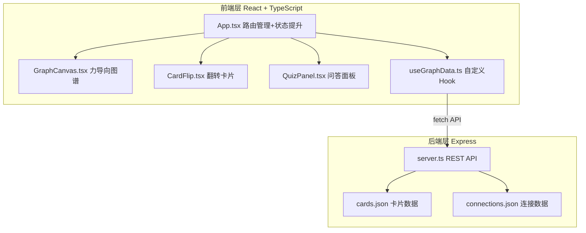
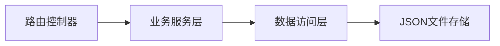
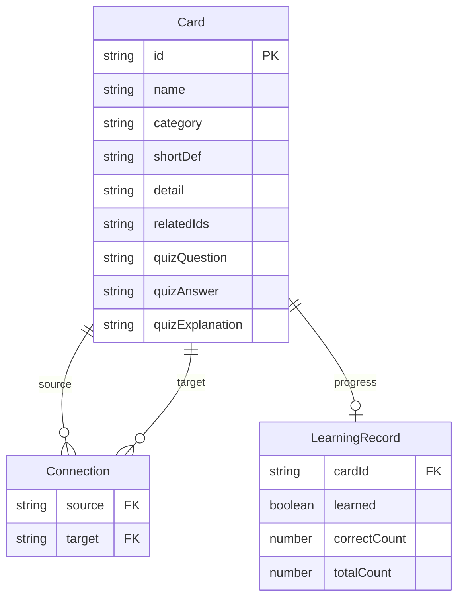

## 1. 架构设计



## 2. 技术说明
- 前端：React@18 + TypeScript + Vite
- 初始化工具：vite-init（react-express-ts模板）
- 后端：Express@4 + TypeScript
- 数据库：JSON文件存储（cards.json + connections.json）
- 状态管理：zustand
- 图谱渲染：Canvas 2D API实现力导向布局
- 样式：Tailwind CSS + CSS Modules（用于动画和特殊效果）

## 3. 路由定义
| 路由 | 用途 |
|------|------|
| / | 知识图谱主页，包含图谱、搜索、详情面板、问答、进度统计 |

## 4. API定义

### 4.1 TypeScript类型定义

```typescript
interface Card {
  id: string;
  name: string;
  category: "science" | "history" | "literature" | "art";
  shortDef: string;
  detail: string;
  relatedIds: string[];
  quizQuestion: string;
  quizAnswer: string;
  quizExplanation: string;
}

interface Connection {
  source: string;
  target: string;
}

interface GraphData {
  nodes: GraphNode[];
  edges: Connection[];
}

interface GraphNode {
  id: string;
  name: string;
  category: string;
  x: number;
  y: number;
}

interface Quiz {
  cardId: string;
  question: string;
  hint: string;
}

interface AnswerResult {
  correct: boolean;
  correctAnswer: string;
  explanation: string;
}

interface LearningProgress {
  totalCards: number;
  learnedCards: number;
  correctRate: number;
}
```

### 4.2 API端点

| 方法 | 路径 | 请求体 | 响应 | 说明 |
|------|------|--------|------|------|
| GET | /api/graph | - | GraphData | 返回图谱节点和边 |
| GET | /api/card/:id | - | Card | 返回卡片详情 |
| GET | /api/quiz | - | Quiz | 随机返回一个问题 |
| POST | /api/answer | { cardId, answer } | AnswerResult | 验证答案并更新学习记录 |
| GET | /api/progress | - | LearningProgress | 获取学习进度 |

## 5. 服务器架构图



## 6. 数据模型

### 6.1 数据模型定义



### 6.2 数据定义

**cards.json**：包含12+张卡片数据，涵盖科学、历史、文学、艺术四个类别，每张卡片包含概念名、简短定义、详细解释、相关概念ID列表、问答题目及答案

**connections.json**：包含20+条连接关系，source和target为卡片ID

**学习记录**：运行时存储在内存中（可持久化到progress.json）
