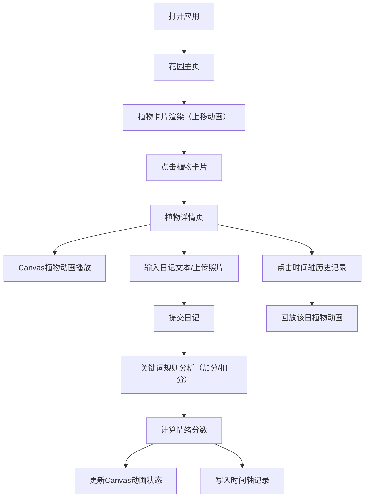

## 1. 产品概述

植物情绪日记是一款帮助用户记录植物养护日常的情感化应用。用户通过文字描述和照片记录植物状态，系统通过规则算法分析植物"情绪"（开心、平静、忧伤、生病），并以动态虚拟植物的形式可视化呈现。

- 核心目标：为植物爱好者提供一个有趣的植物养护记录工具，将枯燥的养护日常转化为生动的情绪互动体验
- 目标用户：植物爱好者、养花人士、喜欢记录生活的人群
- 市场价值：填补植物养护领域情感化记录工具的空白，通过可视化动画提升用户粘性

## 2. 核心功能

### 2.1 功能模块

1. **花园主页**：4x4网格视图展示所有植物卡片，支持新增植物，卡片进入动画，悬浮交互效果
2. **植物详情页**：Canvas动态植物动画、日记输入区、情绪时间轴面板、历史状态回放

### 2.2 页面详情

| 页面名称 | 模块名称 | 功能描述 |
|-----------|-------------|---------------------|
| 花园主页 | 植物卡片网格 | 4x4布局展示植物缩略图和名字，卡片宽280px高360px，背景#f0fdf4，圆角16px，边框2px solid #86efac |
| 花园主页 | 植物卡片悬浮效果 | 阴影从0 2px 8px rgba(0,0,0,0.1)变为0 8px 24px rgba(0,0,0,0.15)，向上平移6px，过渡0.3s ease-out |
| 花园主页 | 植物缩略图 | 圆形裁切，直径80px，边框4px solid #22c55e |
| 花园主页 | 卡片进入动画 | 从底部缓缓上移，0.5秒 |
| 植物详情页 | Canvas植物动画 | 茎部渐变色#16a34a到#15803d，根据情绪变化叶子形态和颜色 |
| 植物详情页 | 情绪叶子效果 | 开心：舒展抖动绿色#22c55e；平静：轻摆淡绿#86efac；忧伤：下垂变黄#fef08a；生病：枯萎卷曲棕色#d97706 |
| 植物详情页 | 日记输入区 | 多行文本框高160px，边框2px solid #d1d5db圆角8px，获得焦点时边框变#22c55e带浅绿色阴影 |
| 植物详情页 | 提交按钮 | 圆角8px，点击时水波纹扩散动画0.4秒 |
| 植物详情页 | 情绪时间轴面板 | 固定450px宽，背景#f8fafc圆角12px内边距16px，按日期倒序显示7天记录 |
| 植物详情页 | 时间轴记录项 | 日期标签14px加粗#475569，情绪图标20px彩色，10字关键词摘要 |
| 植物详情页 | 历史回放 | 点击某天记录，Canvas回放该日植物动画状态 |

## 3. 核心流程

主要用户流程：用户打开应用进入花园主页 → 查看植物列表（卡片动画进入）→ 点击植物卡片进入详情页 → 查看当前植物情绪动画 → 输入日记描述（可选上传照片）→ 提交后系统分析关键词打分 → 植物动画根据新情绪实时更新 → 在右侧时间轴查看历史记录 → 点击历史记录回放过去状态

## 4. 用户界面设计

### 4.1 设计风格

- **森系自然风格**：整体传达自然、清新、宁静的氛围
- **主色调**：墨绿色#064e3b（深度自然感）、草绿色#22c55e（生命活力）
- **辅助色**：浅米色#fefce8（温暖背景）、暖棕色#d97706（大地质感）
- **情绪色**：开心😊 #22c55e 绿、平静😐 #3b82f6 蓝、忧伤😢 #eab308 黄、生病😷 #ef4444 红
- **按钮风格**：圆角8px，点击水波纹扩散动画（持续0.4秒）
- **字体**：标题使用优雅的衬线字体搭配现代无衬线正文，层次清晰
- **布局**：卡片式布局为主，花园采用网格，详情页采用左右分栏（主内容+右侧时间轴450px固定宽）
- **图标/emoji**：使用emoji作为情绪图标，与文字形成视觉互补

### 4.2 页面设计概览

| 页面名称 | 模块名称 | UI元素 |
|-----------|-------------|-------------|
| 花园主页 | 顶部标题区 | 墨绿色标题文字、浅米色背景、装饰性植物元素 |
| 花园主页 | 卡片网格容器 | 4x4网格、响应式适配（4→2→1列）、卡片间距24px |
| 花园主页 | 单张卡片 | 背景#f0fdf4、圆角16px、边框2px #86efac、悬浮阴影+上移6px、0.3s ease-out过渡 |
| 花园主页 | 卡片内缩略图 | 圆形裁切、直径80px、边框4px #22c55e、植物照片/默认图 |
| 花园主页 | 新增植物按钮 | 草绿色背景、白色加号图标、圆角8px、水波纹点击效果 |
| 植物详情页 | 主内容区 | 左侧自适应宽度、内边距统一400px以下为24px |
| 植物详情页 | Canvas画布容器 | 圆角12px、浅米色背景#fefce8、居中显示 |
| 植物详情页 | 日记输入框 | 高160px、边框2px #d1d5db、圆角8px、焦点时边框#22c55e+浅绿色阴影 |
| 植物详情页 | 提交按钮 | 草绿色#22c55e背景、白色文字、圆角8px、水波纹点击、禁用时半透明 |
| 植物详情页 | 时间轴面板 | 固定450px宽、背景#f8fafc、圆角12px、内边距16px、左侧主内容+右侧面板布局 |
| 植物详情页 | 时间轴记录项 | 左右布局（日期+情绪图标+摘要）、悬浮时浅绿色背景、圆角8px、过渡0.2s |

### 4.3 响应式设计

- **桌面端（默认）**：花园4列网格、详情页左右分栏（主内容+450px时间轴）
- **平板端（≤1024px）**：花园2列网格、详情页上下布局（时间轴移到下方，宽度自适应）
- **移动端（≤640px）**：花园1列网格、卡片宽度100%、详情页单列、时间轴宽度100%、所有文字缩放适配

### 4.4 动画性能要求

- Canvas植物动画帧率 ≥ 55fps，使用requestAnimationFrame逐帧更新
- 叶子位置和颜色采用线性插值平滑过渡
- 卡片进入采用stagger延迟（每张卡片递增50ms延迟）
- 照片上传后压缩至≤200KB再存储
