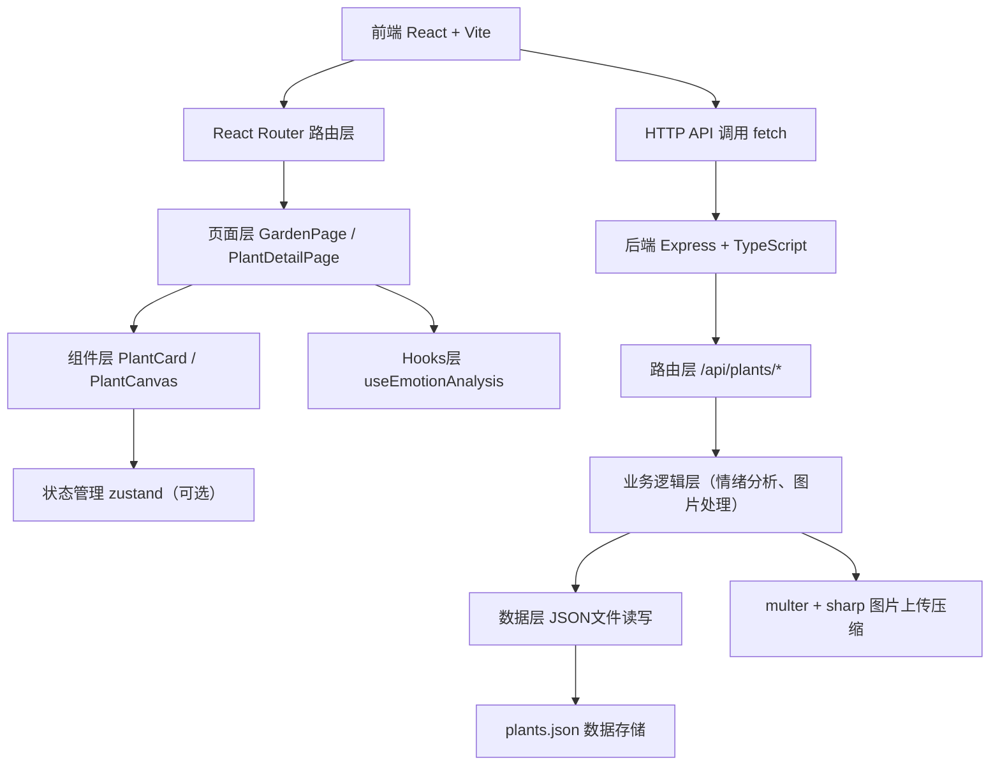
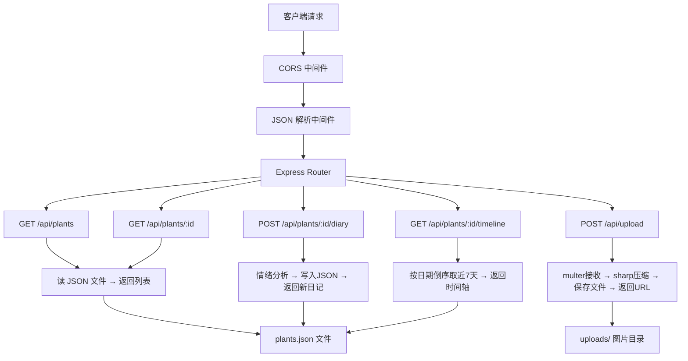
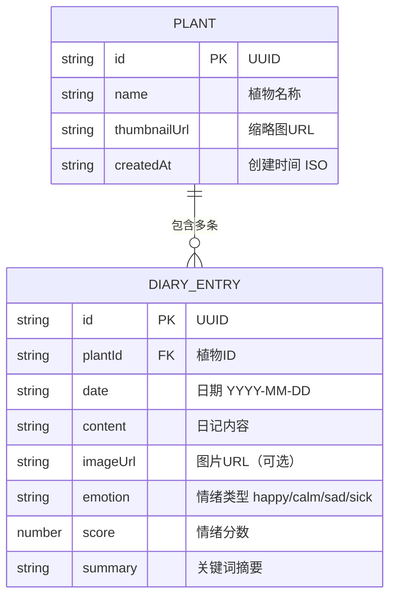

## 1. 架构设计



## 2. 技术说明

- **前端**：React@18 + TypeScript + Vite + react-router-dom
- **初始化工具**：vite-init react-express-ts 模板
- **后端**：Express@4 + TypeScript + ts-node
- **数据存储**：JSON文件（server/data/plants.json）
- **图片处理**：multer（上传）+ sharp（压缩至≤200KB）
- **动画渲染**：Canvas 2D + requestAnimationFrame
- **状态管理**：React useState + 自定义Hooks（zustand可选，但需求不复杂，避免过度设计）

## 3. 路由定义

### 前端路由

| 路由路径 | 页面组件 | 用途 |
|-------|---------|---------|
| / | GardenPage | 花园主页，展示植物卡片网格 |
| /plant/:id | PlantDetailPage | 植物详情页，Canvas动画+日记输入+时间轴 |

### 后端API路由

| HTTP方法 | 路由路径 | 用途 | 请求/响应格式 |
|-------|---------|---------|----------|
| GET | /api/plants | 获取所有植物列表 | 返回 Plant[] |
| POST | /api/plants | 新增植物 | 请求: {name, image?}, 返回: Plant |
| GET | /api/plants/:id | 获取单株植物详情 | 返回 Plant |
| POST | /api/plants/:id/diary | 提交日记记录 | 请求: {content, image?}, 返回: DiaryEntry |
| GET | /api/plants/:id/timeline | 获取情绪时间轴（近7天） | 返回 TimelineEntry[] |
| POST | /api/upload | 上传图片并压缩 | multipart/form-data, 返回 {url} |

## 4. API类型定义

```typescript
// 情绪类型
type EmotionType = 'happy' | 'calm' | 'sad' | 'sick';

// 情绪分析结果
interface EmotionResult {
  score: number;
  emotion: EmotionType;
  color: string;
  matchedKeywords: string[];
}

// 日记条目
interface DiaryEntry {
  id: string;
  date: string; // YYYY-MM-DD
  content: string;
  imageUrl?: string;
  emotion: EmotionType;
  score: number;
  summary: string; // 关键词附近10字摘要
}

// 植物
interface Plant {
  id: string;
  name: string;
  thumbnailUrl: string;
  createdAt: string;
  diary: DiaryEntry[];
}

// 时间轴条目
interface TimelineEntry {
  date: string;
  dateLabel: string; // 如"3月15日"
  emotion: EmotionType;
  emoji: string;
  summary: string;
  score: number;
}

// 关键词规则
interface KeywordRule {
  keyword: string;
  score: number;
  emotion: EmotionType;
}
```

## 5. 服务器架构图



## 6. 数据模型

### 6.1 数据模型关系



### 6.2 plants.json 初始结构

```json
{
  "plants": [
    {
      "id": "uuid-1",
      "name": "示例多肉",
      "thumbnailUrl": "/uploads/default-plant.jpg",
      "createdAt": "2026-06-10T08:00:00.000Z",
      "diary": [
        {
          "id": "uuid-d1",
          "date": "2026-06-15",
          "content": "今天发现长出了新芽，真开心！",
          "emotion": "happy",
          "score": 10,
          "summary": "长出了新芽，真开心"
        }
      ]
    }
  ]
}
```

### 6.3 情绪关键词规则

| 关键词 | 分数变化 | 对应情绪 |
|--------|---------|---------|
| 新芽 | +10 | happy（开心） |
| 开花 | +15 | happy（开心） |
| 开心 | +10 | happy（开心） |
| 茂盛 | +8 | happy（开心） |
| 生长 | +7 | happy（开心） |
| 浇水 | +5 | calm（平静） |
| 施肥 | +5 | calm（平静） |
| 修剪 | +3 | calm（平静） |
| 晒太阳 | +4 | calm（平静） |
| 松土 | +3 | calm（平静） |
| 黄叶 | -15 | sad（忧伤） |
| 掉叶 | -12 | sad（忧伤） |
| 蔫 | -10 | sad（忧伤） |
| 干枯 | -13 | sad（忧伤） |
| 伤心 | -8 | sad（忧伤） |
| 虫害 | -20 | sick（生病） |
| 病害 | -18 | sick（生病） |
| 发霉 | -17 | sick（生病） |
| 黑斑 | -15 | sick（生病） |
| 溃烂 | -20 | sick（生病） |

**情绪判定规则（基于总分）**：
- score ≥ 8 → happy（开心😊）
- 0 ≤ score < 8 → calm（平静😐）
- -10 ≤ score < 0 → sad（忧伤😢）
- score < -10 → sick（生病😷）

## 7. 文件结构（用户指定）

```
project-root/
├── package.json
├── vite.config.ts
├── tsconfig.json
├── index.html
├── src/
│   ├── main.tsx
│   ├── App.tsx
│   ├── components/
│   │   ├── PlantCard.tsx
│   │   └── PlantCanvas.tsx
│   ├── hooks/
│   │   └── useEmotionAnalysis.ts
│   └── pages/
│       ├── GardenPage.tsx
│       └── PlantDetailPage.tsx
├── server/
│   ├── index.ts
│   └── data/
│       └── plants.json
└── uploads/
```
