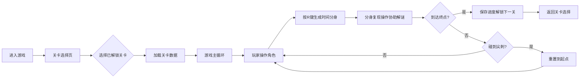

## 1. 产品概述

时间回溯2D平台跳跃游戏，玩家通过录制过去3秒的操作轨迹，生成"时间分身"协助解谜。融合平台跳跃与时间操控机制，创造独特的解谜体验。

- 核心玩法：操控方块角色跳跃闯关，利用时间分身踩踏开关、触发机关
- 目标用户：休闲游戏玩家、解谜游戏爱好者
- 产品价值：创新的时间回溯机制，提供新颖的解谜挑战

## 2. 核心功能

### 2.1 功能模块

1. **关卡选择页**：关卡网格展示、解锁进度显示、难度标识
2. **游戏主页面**：Canvas游戏渲染、角色控制、时间分身系统、UI覆盖层
3. **关卡系统**：3个预设关卡、地形障碍物、尖刺陷阱、开关机关
4. **时间回溯系统**：3秒操作录制、分身生成与回放、6秒持续时间
5. **进度存储系统**：关卡解锁记录、通关进度持久化

### 2.2 页面详情

| 页面名称 | 模块名称 | 功能描述 |
|---------|----------|----------|
| 关卡选择页 | 关卡卡片网格 | 展示3个关卡，已解锁亮起、未解锁灰显，显示难度星标 |
| 关卡选择页 | 进度展示 | 显示已通关关卡数量 |
| 游戏主页面 | Canvas渲染引擎 | 绘制背景、平台、角色、分身、粒子效果 |
| 游戏主页面 | 角色控制 | A/D移动、W跳跃、R生成时间分身 |
| 游戏主页面 | 时间分身系统 | 录制3秒操作、回放生成分身、分身消散动画 |
| 游戏主页面 | UI覆盖层 | 录制指示器、分身持续时间进度条、操作按钮 |
| 游戏主页面 | 碰撞检测 | AABB碰撞、尖刺重置、开关触发 |

## 3. 核心流程

## 4. 用户界面设计

### 4.1 设计风格

- 主色调：深色科幻风格（#0f0c29、#302b63、#24243e）
- 强调色：角色蓝（#00d2ff）、分身红（#ff6b6b）、危险红（#ff4757）、成功绿（#2ed573）、开关橙（#ffa502）
- 按钮风格：重置按钮圆形（直径32px），返回按钮圆角矩形（60x30px）
- 字体：现代无衬线字体，清晰易读
- 布局：游戏画布800x600px居中，深色半透明边框包裹
- 动画过渡：统一0.3秒ease-out

### 4.2 页面设计概述

| 页面名称 | 模块名称 | UI元素 |
|---------|----------|--------|
| 关卡选择页 | 关卡卡片 | 200x150px圆角卡片，背景#2d3436，关卡名+难度星标，未解锁#636e72灰显 |
| 游戏主页面 | 背景 | 深蓝到紫色径向渐变，100颗随机闪烁星星粒子 |
| 游戏主页面 | 角色 | 20x20px方块#00d2ff，白色发光描边，落地压缩拉伸动画 |
| 游戏主页面 | 时间分身 | 半透明#ff6b6b（alpha 0.7），消失时像素消散动画 |
| 游戏主页面 | 左下角操作面板 | 录制指示器（红点脉冲1秒周期）、分身持续进度条（100x6px）、关卡编号 |
| 游戏主页面 | 右上角按钮 | 重置关卡（圆形#ff4757）、返回关卡选择（圆角矩形#2ed573） |

### 4.3 响应式

- 桌面端优先，游戏画布固定800x600px居中显示
- 周围边框自适应窗口大小

## 5. 性能要求

- 稳定60fps运行
- 帧率低于45fps时控制台警告，自动降低星星粒子至50颗
- 分身录制采用环形缓冲区优化内存
